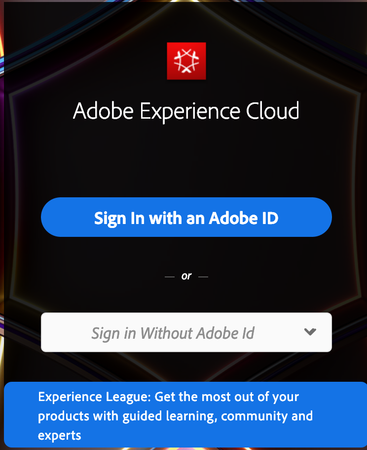

# Report Builder-inloggning

>[!IMPORTANT]
>
>Report Builder version 5.6.47 och senare stöder endast inloggning med Experience Cloud och stöder inte äldre inloggningar som Site Catalyst Single Sign-on eller Standard Login. **Senast den 22 juli 2021 måste alla användare av Report Builder uppdatera tillägget Report Builder till version 5.6.47 eller senare, vilket innehåller en viktig uppdatering av inloggningsprocessen.**

Om du vill logga in på Report Builder använder du ditt Experience Cloud-inloggningskonto.

## Logga in på Adobe Experience Cloud {#section_1FA230F35AB54021A874A7A28DE4C850}

Med inloggningen Experience Cloud kan du använda Enterprise ID (e-post och lösenord) för att logga in på Adobe Experience Cloud.

Klicka på **[!UICONTROL Sign In]** > **[!UICONTROL Sign in with an Enterprise ID]** om du vill omdirigeras till företagets inloggningssida. Mer information om Enterprise ID finns i [Logga in på ditt företags- eller skolkonto](https://helpx.adobe.com/enterprise/kb/enterprise-id-faq.html#whatis).

>[!NOTE]
>
>Inloggningen från Experience Cloud är sessionsbaserad och token upphör att gälla efter 30 dagar.

## Logga in i Report Builder

Logga in på Report Builder

1. Klicka på **[!UICONTROL Add-Ins]** i Excel.
1. Klicka på **[!UICONTROL Sign In]**. Du kan också signera på följande sätt:

   * Klicka på **[!UICONTROL Create]**.
   * Välj en begäran i Begäranhanteraren och klicka sedan på **[!UICONTROL Add]** eller **[!UICONTROL Manage]**. Mer information finns i [Välj en begäran i Begäranhanteraren](/help/analyze/report-builder/manage-requests/r-arb-manage-requests.md)
   * Dubbelklicka på en begäran i Excel.

1. Fyll i fälten på sidan [!UICONTROL Login] och klicka sedan på **[!UICONTROL OK]**.
