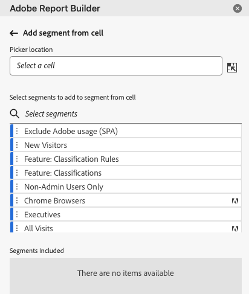

# Arbeta med segment i Report Builder

Du kan tillämpa segment när du skapar ett nytt datablock eller när du väljer alternativet **Redigera datablock** på KOMMANDATORpanelen.

## Använda segment i ett datablock

Om du vill tillämpa ett segment på hela datablocket dubbelklickar du på ett segment eller drar och släpper filter från komponentlistan i segmentavsnittet i tabellen.

## Tillämpa segment på enskilda mätvärden

Om du vill använda segment på enskilda mätvärden drar och släpper du ett segment på ett mätvärde i tabellen. Du kan också klicka på ikonen **..** till höger om ett mätresultat i tabellrutan och sedan välja **[!UICONTROL Segment metric]**. Om du vill visa tillämpade segment håller du pekaren över eller väljer ett mått i tabellrutan. Mätvärden med tillämpade segment visar en filterikon.

## Snabbredigeringssegment

Du kan använda snabbredigeringspanelen för att lägga till, ta bort eller ersätta segment för befintliga datablock.

När du markerar ett cellintervall i kalkylbladet visas en sammanfattningslista över de segment som används av datablocken i markeringen på länken **[!UICONTROL Segments]** på snabbredigeringspanelen.

Redigera segment med hjälp av snabbredigeringspanelen

1. Markera ett cellintervall från ett eller flera datablock.

   

1. Klicka på länken under **[!UICONTROL Segments]** för att öppna panelen Snabbredigering - filter.

   

### Lägga till eller ta bort ett segment

Du kan lägga till eller ta bort segment med alternativen Lägg till/ta bort.

1. Välj fliken **[!UICONTROL Add/Remove]** på panelen Snabbredigeringssegment.

   Alla segment som tillämpas på de markerade datablocken visas på panelen Snabbredigering. Segment som tillämpas på alla datablock i markeringen listas under rubriken **[!UICONTROL Applied to all selected data blocks]**. Segment som tillämpas på vissa, men inte alla, datablock listas under rubriken **[!UICONTROL Applied to 1 or more selected data blocks]**.

   När det finns flera segment i de markerade datablocken kan du söka efter specifika segment med hjälp av sökfältet **[!UICONTROL Add Filter]**.

   

1. Lägg till segment genom att välja segment i listrutan **[!UICONTROL Add segment]**.

   Listan med sökbara segment innehåller alla segment som är tillgängliga för rapportsviterna som finns i ett eller flera av de markerade datablocken samt alla segment som är tillgängliga globalt i organisationen.

   Om du lägger till ett segment används segmentet på alla datablock i markeringen.

1. Om du vill ta bort segment klickar du på borttagningsikonen **x** till höger om segmenten i listan **[!UICONTROL Segments applied]** .

1. Klicka på **[!UICONTROL Apply]** om du vill spara ändringarna och återgå till hubbpanelen.

   Report Builder visar ett meddelande som bekräftar de använda segmentändringarna.

### Ersätta ett segment

Du kan ersätta ett befintligt segment med ett annat segment om du vill ändra hur data segmenteras.

1. Välj fliken **[!UICONTROL Replace]** på panelen Snabbredigering.

   

1. Använd sökfältet **[!UICONTROL Search list]** för att hitta specifika segment.

1. Välj ett eller flera segment som du vill ersätta.

1. Sök efter ett eller flera segment i fältet Ersätt med.

   Om du väljer ett filter läggs det till i listan **[!UICONTROL Replace with]**....

1. Klicka på **[!UICONTROL Apply]**.

   Report Builder uppdaterar segmentlistan så att den återspeglar ersättningen.

### Definiera datablocksegment från celler

Datablocken kan referera till segment från en cell. Flera datablock kan referera till samma cell för segment, vilket gör det enkelt att växla segment för flera datablock samtidigt.

Använda segment från en cell

1. Navigera till Steg 2 när du skapar eller redigerar datablock. Se [Skapa ett datablock](./create-a-data-block.md).
1. Klicka på fliken **[!UICONTROL Segments]** för att definiera filter.
1. Klicka på **[!UICONTROL Create segment from cell]**.

   

1. Markera cellen som du vill att datablocken ska referera till ett segment från.

1. Lägg till segmentvalet som du vill lägga till i cellen genom att antingen dubbelklicka på segmentet eller genom att dra och släppa det i avsnittet **[!UICONTROL Segments Included]**.

   Obs! Endast ett alternativ kan markeras för den aktuella cellen åt gången.

   

1. Klicka på **[!UICONTROL Apply]** för att skapa referenscellen.

1. Lägg till de nya referenscellssegmenten i ditt datablock från fliken **[!UICONTROL Segments]**.

   

1. Klicka på **[!UICONTROL Finish]**.

   Nu kan andra datablock referera till den här cellen i sina segment. Om du vill använda referenscellen som ett segment i andra datablock lägger du bara till cellreferensen i segmenten från fliken Segment.

#### Använd referenscellen för att ändra datablocksegment

1. Markera referenscellen i kalkylbladet.

1. Klicka på länken under **[!UICONTROL Segments from Cell]** på snabbredigeringsmenyn.

   

1. Välj segmentet i listrutan.

   

1. Klicka på **[!UICONTROL Apply]**.
