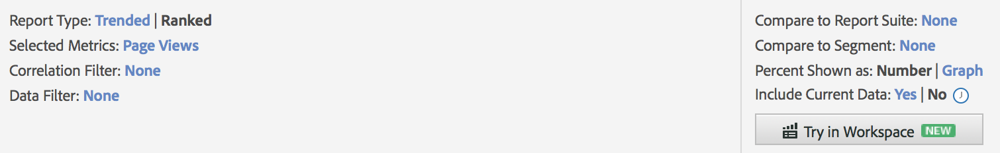
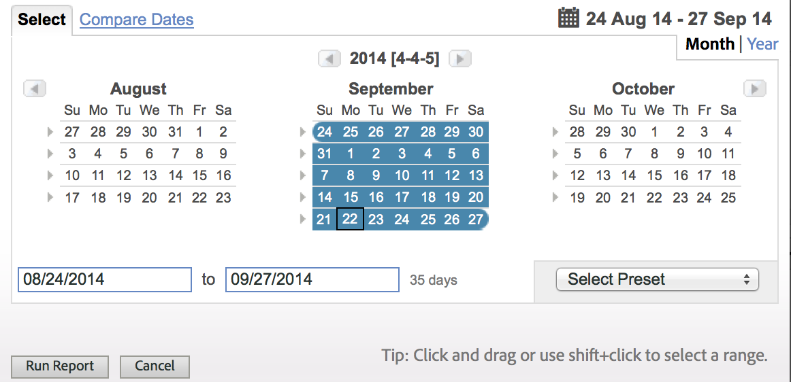
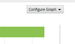

# Rapportfunktioner

En introduktion till funktionerna i en rapport, inklusive verktygsfältet, kalendern och detaljtabellen.

I det här exemplet visas en [!UICONTROL Pages Report]. Konfigurationsalternativen kan variera beroende på vilken rapport du kör. I stället för att välja Trended eller Ranked i en [!UICONTROL Site Content] kan du ange granularitet och sidnamn för en [!UICONTROL Site Metrics] rapport.

>[!IMPORTANT]
>Effektivt **31 december 2023** kommer Adobe att upphöra med rapporter och analyser och tillhörande rapporter och funktioner. Då slutar rapporter och analyser och alla rapporter och scheman att fungera. Rapporterna, visualiseringarna och den underliggande tekniken som ligger till grund för rapporter och analyser uppfyller inte längre Adobe teknikstandarder. De flesta funktionerna Rapporter och Analytics är tillgängliga i Analysis Workspace. Sedan Analysis Workspace lanserades 2015 har funktionerna och funktionerna i Rapporter och analyser flyttats till Analysis Workspace och en tröskel på arbetsflödets paritet har uppnåtts. Det här meddelandet förklarar hur utgånget är.

## Exempelsidrapport {#section_288CC85536684C2DB184141358481EF0}

Ett exempel på en sidrapport ( **[!UICONTROL Reports]** > **[!UICONTROL Site Content]** > **[!UICONTROL Pages Reports]** > **[!UICONTROL Pages]**).

{width=&quot;672px&quot;}

## Verktygsfältet Rapport {#section_0D674177AE6C4A71B07234DB25910ECD}

Dela rapportdata med beslutsfattarna som kan ändra er webbplats- eller marknadsföringsstrategi baserat på data.

{width=&quot;672px&quot;}

Se även [Anpassa en rapport](/help/analyze/reports-analytics/reports-customize/customizing-reports-overview.md).

## Rapporthuvud och inställningar {#section_12A90FAE02EC43FB9F11F0E2CE8FAE8F}

Visar rapportinställningar och låter dig konfigurera rapporttypen, välja mätvärden och mycket annat. Vilka alternativ som är tillgängliga i den här gruppen ändras beroende på vilken rapport du kör.

{width=&quot;672px&quot;}

Se [Anpassa en rapport](/help/analyze/reports-analytics/reports-customize/customizing-reports-overview.md) för mer information.

## Kalender {#section_8C6C4AD84D9043E8ABD53FF8F645AAB1}

Ange datumet genom att klicka på kalenderknappen och välja ett datumintervall. Du kan också välja två tidsintervall för att jämföra prestanda.

{width=&quot;672px&quot;}

Se [Markera ett datum- eller datumintervall](/help/analyze/reports-analytics/reports-customize/customizing-reports-overview.md) och [Jämför datum](/help/analyze/reports-analytics/reports-customize/customizing-reports-overview.md).

## Diagramtyp {#section_8B9CBA4096E64FC3B744E2E06EB83C19}

Markera den typ av diagram som du vill se:

Se [Ändrar rapportdiagram.](/help/analyze/reports-analytics/reports-customize/t-reports-graphs.md)

## Diagramvisning {#section_4C78ADC82C234CC6841AC92C803636F4}

Beroende på vilken typ av diagram du har markerat kan du vanligtvis se de översta objekten i informationslistan. Om diagrammet är ett trenddiagram som visar olika tidsperioder visas alla tidsperioder:

Se [Anpassa rapporter.](/help/analyze/reports-analytics/reports-customize/customizing-reports-overview.md)

## Mätvärden {#section_8B8F9EC72B864E29B91039E7B7381EAD}

Lägg till mätvärden i rapporten. Administratörer kan ange standardvärden.

Se [Mätvärden.](/help/analyze/reports-analytics/metrics.md)

## Detaljtabell {#section_449A5DC848744F65A10DA12E189B835D}

Detaljerna är huvuddelen av rapportdata. I det här fallet har du listade sidor och de mäts med hjälp av sidvyer, vilket är hur många gånger de lästes in under perioden:

I detaljtabellen kan du filtrera data, skapa uppdelningar, lägga till mätvärden och mycket mer.

Se [Anpassa rapporter.](/help/analyze/reports-analytics/reports-customize/customizing-reports-overview.md)
