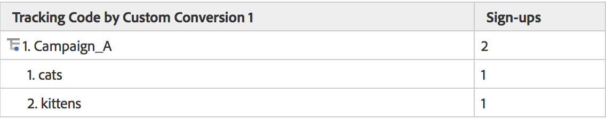

# Underordnade relationer

Fullständiga underrelationer är aktiverade för alla konverteringsrapporter, så du kan dela upp alla eVar med en annan eVar. Menyn Uppdelning efter i rapporttabellen matchar rapportmenyn i standardanalysrapporten, vilket ger enhetliga val

## Så fungerar underrelationer {#section_5BD862BB74FE411B96B59204520E4631}

Ta följande exempel som illustrerar hur underrelationer fungerar:

1. En användare kommer till din webbplats via Campaign_A och kommer till startsidan.
1. Användaren söker efter &quot;katter&quot; och visar sökresultaten. eVar1 håller reda på interna söktermer.
1. Användaren prenumererar på en e-postlista som spåras med event1.
1. En annan användare kommer till din webbplats även via Campaign_A och kommer till din hemsida.
1. Den här användaren söker efter &quot;kattungar&quot; och visas i sökresultat (eVar1) och prenumererar även på utskickslistan (event1).

Om du har tagit fram en rapport om spårningskod ser du följande:

Om du tog fram en eVar1-rapport skulle du se följande:

Om du har relaterat Campaign-rapporten till eVar1 får du följande:

Om du har relaterat eVar1-rapporten till Campaigns får du följande:

På grund av konverteringsvariablernas beständiga karaktär används två datakolumner för att lagra eVar. värdet som utlöses och värdet som kvarstår. Om vi tittar på en export av rådata för det här exemplet skulle det se ut så här (förenklat för det här exemplet):

Vår serverdel fungerar genom att post_campaign och post_evar1 kan behålla de värden som definierats i kampanj och evar1. Underrelationsrapporter tittar bara på träffar som innehåller lyckade händelser (rader markerade med ljusgul). De fyller sedan i underrelationsrapporterna baserat på de beständiga värdena (i det här fallet post_campaign och post_evar1, celler markerade med ljusgult).

Delrelationer följer i själva verket dessa steg för att fylla i rapporten:

* Isolera bildbegäranden som innehåller de lyckade händelser som du visar i rapporten.
* Returnera de beständiga värdena från varje konverteringsvariabel som används i underrelationen.
* Ordna värdena baserat på delrelationens ordning. Om en variabel inte har ett beständigt värde (till exempel om en eVar aldrig har definierats eller gått ut), kommer den att paketeras under Ingen.
