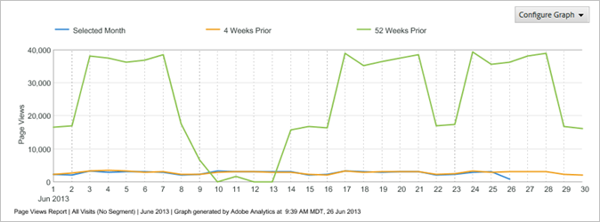
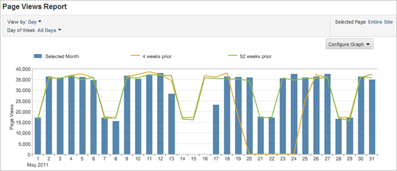
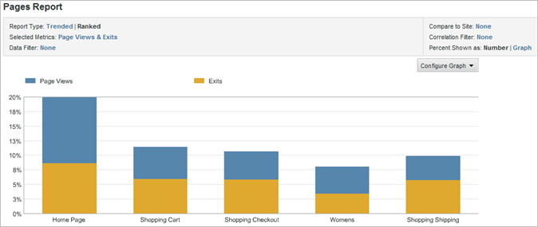

# Ändra rapportdiagram

Steg som beskriver hur du anpassar diagrammet så att det är mest användbart för den avsedda målgruppen.

Vilken typ av diagram som är tillgängliga beror på vilken typ av rapport du kör. Trend Line-diagram är till exempel användbara för trendrapporter, men du kan också använda ett vertikalt liggande diagram med trendlinjer som tydligt visar trender över dagar, veckor, månader osv. Du kan också välja ett cirkeldiagram om du vill visa procentvärden för de visade sidorna.

**Ändra ett rapportdiagram**

1. Kör en rapport.
1. Klicka på **[!UICONTROL Configure Graph]**.
1. Markera en diagramtyp.

   **[!UICONTROL Trend Line]**: Trendlinjer visar dagliga trender för rapportmätvärden och är användbara för trendning av ett mätvärde över tid per rad.

   

   **[!UICONTROL Smooth Line]**: Du använder den här diagramtypen tillsammans med  [!UICONTROL Video Detail Report]. Den visar antalet eller procentandelen vyer för specifika segment i en video. En ökning av vyerna för ett visst segment i videon anger att tittarna har rullat tillbaka och visat det avsnittet flera gånger. Om du använder procentvärden är procentandelen som visas i diagrammet en procentandel av alla segment som visas, inte en procentandel av de tittare som såg segmentet. I diagrammet är summan av alla rapportsegment till exempel 39. Antalet vyer för segmentet 0 till 10 sekunder är 10. Procentandelen vyer för det här segmentet är därför ungefär 26 procent.

   

   **[!UICONTROL Area]**: Ytdiagrammet liknar trendlinjediagrammet, men fyller i området nedanför linjerna. Du måste visa en trendrapport för att kunna visa ytdiagrammet.

   

   **[!UICONTROL Stacked Area]**: Staplade ytdiagram är användbara när du trendar ett antal produkter eller kampanjer över tid. Om du till exempel trendar de fem främsta produkterna med intäkter kan du snabbt se hur mycket de totala intäkterna genererar över tiden. Du kan förfina vyn genom att använda ett sökfilter för att inkludera eller exkludera specifika produkter.

   

   **[!UICONTROL Vertical Bar]**: Diagrammet Lodrät stapel visar relativa procentvärden för rapportmåtten.

   

   **[!UICONTROL Stacked Vertical Bar]**: Genom att stapla liknande objekt kan du snabbt få en bild av hur mycket ett objekt påverkar. I en [!UICONTROL Campaign Report] kan ni till exempel stapla liknande framgångsmått och se vilken kampanj som genererar störst framgång. Stapling gör det enklare att hitta kampanjer som inte är de främsta i ett mätresultat, men som är de bästa resultaten i en kombination av mätvärden.

   

   **[!UICONTROL Horizontal Bar]**: Diagrammet Vågrät liggande stapel liknar diagrammet Lodrät stapel, men kolumnerna är vågräta.

   

   **[!UICONTROL Stacked Horizontal Bar]**: Diagrammet Staplad vågrät liggande stapel liknar diagrammet Lodrät stapel, men kolumnerna är vågräta.

   

   **[!UICONTROL Pie]**: Cirkeldiagrammet visar de övre procentvärdena i förhållande till varandra och visar procentandelen av de valda måtten i förhållande till helheten. Du kan visa cirkeldiagrammet för rankade rapporter.

   

   **[!UICONTROL Scatter]**: Punktdiagrammet visar en punktbaserad visning av de mätvärden du väljer i förhållande till varandra. Med punktdiagram kan du visualisera data i två dimensioner, så att du kan identifiera vilka objekt som är avvikelser.

   

   **[!UICONTROL Bubble]**: I bubbeldiagrammet visas en bubbelvisning av de mätvärden du väljer i förhållande till varandra. Bubblornas placering visar förhållandet mellan mätvärdena på den vågräta och lodräta axeln, medan storleken på bubblan visar huvudrapportens mätvärden. Med bubbeldiagram kan du visualisera data i två dimensioner, så att du kan identifiera vilka objekt som är avvikelser.

   
