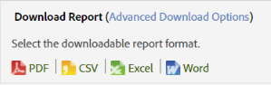

# Rapportschema och distribution

Information om schemaläggning, hämtning och distribution av rapporter.

När du schemalägger en rapport för leverans i ett Adobe Analytics-program kan du använda verktygen för schemaläggning och distribution för att se vilka filer som har skickats automatiskt och ändra eller avsluta leveranserna.

På grund av skillnader i bearbetningsmekanismer och plattformar har de olika typerna av hämtningsbara och schemalagda rapporter som finns i Adobe Analytics olika begränsningar vad gäller högsta antal rader som kan bearbetas i en och samma begäran. Här följer begränsningarna för varje:

* Word, CSV, Excel, HTML och PDF: Samma antal rader som visas i rapporten. Som standard är den här gränsen 50 rader, men den kan öka upp till 200. Uppdelningsrapporter har en hård gräns på 50 rader.
* Datautdrag: 50 000 rader
* data warehouse: Obegränsad

Dessa begränsningar gäller för enskilda schemalagda och nedladdade rapporter. Kontrollpaneler begränsas till det tillgängliga utrymmet i en rapportmodul.

>[!NOTE]
>
>&quot;Leveranstid&quot;/&quot;Dag&quot; som anges av användaren anger den tid som rapporten ska börja bearbetas, inte den tid som den faktiskt kommer att levereras. Den faktiska tiden som rapporten levereras baseras främst på hur lång tid det tar att behandla (komplexa och stora rapporter tar längre tid än enklare rapporter). Om en rapport t.ex. tar 15 minuter att bearbeta, kommer den faktiska leveranstiden att vara minst 15 minuter efter den ursprungligen angivna leveranstiden/&quot;Dagtid&quot;.
>Dessutom finns det ett antal andra faktorer som ytterligare kan öka fördröjningen innan rapporten faktiskt levereras:
>
> * **Köra många olika scheman av samma typ samtidigt**  (t.ex. många Dashboards) kan överlagra systemet. Schemaläggningssystemet tillåter endast ett fåtal (5-10) rapporter av någon typ att köras samtidigt, så när fler än 5-10 är schemalagda samtidigt måste vissa vänta i rad tills andra rapporter är klara innan de kan börja bearbeta. Problemet kan åtgärdas genom att man schemalägger ett företags rapporter vid olika tidpunkter under dygnet eller timmen i stället för samtidigt.
> * Förutom den specifika rapporttypen (Dashboards, osv.) väntar rapporter också på raden om företaget har **mer än 15-20 av någon typ av rapport som schemaläggs samtidigt (för alla olika rapporttyper)**. Detta kan minskas genom att tidsintervallen ökas i stället för att många körs exakt samtidigt.
> * **Problem i underordnade** tjänster som Schemaläggaren förlitar sig på kan också påverka rapportleveransen. Om du t.ex. använder API:erna separat för att köra rapporter och fylla i API-begärandekön kan dina schemalagda rapporter leverera långsamt medan du konkurrerar om den resursen.
> * **Rapporteringssvitens fördröjning**  (en fördröjning i datainsamlingen) kan även fördröja vissa schemalagda rapporter.

## Skicka en rapport {#task_27642CD33D484FD0BF59EBD159EEF52C}

Steg som beskriver hur du laddar ned och skickar rapporter via e-post i en mängd olika format och schemalägger en leveransrapport.

1. Kör en rapport och klicka sedan på **[!UICONTROL More]** > **[!UICONTROL Send]**.
1. Ange leveransalternativ:

   | Alternativ | Beskrivning |
   |--- |--- |
   | Format | Välj PDF eller HTML. |
   | Skicka till | Ange en e-postadress för att ta emot rapporten. |
   | Ämne | Ämne för e-postmeddelandet. |
   | Schemaläggning | Välj att skicka rapporten omedelbart eller med ett annat intervall. |

1. Klicka på **[!UICONTROL Advanced Delivery Options]** för att ange ett leveransschema.

| Alternativ | Beskrivning |
|--- |--- |
| Rapportfilnamn | Anger rapportens namn. Standardformatet är `<report name> for <suite> - <report date range>`. Välj [!UICONTROL Custom] om du vill ange ett eget namn. |
| Rapportformat | Här kan du ange PDF-, CSV-, Excel-, HTML-, Word- eller mobilformat för leverans. Om du väljer CSV kan du även ange kodning för CSV:<ul><li>Skift-JIS: Japansk teckenkodning.</li><li>EUC-JP: Utökad Unix-kod, främst för japanska, koreanska och förenklad kinesiska.</li></ul> |
| Rapportinnehåll | <ul><li>Antal rader i tabellen: Anger det antal rader som du vill ska vara synliga i tabellen i rapporten som du skickar.</li><li>Språk för sidhuvud och sidfot: Anger språket för sidhuvudet och sidfoten.</li><li>Kommentarer: Anger texten som visas i början av rapporten.</li></ul> |
| Skicka digital signaturfil | När du begär en rapport, till exempel en rapport med bokmärken eller Data warehouse, kan du begära en dataunderskrift. Adobe digitala signatur begränsar inte vem som har åtkomst till data, men syftet med den digitala signaturfilen (.sig) är att verifiera giltigheten hos den levererade rapportfilen. Med den digitala signaturen kan rapportmottagarna verifiera att filen kommer från Adobe och inte har ändrats. |
| Rapportdestination | <ul><li>E-post: Här kan du konfigurera e-postadressinställningar, ämnesraden och anteckningar.</li><li>FTP: Gör att du kan konfigurera FTP-inställningar, inklusive värd, port, katalog, användarnamn och lösenord.</li></ul> |

1. Klicka på **[!UICONTROL Scheduling Options]**.

| Alternativ | Beskrivning |
|--- |--- |
| Skicka rapport nu | Skickar rapporten omedelbart. |
| Schemalägg senare | Visar alternativ för att ange en tidsram och leveransalternativ. |
| Tidsram för rapport | **Fast**: Förhindrar att datumet flyttas när tiden går. **Rullande**: Tillåter att datumet flyttas framåt när tiden går. Vissa överväganden:<ul><li>Om du väljer Rolling för både start- och slutdatum och väljer en daglig rapport för föregående dag får du ett e-postmeddelande varje dag med en rapport för föregående dag.</li><li>Om du väljer Fast för startdagen och rullande för slutdagen får du den första dagen en rapport för föregående dag. Den andra dagen får du en rapport för de senaste två dagarna och den tredje dagen får du en rapport för de föregående tre dagarna, och så vidare.</li><li>Om du väljer Fast för både start- och slutdatum får du varje dag en identisk rapport för de dagar som du har angett.</li><li>Du kan inte välja ett rullande startdatum och ett fast avslutsdatum.</li></ul> |
| Leveransfrekvens | <ul><li>**Timme**: Levererar e-postmeddelandet varje timme, varannan timme eller något annat timintervall.</li><li>**Dagligen**: Skickar e-postmeddelandet varje dag, varannan dag, var tredje dag eller något annat intervall av dagar. Du kan också få det skickat varje veckodag.</li><li>**Varje vecka**: Skickar e-postmeddelandet varje vecka, varannan vecka, var tredje vecka eller något annat veckointervall. Du kan också ange vilken veckodag den skickas.</li><li>**Varje månad**: Anger intervallet i antal månader, och du kan också välja dagen i den månad då det skickas, eller veckodagen i en viss vecka i månaden.</li><li>**Årsvis**: Anger dagen på året då rapporten skickas eller så kan du skicka den en viss dag i veckan i vilken vecka som helst på året.</li><li>**Tid på dagen**: Gäller den tidszon som är kopplad till den valda rapportsviten.</li></ul> |
| Alternativ för slutleverans | <ul><li>**Aldrig slut**: Anger inget slut.</li><li>**Sluta efter  `value` förekomster**: Anger antalet förekomster innan leveransen avslutas.</li><li>**Sluta den**: Här kan du ange ett specifikt datum. Om du vill bearbeta data på samma datum som rapportdata, innehåller rapporten bara data som har placerats i databasen när rapporten skickas. Eftersom en fullständig behandling för en dag kan ta upp till 24 timmar, kanske fullständiga data inte är tillgängliga när rapporten skickas. För fullständiga data ska du alltid ange bearbetningstiden i 24 timmar efter rapportperiodens slut.</li></ul> |

## Skriv ut en rapport {#task_0F7CF6D6ED54462CAE4A793E271AF7E5}

Steg som beskriver hur du skriver ut en rapport.

1. Kör en rapport.
1. Klicka på **[!UICONTROL More]** > **[!UICONTROL Print]**.  

## Hämta en rapport med grundläggande alternativ {#task_43660107A1C9485D92981CD75B562577}

Ladda ned detaljerad information om en viss rapport i PDF-, CSV-, Excel- eller Raw Data Export-format.

1. I **[!UICONTROL Analytics]** > **[!UICONTROL Reports]** väljer du en rapport att visa.
1. Klicka på **[!UICONTROL Download]**.

   

1. Välj önskat format för rapporten:

   * **[!UICONTROL PDF]**: Anger att rapporten hämtas till Adobe PDF, vilket gör att du kan dela rapporten med andra, oavsett vilket datorsystem mottagaren kör.
   * **[!UICONTROL CSV]**: Anger att rapporten hämtas i  [!DNL .csv] (kommaavgränsat värdeformat).
   * **[!UICONTROL Excel]**: Anger att rapporten hämtas i Microsoft Excel-format, vilket gör att du kan dela rapporten med andra som kan öppna den i ett kalkylprogram.
   * **[!UICONTROL Word]**: Anger att rapporten hämtas i Microsoft Word-format.

   >[!NOTE]
   >
   >Om du använder ett av exportformaten i Raw-format för att hämta en rapport och sidnamnet är tomt, har Adobe Analytics förmodligen inte haft tillräckligt med tid för att bearbeta data. Ladda ned rapporten vid ett senare tillfälle.

## Hantera schemalagda rapporter {#task_C17677C543454FF2B06D10EA5652DFBC}

Information om hantering av schemalagda rapporter.

I [!UICONTROL Schedule Reports Manager] kan du redigera och ta bort återkommande rapportleveranser. Du kan skapa leveransscheman som skickar rapporter via e-post eller FTP till en angiven adress. Du kan konfigurera dessa scheman så att de automatiskt skickar rapporterna med angivna intervall under en tid eller på obestämd tid, eller så kan du stoppa leveransen av en återkommande rapport.

[!UICONTROL Schedule Report Manager] visar de objekt som en viss användare har skapat. Om användarkontot är inaktiverat i programmet stoppas alla schemalagda leveranser.

1. Klicka på **[!UICONTROL Analytics]** > **[!UICONTROL Components]** > **[!UICONTROL Scheduled Reports]** för att komma åt hanteraren.

## Dela en rapportlänk {#task_9711DDE9E140451B8C914EC5513E21EC}

Steg som beskriver hur du delar en rapport genom att generera en rapportlänk (URL) som ska skickas till en annan användare.

När mottagaren klickar på länken begär systemet inloggningsuppgifter (företagsnamn, användarnamn och lösenord). När du har loggat in visas den rapport som genererats av den ursprungliga användaren. Standardbehörighetsbegränsningar gäller.

**Dela en rapportlänk**

1. Kör en rapport.
1. Klicka på **[!UICONTROL More]** > **[!UICONTROL Link to This Report]**.

## Avbeställ schemalagda rapporter {#concept_6B48360F935740B6851BA85D32DEF637}

Du kan avbryta prenumerationen på schemalagda rapporter. Du får inte längre rapporten även om ditt användarnamn läggs till i den schemalagda rapporten.

>[!IMPORTANT]
>
>För att du ska kunna ta emot rapporten igen måste ett nytt schema skapas.

Så här avbeställer du en schemalagd rapport:

1. Öppna e-postmeddelandet med länken till den rapport som du vill avbeställa.

   

1. Klicka på länken **[!UICONTROL click here]** bredvid **[!UICONTROL To cancel automatic delivery of this report]**.

1. Bekräfta att du vill avbryta rapportleveransen.

   >[!NOTE]
   >
   >Det här arbetsflödet är detsamma oavsett om du är rapportschemaläggare eller rapportmottagare.

Om du avbryter prenumerationen på en rapport avbryts inte den schemalagda rapporten.

Om du vill avbryta en schemalagd rapport går du till Schedule Manager och klickar på det röda X:et bredvid rapportnamnet. [Mer...](/help/analyze/reports-analytics/scheduling.md#task_C17677C543454FF2B06D10EA5652DFBC)
