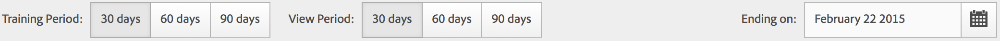

# Köra olika rapporttyper

Steg för att köra de olika rapporttyperna.

## Kör en rankad rapport {#task_C570BA4A213F4F2EB7B30E012934BE7D}

I en rankad rapport visar tabellen rangordningarna av rapportsidorna i förhållande till måttet, utifrån antal eller procent. Rankade rapporter kan visa flera mätvärden i en rapport.

<!-- 

t_reports_ranked.xml

 -->

1. Generera en rapport, till exempel en [!UICONTROL Pages Report] ( **[!UICONTROL Reports]** > **[!UICONTROL Site Content]** > **[!UICONTROL Pages]**).
1. Klicka på **[!UICONTROL Ranked.]** i rapportrubriken
1. Om du vill rangordna rapporten klickar du på en kolumnrubrik i tabellen.

   Rankade rapporter kan innehålla upp till 200 artiklar som listas i tabellen (t.ex. produkter, kategorier, webbsidor) och tio siffror (intäkter, order, vyer osv.).

## Kör en trendrapport {#task_F03B4E760B9E4EA29FC3F654E6316887}

Trendrapporter visar mätvärden över tid. Du använder den här rapporttypen när du vill se hur ett segment fungerar från en tidsperiod till nästa.

<!-- 

t_reports_trended.xml

 -->

De flesta konverterings- och trafikrapporter har en trendvy tillgänglig. Med [!UICONTROL Calendar] kan du visa förbättring för alla delningar av tidsperioder, t.ex. dagar i en månad, veckor i ett år, veckor i ett kvartal, månader i ett år o.s.v. Trendrapporter visar trender för ett enskilt mått (intäkter, order, vyer och så vidare) för upp till fem artiklar (som produkter, kategorier, webbsidor och så vidare).

**Köra en trendrapport**

1. Kör en konverterings- eller trafikrapport, till exempel **[!UICONTROL Reports]** > **[!UICONTROL Site Content]** > **[!UICONTROL Pages]**.
1. Under **[!UICONTROL Report Type]** klickar du på **[!UICONTROL Trended.]**

## Kör en konverteringsTratt-rapport {#task_B926A74AA6A641138C2986C1635120CB}

Konverteringstrattrapporter visar hur många besökare i procent som gått igenom en uppsättning händelser för att utföra en önskad åtgärd. Du kan till exempel se hur många besökare som har gått från att besöka din webbsida, genom att lägga till artiklar i en kundvagn och sedan till att köpa en artikel. Den här rapporten visar också antalet som föll ned längs vägen.

<!-- 

t_reports_conversion_funnel.xml

 -->

Om du vill köra den här rapporten väljer du en rapport, till exempel en sidrapport ( **[!UICONTROL Reports]** > **[!UICONTROL Campaigns]** > **[!UICONTROL Tracking Code]** > **[!UICONTROL Campaign Conversion Funnel]**).

En beskrivning finns i [Konverteringsrapporter](https://docs.adobe.com/content/help/en/analytics/components/variables/dimensions-reports/reports-conversion.html).

## Kör en utfallsrapport {#task_8FD97C8260464F9DA731A93DB8F80184}

I [!UICONTROL Fallout Report] visas antalet besökare som besökt en fördefinierad sidsekvens. Här visas också konverterings- och bortfallsfrekvenser mellan varje steg.

<!-- 

t_reports_fallout.xml

 -->

Kolla in den nya panelen [Bortfallsanalys](https://docs.adobe.com/content/help/en/analytics/analyze/analysis-workspace/visualizations/fallout/fallout-flow.html) i Analysis Workspace!

1. I [!UICONTROL Adobe Analytics] klickar du på **[!UICONTROL Reports]** > **[!UICONTROL Paths]** > **[!UICONTROL Pages]** > **[!UICONTROL Fallout]**.
1. Klicka på **[!UICONTROL Launch the Fallout Report Builder]** på sidan [!UICONTROL Fallout Report].

   

1. På sidan [!UICONTROL Define Checkpoints] anger du de kontrollpunkter som du vill använda för rapporten.
1. Klicka på **[!UICONTROL Run Report]**.

   

>[!MORELIKETHIS]
>
>* [Beskrivning av bortfallsrapport](https://docs.adobe.com/content/help/en/analytics/components/variables/dimensions-reports/reports-fallout.html)

## Kör en sidflödesrapport {#task_133E8B87C3F04DA0A42D10CBA499305B}

Sidflödesrapporter visar i vilken ordning besökarna kommer åt sidorna och navigerar på webbplatsen. Den här rapporten hjälper dig att svara

Kolla in den nya [Flödesvisualiseringen](https://docs.adobe.com/content/help/en/analytics/analyze/analysis-workspace/visualizations/fallout/fallout-flow.html) i Analysis Workspace!

Kör en [rapport för sökvägar](https://docs.adobe.com/content/help/en/analytics/components/variables/dimensions-reports/reports-paths.html).

Klicka till exempel på **[!UICONTROL Reports]** > **[!UICONTROL Paths]** > **[!UICONTROL Pages]** > **[!UICONTROL Next Page Flow]**.

Du läser den här rapporten från vänster till höger, med början på den valda sidan. De sidor som visades efter den valda sidan illustreras som en gren till höger.

Procentandelen som varje efterföljande sida visades visas bredvid sidans namn. Bredden på raden som är kopplad till varje nästa sida visar den relativa procentandelen.

**[!UICONTROL Path Views]**: Anger hur många gånger en sida visades, när den begränsades till de visade sökvägarna.

Sidan Integritetspolicy kan t.ex. ha totalt 10 000 sidvisningar, men endast 500 av dessa sidvyer inträffade direkt efter hemsidan. Termen sökvägsvy används därför.

Den relativa procentandelen avbildas av linjens relativa bredd. Som standard visar den här rapporten fem grenar på andra nivån och fem grenar på tredje nivån. Du kan utöka antalet grenar så att du kan visa upp till tio grenar på andra nivån och fem grenar på tredje nivån. Om du gör det höjden på rapporten ökas höjden, vilket troligen kräver bläddring för att visa hela diagrammet.

## Kör en trattrapport {#task_2BBF6FACD48F479E8B2EE458919941CB}

Du kan välja lyckade händelser och lägga till dem i en [!UICONTROL Purchase Conversion Funnel]-rapport eller en [!UICONTROL Product Conversion Funnel]-rapport.

<!-- 

t_reports_funnel.xml

 -->

1. Klicka på **[!UICONTROL Reports]** > **[!UICONTROL Products]** > [Produktkonverteringstratt](https://docs.adobe.com/content/help/en/analytics/components/variables/dimensions-reports/reports-conversion-funnel.html).

## Kör en marknadsföringskanalrapport {#task_64ADED5CC75248319E06E3E029B47F78}

Marketing Channel-rapportering ger en översiktsrapport över den första och sista beröringskanalen, med standardstatistik som intäkter, order och kostnader. Med hjälp av dessa rapporter kan ni analysera hur mycket intäkter varje kanal genererar.

<!-- 

t_reports_marketing_channel.xml

 -->

Mer information finns i hjälpsystemet [Marketing Channel](/help/components/c-marketing-channels/analyze-mc.md).

## Kör en avvikelseidentifieringsrapport {#task_4808C96327354D789C075823F5C3A049}

Beskriver hur du tolkar Sammanfattning och Individuella måttscheman i avvikelseidentifiering.

<!-- 

t_anomaly_view.xml

 -->

Kolla in de nya [analysfunktionerna för avvikelseidentifiering och bidragsanalys](https://docs.adobe.com/content/help/sv-SE/analytics/analyze/analysis-workspace/virtual-analyst/anomaly-detection/anomaly-detection.html) i Analysis Workspace!

**[!UICONTROL Reports]** > **[!UICONTROL Site Metrics]** > **[!UICONTROL Anomaly Detection]** .

>[!NOTE]
>
>Du kan också köra avvikelseidentifiering inifrån Analysis Workspace-projekt. [Mer...](https://docs.adobe.com/content/help/en/analytics/analyze/analysis-workspace/virtual-analyst/anomaly-detection/anomaly-detection.html)

Information om hur du konfigurerar avvikelseidentifiering finns i [referenshandboken](https://docs.adobe.com/content/help/en/analytics/analyze/reports-analytics/getting-started.html#Setting_up_Anomaly_Detection).

Analysidentifiering visar två typer av diagram: Ett sammanfattningsdiagram och enskilda mätdiagram. Enskilda måttscheman visas endast om minst en avvikelse har identifierats för det måttet.

<table id="table_88163CD8FC164342855D90D01F9C581A"> 
 <thead> 
  <tr> 
   <th colname="col1" class="entry"> 
Typ av diagram 
 </th> 
   <th colname="col2" class="entry"> 
Vad gör 
 </th> 
  </tr> 
 </thead>
 <tbody> 
  <tr> 
   <td colname="col1"> 
Sammanfattningsdiagram 
 
 
 </td> 
   <td colname="col2"> 
 
     <ul id="ul_D26DA3024CD7468291369F549557B28A"> 
      <li id="li_1C22B6E02FFB479FB71EFAD89EB37A4E">Varje ruta representerar en avvikelse som spåras per dag och som motsvarar ett mått nedan. </li> 
      <li id="li_8FC587D3FF4E452D83263CC7A10B6675">Grönt anger avvikelser ovanför trendlinjen, blått under trendlinjen. </li> 
      <li id="li_25135AB691BF443599AF2A3A60E2E71A">Anger avvikelsens styrka: Ju större avvikelse, desto mörkare blir datapunktens färg och desto längre bort från trendlinjen. </li> 
      <li id="li_0C42AFA8897D420D8AB1A5D0F65B3B3A">Om du klickar på enskilda avvikelser placeras den avvikelsens individuella måttschema (under sammanfattningsdiagrammet) överst. </li> 
      <li id="li_85C0F426952547B5A75D6BD31DE19CA5">Procentvärdena för avvikelsen (vänster om diagrammet) beräknas enligt följande: 
       <ul id="ul_BEC0A88BFFAC4CF78BC9885FEB749694"> 
        <li id="li_1BAB2F50482745B69937DFAF1E09982E">Om de övre gränserna och det förväntade värdet är samma, är avvikelsen % 100 % </li> 
        <li id="li_CA48064F5788448C8646CCE196161237">I annat fall är avvikelsen % (faktiskt värde - övre gränsvärde) / (övre gränsvärde - förväntat värde) * 100 </li> 
        <li id="li_4090357A0D214BC7B1C3DE0615875554">Om de nedre gränserna och det förväntade värdet är samma, är avvikelsen % -100 % </li> 
        <li id="li_EF694E1A4E874ECD94E1E8F7302E494F">I annat fall är avvikelsen % ((nedre gränsvärde - faktiskt värde) / (förväntat värde - undre gränsvärde) * -100 </li> 
       </ul> </li> 
      <li id="li_5C05EF7023484CC993E96D63E842B65C">Om du klickar på  Visa segment  öppnas segmentspåret där du kan tillämpa segment i en avvikelseidentifieringsrapport. <a href="https://docs.adobe.com/content/help/en/analytics/components/segmentation/seg-home.html"  > Mer  </a> om segmentering. </li> 
      <li id="li_1B41CABF13D1407886C68EE3BC201E60">Om du klickar på  Redigera mått kan du markera och avmarkera mått som du vill identifiera avvikelser för. </li> 
     </ul> 
 </td> 
  </tr> 
  <tr> 
   <td colname="col1"> 
Individuellt måttdiagram 
 
 
 </td> 
   <td colname="col2"> 
 
     <ul id="ul_739C5687013743A29B63089FDA763F45"> 
      <li id="li_456A0BDA4D4E46CE9CC1C3DBAA1E2220">Visar avvikande datapunkter för enskilda trendmått (inklusive beräknade värden) som punkter. </li> 
      <li id="li_89FD847C65F04F48BCA7CD38D0EC51CD">Visar den senaste avvikelsen överst och rankas sekundärt efter antal avvikelser. </li> 
      <li id="li_98B97A9706DE4455B8D8850904CBDE03">Visar en heldragen linje för att visa faktiska data som samlats in. Detta jämförs med prognosen och felmarginalen för att ta reda på om datapunkterna är onormala. </li> 
      <li id="li_0EEA38DDDC344BF3879430E67D74EB72">Visar en prickad linje som representerar en prognos baserad på historiska data (d.v.s. utbildningsperioden). </li> 
      <li id="li_035BD2725D004AEDB630BF8DFF4DA4F3">Visar övre och nedre 95 % konfidensintervall/gränser i en grå ton. </li> 
      <li id="li_021A3D1F2EDB4319B9B39620EF1C038A">Gör att du kan komprimera och expandera enskilda rapporter genom att klicka på upp- eller nedpilarna bredvid måttnamnet. </li> 
      <li id="li_722E4B9FC21047AC96D7B143197E293D">Ändrar den ordning i vilken måttdiagrammen visas genom att reagera på detaljerna i översiktsrapporten (se ovan) </li> 
      <li id="li_A2441169B185475AA68A64F81E6E40B8">Gör att du kan filtrera diagram genom att använda söktermer, t.ex. "sida" för alla sidrelaterade mått. </li> 
      <li id="li_F1BBBFCA8E2A43C29658E4FCAA36C904">Gör att du kan visa alla mått som du har definierat eller endast de med avvikelser. </li> 
     </ul> 
 </td> 
  </tr> 
 </tbody> 
</table>

## Konfigurera avvikelseidentifiering {#task_AF347B34F56E44A6AE70E019B6EB2F08}

Steg för att välja rapportsviter, mätvärden och utbildnings-/visningsperioder för avvikelseidentifiering.

<!-- 

t_anomaly_config.xml

 -->

Du ställer in avvikelseidentifiering oberoende av rapportsviten.

1. Navigera till  **[!UICONTROL Analytics > Reports > Site Metrics > Anomaly Detection]** .
1. Välj den rapportsvit som du vill spåra daglig avvikelseidentifiering för. Om du vill visa en lista med rapportsviter klickar du på den nedrullningsbara menyn Rapportsvitväljare.
1. Om du vill välja mått och/eller definiera filtrerade mått klickar du på **[!UICONTROL Edit Metrics]** längst upp till höger på skärmen:  .

   Du kan välja mätvärden från listan (inklusive beräknade värden) med alla mätvärden eller från en lista med spårade mätvärden. Du kan också filtrera efter specifika termer för att begränsa listan. 1. När rapporten har skapats definierar du **[!UICONTROL Training Period]** och **[!UICONTROL View Period]** för avvikelseidentifiering. (Se utbildningsperioden som&quot;inlärningsperiod&quot; för algoritmen.)

   

   Kom ihåg:

* Utbildningsperioden avslutas precis innan vyperioden börjar.
* Standardvärdet för båda är 30 dagar, och du kan utöka dem till 60 eller 90 dagar.
* Om du förlänger utbildningsperioden får dina data ett större sammanhang och kan minska storleken på en avvikelse.

   Rapporten för avvikelseidentifieringsstatistik uppdateras varje gång du ändrar en parameter.
1. (Valfritt) Använd segment i rapporten genom att klicka på **[!UICONTROL Show Segments]** och markera ett eller flera befintliga segment eller skapa ett nytt segment och använda det.

   

   Mer information om hur du skapar och hanterar segment finns i [Analytics Segmentation Guide](https://docs.adobe.com/content/help/en/analytics/components/segmentation/seg-home.html). 1. (Valfritt) Favorit eller bokmärk rapporten.
1. (Valfritt) Ändra slutdatumet för visningsperioden. Standardvärdet är igår.
1. Nu kan du börja tolka rapporten. [Visa avvikelseidentifieringsdiagram](/help/analyze/reports-analytics/t-running-report-types.md#task_4808C96327354D789C075823F5C3A049).

## Kör en realtidsrapport {#task_5D25929C918E40B18965222FA94176B0}

Beskriver hur du visar och tolkar realtidsrapporter.

<!-- 

reports_realtime.xml

 -->

**[!UICONTROL Reports > Site Metrics > Real-Time]** .

Realtidsrapportering innehåller två huvudrapporter - en översiktsrapport och en detaljrapport. De består av ett antal rapporter.

Information om hur du konfigurerar realtidsrapporter finns i [referenshandboken för analyser](https://docs.adobe.com/content/help/en/analytics/landing/home.html#RealTime_Reports_Configuration).

1. Ta en titt på **[!UICONTROL Overview]**-rapporten och dess komponenter:  

   <table id="choicetable_8586BECF55E843B2B5CD41205567EA32"> 
   <thead class="chhead sthead"> 
   <th class="choptionhd"> UI-komponent </th> 
   <th class="chdeschd"> Beskrivning </th> 
   </thead> 
   <tr class="chrow strow"> 
   <td class="choption"><strong>Välj Report Suite</strong></td> 
   <td class="chdesc stentry"> Visar rapportsviten som den här realtidsrapporten omfattar. Information om hur du ändrar rapportsviten finns i <a href="https://docs.adobe.com/content/help/en/analytics/admin/admin-tools/real-time-reports/t-realtime-admin.html"  > Konfiguration av realtidsrapporter </a>. </td> 
   </tr> 
   <tr class="chrow strow"> 
   <td class="choption"><strong>Växla mellan rapporter</strong></td> 
   <td class="chdesc stentry"> Här kan du växla mellan de rapporter du har ställt in (högst 3). </td> 
   </tr> 
   <tr class="chrow strow"> 
   <td class="choption"><strong>Välj tidsintervall</strong></td> 
   <td class="chdesc stentry"> Här kan du välja det övergripande tidsintervallet som ska användas av alla rapporter i rapporten. </td> 
   </tr> 
   <tr class="chrow strow"> 
   <td class="choption"><strong>Konfigurera rapporter</strong></td> 
   <td class="chdesc stentry"> Den här kugghjulsikonlänken visas bara om du har administratörsbehörighet. Om du klickar på den öppnas Report Suite Manager under   Admin Tools  &gt;  Report Suites  &gt;  Edit Settings  &gt;  Real-Time  . </td> 
   </tr> 
   <tr class="chrow strow"> 
   <td class="choption"><strong>Helskärmsläge</strong></td> 
   <td class="chdesc stentry"> Ikonen för helskärmsläge visas bara om bildskärmen har ett visst proportioner (16:9 eller 16:10) OCH om webbläsaren stöder det. Observera att du inte kan interagera med skärmen när den är i helskärmsläge (tryck på  Esc  för att avsluta). Helskärmsläge gör inte timeout. </td> 
   </tr> 
   <tr class="chrow strow"> 
   <td class="choption"><strong>Platstrafikrapport</strong></td> 
   <td class="chdesc stentry"> Den blå trendlinjen visar den totala trafiken för webbplatsen. X-axeln använder literala etiketter (för 15 minuter sedan, för 10 minuter sedan) förutom det aktuella värdet, som visas som ett realtidsuttryck. </td> 
   </tr> 
   <tr class="chrow strow"> 
   <td class="choption"><strong>Site Total Report</strong></td> 
   <td class="chdesc stentry"> Visar antalet Webbplatssummor för de senaste N minuterna i realtidsrapportens valda mått. "N" kan konfigureras med tidsintervallväljaren. 
Pilens färg och riktning baseras på följande algoritm: 
      <ul id="ul_9F40CEA33798467393CB1266BB36D500"> 
      <li id="li_CCD01A44F912487DA5681EA50113643C">Betydande förstärkning (uppåtpil): &gt; 100 % </li> 
      <li id="li_7402491A9A614851B7F2AE0C77BD9A97">Vinst (uppåthögerpil): mellan 5 % och 100 % </li> 
      <li id="li_BCA79C08B5714D4B9315068112C66107"> Platt (högerpil): mellan 5 % och -5 % </li> 
      <li id="li_234ECBD7D83A4AE680E4A70BF288681F"> Förlust (högerpil nedåt): mellan -5 % och -100 % </li> 
      <li id="li_10C5EA8803604C1CA714D3DB27478B31"> Betydande förlust (nedpil): &lt; -100% </li> 
      </ul> 
 
Om platsens totala antal rapporteras i "instanser", återspeglar dessa instanser dimensionen i den primära rapportleten. Om det finns ett instansspecifikt namn (t.ex. "Sidvyer") rapporterar platsens totala namn. 
 </td> 
   </tr> 
   <tr class="chrow strow"> 
   <td class="choption"><strong>Primär rapportlet</strong></td> 
   <td class="chdesc stentry"> Rapport för realtidsrapportens primära dimension och för dess mått. Visar en trendlinje för det elementet för det valda tidsintervallet. Måttsumman representerar summan för hela trendlinjen. Pilen anger om objektet är kraftigt uppåt, uppåt, platt, nedåt eller till stor del förlorar. </td> 
   </tr> 
   <tr class="chrow strow"> 
   <td class="choption"><strong>Dialogrutan Sök</strong></td> 
   <td class="chdesc stentry"> Sökningen påverkar alla rapporter. Sökningen kvarstår när du visar rapporten. </td> 
   </tr> 
   <tr class="chrow strow"> 
   <td class="choption"><strong>Sortera efter.. Mest populära/generatorer/förlorare</strong></td> 
   <td class="chdesc stentry"> Du kan växla till att sortera efter  Popular  (standard),  Gainers  (mått som visar störst tillväxt) och  Losers  (dimensioner som finns på en nedåtriktad projektbana). 
Här är formeln som används för att bestämma vinjetter eller förlorare: I realtid undersöks det tidigaste exemplet och det näst senaste exemplet och en enkel beräkning av "% change" utförs. Om"De senaste 15 minuterna" markeras och n representerar den aktuella minuten, jämförs n-1 med n-15. I realtid görs för närvarande ingen viktning. Den aktuella minuten ignoreras eftersom den inte är fullständig och troligen ger en falsk %-ändring. 
 
Den här formeln är konsekvent för alla mätvärden som används i realtidsrapporten. 
 </td> 
   </tr> 
   <tr class="chrow strow"> 
   <td class="choption"><strong>Sekundär 1-rapport</strong></td> 
   <td class="chdesc stentry"> Visar realtidsrapporter för den andra tilldelade rapportens dimension och för måttet. 
I den sekundära rapportletten visas de fyra viktigaste kategorierna. det femte är en sammanställning av alla återstående värden. För varje kategori anges den totala råvyn för den kategorin. Dessutom visas summan för alla kategorier i mitten. 
 
 När du hovrar i ett avsnitt markeras den associerade kategorin och kategoritrendlinjen visas nedanför munstycket. 
 
 När du hovrar på ett radobjekt markeras radobjektet plus det tillhörande avsnittet och kategoritrendlinjen visas nedanför munstycket. 
 </td> 
   </tr> 
   <tr class="chrow strow"> 
   <td class="choption"><strong>Sekundär 2-rapport</strong></td> 
   <td class="chdesc stentry"> Visar realtidsrapporter för den tredje tilldelade rapportens dimension och för måttet. Om du placerar pekaren ovanpå objektetiketten skjuts etiketten åt höger och en trendlinje för det hovrade objektet visas. </td> 
   </tr> 
   </table>

1. Klicka på ett listobjekt i den primära rapporten för att starta vyn **[!UICONTROL Details]** för det listobjektet:  

   | **Artikeltrendrapport** | Visar trendlinjen för objektet som markerades i översiktsrapporten under de senaste N minuterna. N kan konfigureras via tidsintervallväljaren. |
   |---|---|
   | **Artikelsumma, rapport** | Visar det totala antalet mätvärden för objektet som markerades i översiktsrapporten under de senaste N minuterna. N kan konfigureras via tidsintervallväljaren. |
   | **Korrelerad sekundär 1-rapport** | Den här rapportleten liknar mycket den sekundära 1-rapporten. Den enda skillnaden är den datakälla som används för att fylla i den här rapporten: I det här exemplet visar det korrelationen (eller uppdelningen) mellan en viss sida (den som du valde i den primära rapportleten i översiktsrapporten) och de förekomster som visas. |
   | **Korrelerad sekundär rapport 2** | Den här rapportleten liknar mycket den andra rapportleten. Den enda skillnaden är den datakälla som används för att fylla i den här rapporten: I det här exemplet visar det korrelationen (eller uppdelningen) mellan en viss sida (den du valde i den primära rapportleten i översiktsrapporten) och språkdimensionen. |
