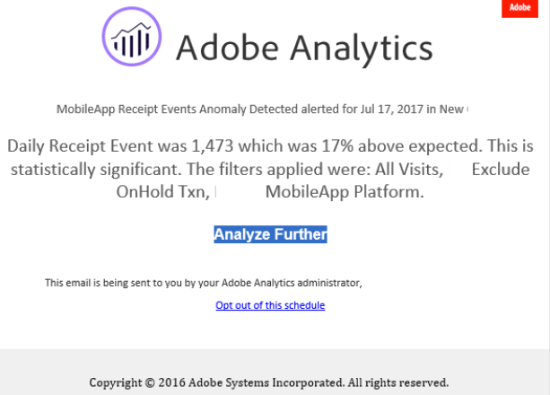

# Skapa aviseringar {#create-alerts}

<!-- markdownlint-disable MD034 -->

>[!CONTEXTUALHELP]
>id="components_alerts_timegranularity"
>title="Tidsgranularitet"
>abstract="Tidsgranularitet avser hur ofta varningen kontrolleras."

<!-- markdownlint-enable MD034 -->

>[!NOTE]
>
>Det går bara att använda aviseringar med avvikelseidentifiering (kallas även _Intelligent Alerts_) för organisationer med ett Adobe Analytics Prime- eller Ultimate-paket.

Med varningar i Adobe Analytics kan du meddelas baserat på ändrade procentsatser eller specifika datapunkter. Beroende på ditt Adobe Analytics-paket kan du även använda varningar som utlöses baserat på avvikelsetrösklar. Varningar om användning av serversamtal är en annan typ av varning som bara är tillgänglig för Analytics-administratörer. Dessa varningar meddelar dig om risken för eller förekomsten av en överbelastning i serversamtalsförbrukning och åtagandedata. Mer information finns i [Varningar om användning av serversamtal](/help/admin/tools/server-call-usage/scu-alerts.md).

Mer detaljerad information om aviseringar finns i [Översikt över aviseringar](alerts-overview.md).

Så här skapar du en varning:

1. Använd något av följande sätt för att skapa en varning:

   * Öppna ett projekt i Analysis Workspace och välj sedan **[!UICONTROL Components]** > **[!UICONTROL Create alert]**.
   * Öppna ett projekt i Analysis Workspace och använd sedan följande kortkommando: ***cmd + shift + a*** (macOS) eller ***ctrl + shift + a*** (Windows).
   * Öppna ett projekt i Analysis Workspace, markera ett eller flera linjeobjekt i en frihandstabell, högerklicka och välj **[!UICONTROL Create alert from selection]**. Den här åtgärden fyller i [varningsverktyget](alert-builder.md) i förväg för att skapa en avisering med rätt mått och filter.
   * Skapa en avisering [från aviseringshanteraren](/help/components/alerts/alert-manager.md#create-alerts).

   Varningsbyggaren visas. Gränssnittet är välbekant med gränssnittet för att skapa segment eller beräknade värden i Analytics.

## Varningsverktyg

Gränssnittet i Alert Builder liknar det gränssnitt du använder för att skapa segment eller beräknade värden i Customer Journey Analytics:

Ange följande information i varningsverktyget för en avisering:

| Element | Beskrivning |
|---------|----------|
| **[!UICONTROL Title]** | Ange ett namn för aviseringen. Varningsnamnet kan innehålla rapportens namn eller måttets tröskelvärde. |
| **[!UICONTROL Description (optional)]** | Ange en beskrivning för aviseringen. |
| **[!UICONTROL Time granularity]** | Välj hur ofta du vill att måttet ska kontrolleras: Varje dag, Varje vecka eller Varje månad.
 |
| **[!UICONTROL Recipients]** | Ange var aviseringen kan skickas. En avisering kan skickas till en Analytics-användare, en Analytics-grupp, en raw-e-postadress eller till ett telefonnummer.
<b>Viktigt</b>: Telefonnumret måste föregås av en `+` och en [landskod](https://countrycode.org/).

Ett exempel på e-postmeddelandet som en användare får:

 |
| **[!UICONTROL Expiration date]** | Ange det datum och den tidpunkt då du vill att aviseringen ska förfalla. |
| **[!UICONTROL Delay]** | Den tid som krävs innan data är fullständiga och tillgängliga för att rapporteras i Customer Journey Analytics varierar beroende på organisation, vanligtvis mellan 3 och 9 timmar efter datahändelsetiden. För att varningarna ska vara korrekta måste händelsedata för ett givet händelseintervall vara fullständiga, vilket innebär att Adobe inte längre tar emot några händelsedata för det angivna händelseintervallet.
Om du vill ta hänsyn till den här fördröjningen av inmatningstiden har aviseringar en standardfördröjning på 9 timmar innan de skickas.

Du kan justera standardfördröjningen på 9 timmar till valfri plats mellan 0 och 24 timmar. Om du minskar fördröjningen till under 9 timmar kan det dock innebära att du rapporterar ofullständiga data, vilket leder till felaktig varningsinformation.

Tänk på följande när du minskar fördröjningstiden:
<ul><li>**Förstå datatillgänglighet jämfört med datainsamling**: Alla batchdata importeras endast till en Experience Platform-datauppsättning efter en period på 3 till 9 timmar. För att varningarna ska vara korrekta måste datainmatningen vara fullständig, med alla batchdata tillgängliga i datauppsättningen.</li><li>**Bestäm hur lång tid det tar för dina data att bli fullständiga och tillgängliga i datauppsättningen**: Dataöverföringstiderna skiljer sig åt i olika organisationer. Se till att fördröjningen som du väljer för varningsleverans är samma eller mindre frekvent än den tid det tar för batchdata att vara tillgängliga i plattformsdatauppsättningen <!--add link? -->.</li>
**Tips!** Det mest korrekta sättet att veta hur lång tid det tar för alla batchdata att slutföras och hämtas till plattformsdatauppsättningen är att rådfråga datateknikerna i organisationen.

Du kan också få en allmän uppfattning om hur lång tid det tar för batchleveransen i din organisation att vara tillgänglig i Experience Platform datamängd. Skapa följande friformstabell i Analysis Workspace:
<ol><li>I en frihandstabell i Analysis Workspace lägger du till måtten [!UICONTROL **Händelser**] och [!UICONTROL **Dag**] .</li><li>Dela upp dimensionen [!UICONTROL **Dag**] med en [!UICONTROL **Timmar**]-dimension.
Timmar som inte har några data visas som 0.
</li></ol><li>**Ta hänsyn till fel i dina beräkningar**: Om du minskar standardfördröjningstiden konfigurerar du fördröjningen i minst en timme längre än den tid det tar för organisationen att få en fullständig dataöverföring. Om det till exempel finns en 3-timmars fördröjning innan dataimporten är klar bör du ange fördröjningen till 4 timmar.</li> |
| **[!UICONTROL Send an alert when]** | [!UICONTROL **Någon av dessa mätvärden utlöser**]: <ol><li>Dra och släpp mätvärden (inklusive beräknade mätvärden) för att skapa utlösare för aviseringen.
Ett *inkompatibelt komponentmeddelande* visas om inte alla mått, dimensioner eller segment i aviseringen är kompatibla med den valda rapportsviten.

Bestäm tröskelvärdet (för en avvikelse) som mätvärdet måste överstiga eller det värde (om värdet är högre, lägre, lika med eller procentuell ändring) som ska användas innan en varning ställs in.</li><li>Välj något av följande villkor:<ul><li>avvikelse finns</li><li>avvikelsen är större än förväntat</li><li>avvikelsen är under förväntad</li><li>är över eller lika med</li><li>är under eller lika med</li><li>ändras med</li></ul></li><li>Välj ett tröskelvärde eller ange ett värde.</li></ol>[!UICONTROL **Med alla dessa filter**]: Dra och släpp segment eller dimensioner för att lägga till filter i aviseringen. Om du till exempel lägger till segmentet *Endast mobila enheter* innebär det att regeln bara aktiveras för mobila enheter. Du kan lägga till ytterligare filter med en AND-programsats. Du kan lägga till OCH- eller OR-regler genom att klicka på kugghjulsikonen.

Se [Varningar - användningsfall](alerts-use-cases.md) använder till exempel fall.
 |
| **[!UICONTROL Preview]** | Den interaktiva förhandsvisningen visar hur ofta, ungefär, en varning utlöses baserat på tidigare erfarenheter.
Om du t.ex. anger tidsterminalariteten till daglig, kan förhandsgranskningen tala om för dig att varningen skulle ha utlösts för ett visst mått x gånger under de senaste 30 eller 31 dagarna.

Om för många aviseringar utlöses kan du justera tröskelvärdet i [Hantera aviseringar](alert-manager.md).

{width="50%"}
 |
