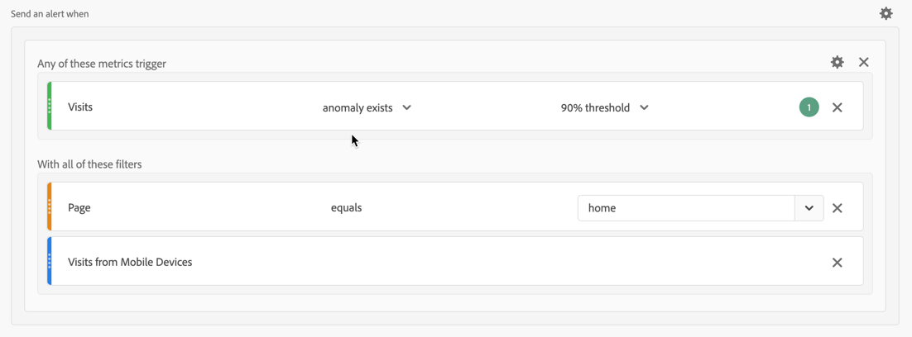

# Användningsfall för avisering

Du kan skapa aviseringar enligt beskrivningen i [Skapa aviseringar](alert-builder.md).

I följande avsnitt visas exempel på användningsområden som du kan använda när du skapar varningar.

## Filtrera aviseringar

Du kan skapa enkla varningar med hjälp av segment. Du kan till exempel definiera en avisering om antalet sessioner för personer som besöker hemsidan via en mobilappssession.

## Stapla aviseringar

Du kan konsolidera (stapla) aviseringar i stället för att skapa flera aviseringar. Med staplingsmeddelanden kan du vara säker på att varningar kombineras och du inte får ett antal separata varningar. I exemplet nedan skickas en avisering när någon av måtttrösklarna aktiveras.

