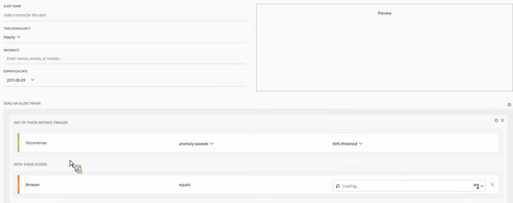

# Intelligenta aviseringar - användningsfall

## Skapa en enkel avisering filtrerad av två segment {#filter}

## Skapa en avisering från ett tabellval {#from-selection}

I frihandstabeller kan du nu skapa snabbmeddelanden genom att högerklicka på en tabellrad och välja **[!UICONTROL Create Alert from Selection]**.

Detta fyller i varningsfunktionen automatiskt för att skapa en avisering med rätt mätvärden och filter:

## Konsolidera (hög) aviseringar i stället för att skapa flera aviseringar {#stacking}

Med staplingsmeddelanden kan du vara säker på att varningar kombineras och du inte får ett antal separata varningar.

