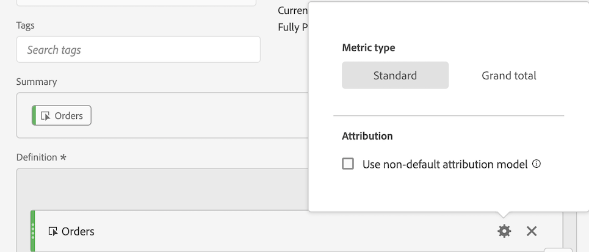

# Bygg upp en orderassistent

Följande information förklarar hur du skapar ett mätvärde som visar vilka marknadsföringskanaler som hjälper dig att hantera beställningar. Detta kan anpassas till alla dimensioner eller framgångsrika händelser av intresse.

1. Börja skapa ett beräknat mått enligt beskrivningen i [Bygg mätvärden](/help/components/c-calcmetrics/c-workflow/cm-workflow/c-build-metrics/cm-build-metrics.md).

1. I verktyget Beräknade mått anger du måttet&quot;Assisted Orders&quot; eller något liknande.

1. Dra i ett ordningstal på arbetsytan Definition. Justera sedan attribueringsmodellen med inställningsverktyget genom att kontrollera **[!UICONTROL Use non-default attribution models]** kryssrutan.

   

1. Välj **[!UICONTROL Custom]** som attribueringsmodell. Ändra bredderna till 0 (start), 100 (spelare) och 0 (närmare).

   

1. Välj [!UICONTROL **Använd**] > [!UICONTROL **Spara**].

1. I Analysis Workspace skapar du en frihandstabell med mått för marknadsföringskanal, beställningar och nya måtten för Assisted Orders.

   

   Det här är ett enkelt sätt att se vilka marknadsföringskanaler som har hjälpt till med körorder. Du kan också högerklicka på ett mätresultat i en frihandstabell och justera attribueringsmodellen direkt i tabellen.

1. (Valfritt) Dela mätvärdena med andra användare i organisationen enligt beskrivningen i [Dela beräknade värden](/help/components/c-calcmetrics/c-workflow/cm-workflow/cm-sharing.md).
