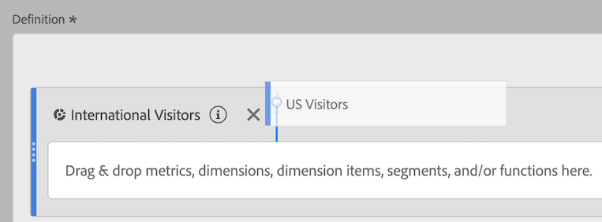

# Stapla och ersätta segment

Du kan stapla och ersätta segment i verktyget Beräknade mätvärden.

## Stapla segment {#section_3FC1118FEE2B40B7BB90F29C8521AF53}

1. Börja skapa ett mätvärde enligt beskrivningen i [Bygg mätvärden](/help/components/c-calcmetrics/c-workflow/cm-workflow/c-build-metrics/cm-build-metrics.md).

1. På arbetsytan Definition släpper du det nya segmentet bredvid det befintliga:

## Ersätta ett segment med ett annat {#section_3DA899DF522A44D7A583C5DC8C0A033E}

1. Börja skapa ett mätvärde enligt beskrivningen i [Bygg mätvärden](/help/components/c-calcmetrics/c-workflow/cm-workflow/c-build-metrics/cm-build-metrics.md).

1. På arbetsytan Definition släpper du det nya segmentet ovanpå det befintliga:

