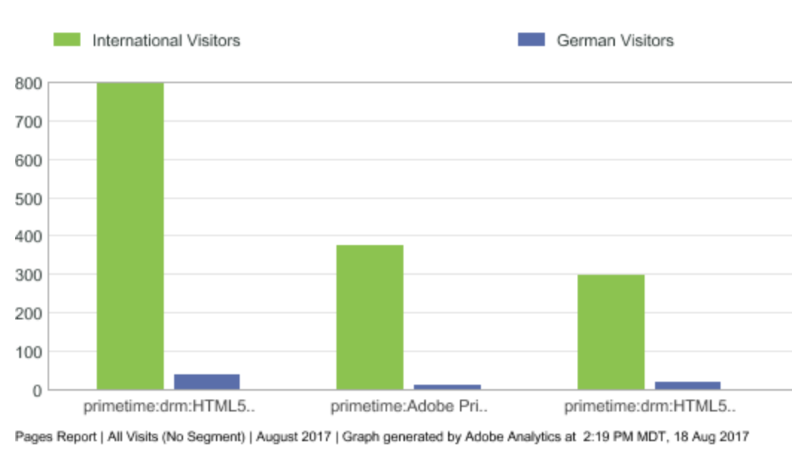
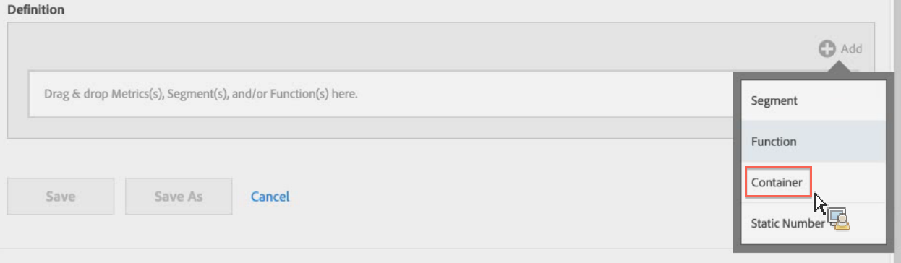
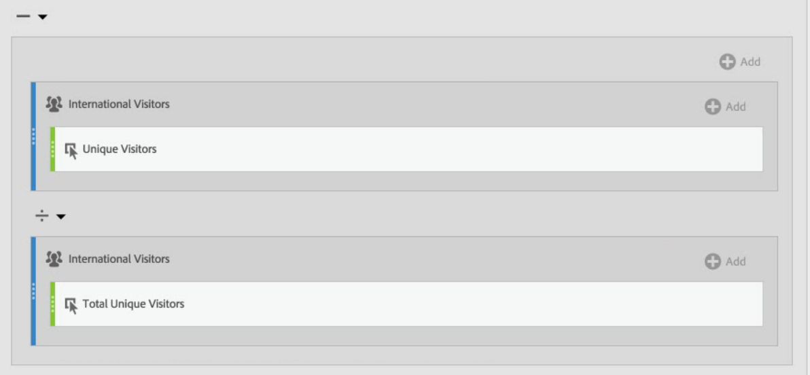

# Segmenterade mätvärden

Genom att segmentera enskilda mätvärden kan ni göra mätjämförelser inom samma rapport. (Endast härledda värden)

## Jämför segment {#section_29A6E0070F084BFDB6228FA9CE106F48}

Låt oss säga att du vill jämföra olika aspekter av ett&quot;US Visitors&quot;-segment med ett&quot;International Visitors&quot;-segment. Du kan skapa mätvärden som ger dig insikter som:

* Hur fungerar innehållssökning jämfört med de två grupperna? (Ett annat exempel är: Hur skiljer sig konverteringsgraden mellan de två segmenten?)
* Hur många amerikanska besökare surfar på vissa sidor jämfört med internationella besökare som en procentandel av det totala antalet besökare?
* Var är de största skillnaderna när det gäller vilket innehåll som nås av de olika segmenten?

Låt oss titta på den första frågan: Hur fungerar innehållssökning jämfört med de två grupperna?

1. Om du inte har något jämförbart segment skapar du ett internt segment i Calculated Metric Builder som heter&quot;Tyska besökare&quot;, där&quot;Länder&quot; är lika med&quot;Tyskland&quot;. Dra bara dimensionen Länder till arbetsytan Definition och välj Tyskland som värde:

   

   >[!NOTE]
   >
   >Du kan också göra detta i [Segmentverktyget](https://marketing.adobe.com/resources/help/en_US/analytics/segment/seg_build.html), men vi har förenklat arbetsflödet genom att göra dimensioner tillgängliga i verktyget Beräknad metrisk.

   >[!NOTE]
   >
   >&quot;Internt&quot; innebär att segmentet inte är synligt i listan i den vänstra listen **[!UICONTROL Segments]** . Du kan emellertid göra den offentlig genom att hålla muspekaren över ikonen&quot;i&quot; bredvid den och klicka **[!UICONTROL Make public]**.

1. Om du inte har något jämförbart segment skapar du ett segment som kallas&quot;Internationella besökare&quot; där&quot;Länder&quot; inte är lika med&quot;Tyskland&quot;.
1. Bygg och spara ett mätvärde som kallas&quot;tyska besökare&quot; genom att dra segmentet Tyskland till arbetsytan Definition och dra det unika besökarmåttet i det:

   

1. Upprepa steg 3 med segmentet Internationell besökare och mätvärdet Unik besökare för att skapa ett internationellt besökarmått.
1. I Analysis Workspace drar du **[!UICONTROL Page]** dimensionen till en frihandstabell och drar de två nya beräknade måtten till varandra högst upp:

   

1. Eller öppna [!UICONTROL Reports & Analytics]rapporten och klicka [!UICONTROL Pages] **[!UICONTROL Show Metrics]** och använd sedan de nya segmenterade mätvärdena för besökare och besökare för att se hur deras beteende vid innehållssurfning ser ut.

   

## Jämför procent av summor {#section_846CB89725F04388AE0352DB20189EE8}

Du kan föreslå en annan frågenivå genom att jämföra besökares surfbeteende i normaliserade procenttal. Det gör du genom att skapa två nya mätvärden, % av totalt antal tyska besökare och % av totalt antal internationella besökare:

1. Släpp segmentet med tyska (eller internationella) besökare på arbetsytan.
1. Släpp ytterligare tyska (eller internationella) besökare nedan. Men den här gången klickar du på konfigurationsikonen (kugghjulsikonen) för att välja måtttypen &quot;Totalt&quot;. Formatet ska vara &quot;Procent&quot;. Operatorn ska delas med. Resultatet blir den här måttdefinitionen:

   

1. Använd följande mått i ditt projekt:

   

## Jämför skillnader i procent (med behållare) {#section_13D6353259B74C09B37BA6378A501938}

Om du snabbt vill se de största skillnaderna mellan surfbeteendet i USA och internationellt kan du skapa ett annat mätvärde som subtraherar procentsatserna från varandra. För att göra det kan du använda behållarfunktionen som fungerar som parenteser runt de två uppsättningarna mätvärden.

1. På [!UICONTROL Definition] arbetsytan klickar du **[!UICONTROL Add]** > **[!UICONTROL Container]**:

   

1. Släpp måttet % av det totala antalet besökare i USA som du skapade tidigare i den första behållaren - det utökas till sin fullständiga definition:

   

1. Skapa ytterligare en behållare nedan och släpp måttet % av totalt antal internationella besökare i den.
1. Ändra operatorn mellan de två behållarna till ett minustecken (-).

   

1. Spara måttet (se till att du har namngett det något som &quot;Differens i % mellan USA och Int&#39;l.&quot;).
1. När du tillämpar det på rapporten kan du enkelt var de största skillnaderna i procentandelar finns, och du kan sortera rapporten därefter.

   

