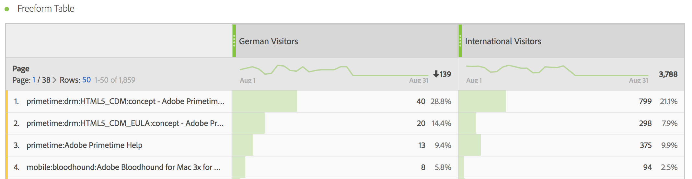

# Segmenterade mätvärden

I verktyget Beräknade mätvärden kan du använda segment i måttdefinitionen. Detta är praktiskt om du vill ta fram nya mätvärden som ska användas i din analys. Tänk på att segmentdefinitioner kan uppdateras med segmentverktyget. Om ändringar görs uppdateras segmentet automatiskt varhelst det används, inklusive om det ingår i en beräknad måttdefinition.

## Skapa ett segmenterat mätresultat {#create}

Låt oss säga att du vill jämföra olika aspekter av ett&quot;tyska besökarsegment&quot; med ett&quot;internationellt besökarsegment&quot;. Du kan skapa mätvärden som ger dig insikter som:

* Hur fungerar innehållssökning jämfört med de två grupperna? (Ett annat exempel är: Hur ser konverteringsgraden ut mellan de två segmenten?)
* Hur många tyska besökare surfar på vissa sidor jämfört med internationella besökare som en procentandel av det totala antalet besökare?
* Var är de största skillnaderna när det gäller vilket innehåll som nås av de olika segmenten?

Bygg och spara ett mätvärde som kallas&quot;tyska besökare&quot; och ett mätvärde som kallas&quot;internationella besökare&quot;:

1. Skapa ett ad hoc-segment i beräkningsverktyget som kallas&quot;tyska besökare&quot;, där&quot;länder&quot; är lika med&quot;Tyskland&quot;.

   Dra dimensionen Länder till arbetsytan Definition och välj [!UICONTROL **Tyskland**] som värde:

   

   >[!NOTE]
   >
   >Du kan också göra detta i [Segmentverktyget](/help/components/segmentation/segmentation-workflow/seg-build.md), men vi har förenklat arbetsflödet genom att göra dimensioner tillgängliga i verktyget Beräknade mätvärden. &quot;Adhoc&quot; innebär att segmentet inte är synligt i listan **[!UICONTROL Segments]** i den vänstra listen. Du kan emellertid göra den offentlig genom att hålla muspekaren över ikonen i bredvid den och klicka på **[!UICONTROL Make public]**.

1. Dra segmentet Tyskland till arbetsytan Definition och dra det unika besökarmåttet i det:

   

1. Välj [!UICONTROL **Spara**] om du vill spara det beräknade måttet.

1. Skapa ett ad hoc-segment i beräkningsverktyget som kallas&quot;Internationella besökare&quot;, där&quot;länder&quot; inte är lika med&quot;Tyskland&quot;.

   Dra dimensionen Länder till definitionsytan, markera [!UICONTROL **Tyskland**] som värde och markera sedan [!UICONTROL **inte är lika med**] som operatorn.

1. Dra det unika besökarmåttet i det.

1. Välj [!UICONTROL **Spara**] om du vill spara det beräknade måttet.

1. I Analysis Workspace drar du Dimensionen **[!UICONTROL Page]** till en frihandstabell och drar de två nya beräknade måtten intill varandra till överkanten:

   

Här är en videoöversikt:

>[!VIDEO](https://video.tv.adobe.com/v/25409/?quality=12&learn=on)

## Procent av totala mätvärden {#percent-total}

Du kan ta exemplet ovan ett steg längre genom att jämföra segmentet med en total population. Det gör du genom att skapa två nya mätvärden, &quot;% av totalt antal tyska besökare&quot; och &quot;% av totalt antal internationella besökare&quot;:

1. Släpp segmentet med tyska (eller internationella) besökare på arbetsytan.
1. Släpp ytterligare tyska (eller internationella) besökarsegment nedan. Men den här gången klickar du på konfigurationsikonen (kugghjulsikonen) för att välja måtttypen &quot;Totalt&quot;. Formatet ska vara &quot;Procent&quot;. Operatorn ska delas med. Resultatet blir den här måttdefinitionen:

   

1. Använd följande mått i ditt projekt:

   
