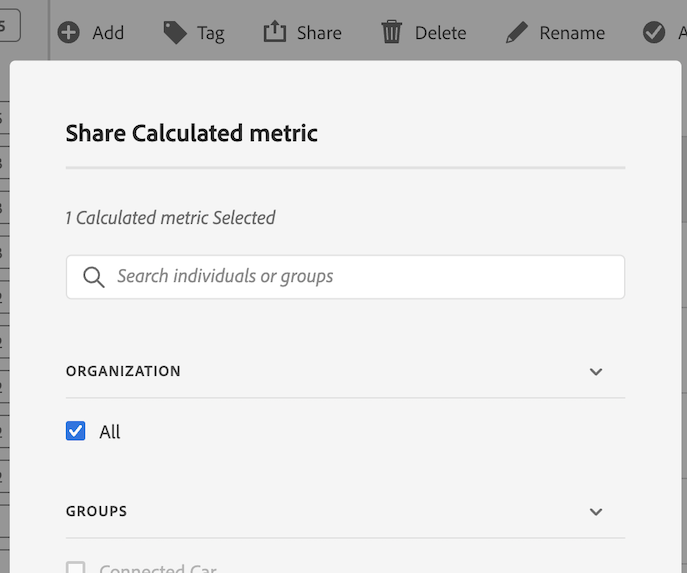

# Dela beräknade värden

Beroende på dina behörigheter kan du dela mätvärden med hela organisationen, grupper eller enskilda användare.

| Roll | Behörigheter |
|---|---|
| Administratör | Kan dela mätvärden med alla, med grupper och med användare. Grupper skapas som behörighetsgrupper i Admin Console. |
| Icke-administratör | Kan endast dela mätvärden med enskilda användare. |

Så här delar du ett beräknat mått:

1. I Adobe Analytics väljer du fliken **[!UICONTROL Components]** och sedan **[!UICONTROL Calculated metrics]**.

1. Markera kryssrutan till vänster om de mätvärden du vill dela i hanteraren för beräknade mätvärden.

1. Välj ikonen **[!UICONTROL Share]**. 

   Dialogrutan Dela beräknade mått visas.

   

1. Välj **[!UICONTROL Share]**.

1. Välj vem du vill dela med:

   * **[!UICONTROL All]** (endast administratörer): Delar med alla användare i organisationen.

     Överväg att dela med alla bara om det är användbart för hela företaget och alla känner sig bekväma med att använda det. I det här fallet bör du även överväga att göra det till ett [godkänt mätvärde](/help/components/c-calcmetrics/c-workflow/cm-workflow/cm-approving.md).

   * **[!UICONTROL Groups]** (endast administratörer): Välj de grupper du vill dela med.

     Överväg att dela med en grupp om mätvärdena ger ett bra affärsvärde för teamet.

   * **[!UICONTROL Individual users]**: Sök efter och välj de enskilda användare som du vill dela med.

     Det här är det enda delningsalternativet som är tillgängligt för alla användare. Administratörer kan använda det här alternativet för att kontrollera och validera ett mätvärde innan det görs tillgängligt för en grupp eller för alla. Om måttet inte är användbart kan det tas bort. Administratörer bör inte godkänna den här typen av mätvärden officiellt.

1. Välj **[!UICONTROL Share]**.

   Ikonen Delad visas bredvid måttet: .

1. Du kan filtrera mätvärden som delas med dig genom att gå till **[!UICONTROL Filters]** > **[!UICONTROL Other Filters]** > **[!UICONTROL Shared with Me]**.

1. (Valfritt) Om du vill filtrera listan med beräknade mått i hanteraren för beräknade mått så att endast mått som delas med dig visas, markerar du ikonen **Filter** , expanderar **[!UICONTROL Other filters]** och väljer sedan **[!UICONTROL Shared with me]** .

