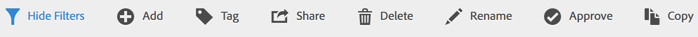

# Dela beräknade värden

Beroende på dina behörigheter kan du dela mätvärden med hela organisationen, grupper eller enskilda användare.

| Roll | Behörigheter |
|---|---|
| Administratör | Kan dela mätvärden med Alla, med Grupper och med Användare. Grupper konfigureras som behörighetsgrupper i Admin Console. |
| Icke-administratör | Kan endast dela mätvärden med enskilda användare. |

När ska ni dela mätvärden med hela företaget jämfört med bara en grupp användare eller enskilda? Här är några tips du kan följa:

* Som administratör kan du dela ett mått med **[!UICONTROL All]** om det är användbart för hela företaget och alla är bekväma med att använda det. I det här fallet bör du också överväga att göra det till ett godkänt mätvärde.
* Som administratör kan du dela ett mått med ett specifikt värde **[!UICONTROL Group]** om mätvärdet ger ett bra affärsvärde för det teamet.
* Som administratör eller enskild användare kan du dela ett mätvärde med andra personer för att kontrollera och validera det. Om det inte visar sig användbart kan det kasseras. Godkänn inte den här typen av mätvärden officiellt.

1. Markera kryssrutan bredvid det mätvärde du vill dela i Beräknade mätvärden. Åtgärdsfältet visas:

   

1. Klicka på **[!UICONTROL Share]** ikonen.

   

   Om du är administratör kan du välja **[!UICONTROL All]** eller välja mellan **[!UICONTROL Groups]** och (rulla nedåt till) **[!UICONTROL Users]** i organisationen. Som icke-administratör kan du bara se enskilda användare. Använd **[!UICONTROL Search]** fältet för att söka efter grupper eller användare

1. Klicka på **[!UICONTROL Share]**.

   Ikonen Delad visas bredvid måttet:  

1. Du kan filtrera mätvärden som delas med dig genom att gå till **[!UICONTROL Filters]** > **[!UICONTROL Other Filters]** > **[!UICONTROL Shared with Me]**.

