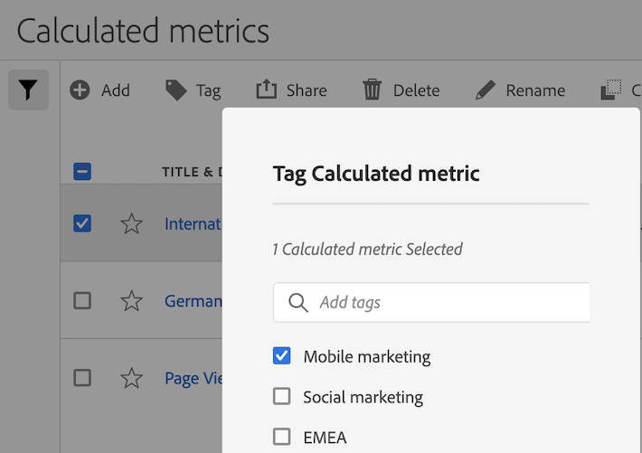

# Tagga beräknade mätvärden

I hanteraren för beräknade mätvärden kan du ordna segment genom att tagga dem.

Alla användare kan skapa taggar för beräknade värden och använda en eller flera taggar för ett mätresultat. Men du kan bara se taggar för de beräknade värden som du äger eller som har delats med dig.

>[!TIP]
>
>De mest användbara taggtyperna är oftast taggar som baseras på följande kriterier:
>
>* **Teamnamn**, som social marknadsföring, mobilmarknadsföring.
>* **Projekt** (analystaggar), t.ex. på ingångssidan.
>* **Kategorier**, t.ex. Kvinnor. Geografi.
>* **Arbetsflöden** som ska godkännas, Kuraterad för (en specifik affärsenhet)

## Tillämpa taggar på ett beräknat mått

1. I Adobe Analytics väljer du [!UICONTROL **Komponenter**] > [!UICONTROL **Beräknade mått**] för att gå till Calculated Metrics Manager.

1. Markera kryssrutan bredvid de mätvärden du vill tagga i Calculated Metrics Manager.

   

1. I **[!UICONTROL Tag Calculated metric]** dialogruta:

   * Lägg till en ny tagg. Skriv namnet i [!UICONTROL **Lägg till taggar**] och tryck sedan på Retur.
   * Markera en eller flera befintliga taggar som ska användas för de valda måtten.

1. Välj [!UICONTROL **Spara**] om du vill använda taggarna.

## Visa använda taggar

1. I Adobe Analytics väljer du [!UICONTROL **Komponenter**] > [!UICONTROL **Beräknade mått**] för att gå till Calculated Metrics Manager.

1. Taggar visas i [!UICONTROL **Taggar**] kolumn. (Klicka på kugghjulsikonen uppe till höger för att hantera kolumnerna.)

## Filtrera mätvärden efter taggar

1. I Adobe Analytics väljer du [!UICONTROL **Komponenter**] > [!UICONTROL **Beräknade mått**] för att gå till Calculated Metrics Manager.

1. Välj alternativet **Filter** markerar du de taggar som du vill filtrera efter.

   Endast mätvärden som har det filter du väljer visas.
