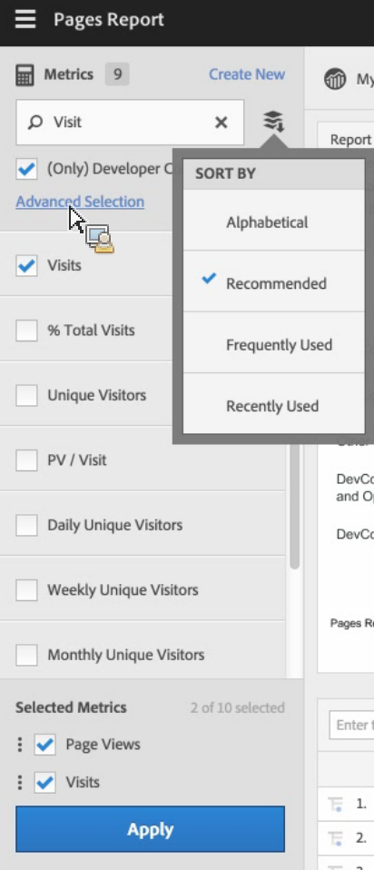

# Beräknade och avancerade beräknade (härledda) värden

Beräknade och avancerade beräknade (eller härledda) mått är anpassade mått som du kan skapa utifrån befintliga mätvärden.

Våra verktyg för beräknade värden är ett mycket flexibelt sätt att bygga, hantera och strukturera mätvärden. Med dem kan ni som marknadsförare, produktchefer och analytiker ställa frågor om data utan att behöva ändra er [!DNL Analytics] implementering. Anpassade mätvärden som finns i [!DNL Analytics] paketet är:

* Adobe [!DNL Analytics] Foundation: Beräknat
* [Adobe Analytics Select](https://www.adobe.com/se/data-analytics-cloud/analytics/select.html): Beräknat + Avancerat beräknat
* [Adobe Analytics Prime](https://www.adobe.com/se/data-analytics-cloud/analytics/prime.html): Beräknat + Avancerat beräknat
* [Adobe Analytics Ultimate](https://www.adobe.com/se/data-analytics-cloud/analytics/ultimate.html): Beräknat + Avancerat beräknat

Här följer en jämförelse av funktionerna för beräknade värden och avancerade beräknade värden:

| Alternativ för verktyget Builder | Beräknade mätvärden | Avancerade beräknade (härledda) mått |
|---|---|---|
| [Formattyper (decimal, time, percent, currency)](/help/components/c-calcmetrics/c-workflow/cm-workflow/c-build-metrics/cm-build-metrics.md) | Ja | Ja |
| [Attributionsändringar (standard, linjär, deltagande osv.)](/help/components/c-calcmetrics/c-workflow/cm-workflow/c-build-metrics/m-metric-type-alloc.md) | Ja | Ja |
| [Mättyper (standard, total)](/help/components/c-calcmetrics/c-workflow/cm-workflow/c-build-metrics/m-metric-type-alloc.md) | Ja | Ja |
| Grundläggande operatorer (lägg till, subtrahera, multiplicera, dividera) | Ja | Ja |
| [Använd segment](/help/components/c-calcmetrics/c-workflow/cm-workflow/c-build-metrics/metrics-with-segments.md) | Nej | Ja |
| [Grundfunktioner (antal, abs-värde, medelvärde osv.)](/help/components/c-calcmetrics/cm-reference/cm-functions.md) | Nej | Ja |
| [Avancerade funktioner (regression, if/then, t-score etc.)](/help/components/c-calcmetrics/cm-reference/cm-adv-functions.md) | Nej | Ja |

## Funktioner {#section_A0A5C275B68A4D628950BBB0B1EE631F}

Ni kan

* Skapa mätvärden för [!UICONTROL Analysis Workspace], [!UICONTROL Reports & Analytics], [!UICONTROL Report Builder], [!UICONTROL Anomaly Detection]och [!UICONTROL Contribution Analysis].
* Skapa segmenterade mätvärden som genereras vid rapportkörning, utan att behöva ändra implementeringen. Dessa kan ses historiskt eftersom de baseras på segment. Här är en video om implementeringsfria mätvärden:

   >[!VIDEO](https://video.tv.adobe.com/v/25407/?quality=12)

* Dela mätvärden mellan olika rapportsviter. Det innebär att alla nya mätvärden gäller för alla rapportsviter i samma inloggningsföretag.
* (Endast avancerade beräknade värden) Segment på mätvärden. Du kan t.ex. skapa ett mått för&quot;Nya besökare&quot;, med antalet personer som detta är den första sessionen för. Här är ett videoklipp om detta ämne:

   >[!VIDEO](https://video.tv.adobe.com/v/25409/?quality=12)

* (Endast avancerade beräknade värden) Inkludera statistiska funktioner som hjälper dig att beskriva dina data bättre. Du kan till exempel räkna antalet objekt i en rapport eller lägga till antalet standardavvikelser för varje objekt.

## Begränsningar {#section_CB878B02451541D68A68B508D4DBD19A}

Några [!DNL Analytics] funktioner som gör att du kan använda händelser men inte beräknade värden:

* [!UICONTROL Funnels] in [!UICONTROL Reports & Analytics]
* [!UICONTROL Fallout] in [!UICONTROL Analysis Workspace]
* [!UICONTROL Cohort Analysis] i Analysis Workspace
* [!UICONTROL Data Warehouse]
* [!UICONTROL Segments]
* [!UICONTROL Real-Time] rapporter
* [!UICONTROL Current Data] rapporter
* [!DNL Analytics] for [!DNL Target]

## verktyg {#section_D65E9C067E9C45E1A50DD30F50561BB2}

Här är en kort översikt över [!UICONTROL Calculated Metrics] verktyg:

<table id="table_520AFE97DB514958ABE23FD3C9CE0ABD"> 
 <thead> 
  <tr> 
   <th colname="col1" class="entry"> Verktyg </th> 
   <th colname="col2" class="entry"> Funktioner </th> 
  </tr>
 </thead>
 <tbody> 
  <tr> 
   <td colname="col1"><a href="/help/components/c-calcmetrics/c-workflow/cm-workflow/c-build-metrics/cm-build-metrics.md"  > Beräknad metrisk Builder</a> </td> 
   <td colname="col2"> 
    <ul id="ul_E6F02AB9DF204C2F9A0AC92A31594B3E"> 
     <li id="li_A4A6E716374243A190C539A3F4A41C0C">Skapa beräknade och avancerade beräknade värden med avancerade allokeringsmodeller. </li> 
     <li id="li_C8C97BA4E227463E98077ABA5818FFC6">Lägg till segment textbundet i mätformler. </li> 
     <li id="li_8503D9E06A3C46569B5CDB4B90F72446">Jämför segment i samma rapport. Exempel: jämför lokala besökare med internationella besökare. </li> 
     <li id="li_4B528FDE1F96400DBA0D3276408FF919">Använd statistiska funktioner. </li> 
     <li id="li_C1162B1EA6784B8189A8A87E2B0DA79A">Ange detaljerade måttbeskrivningar (visa vad den gör, var den ska användas, var den inte ska användas). </li> 
     <li id="li_DEA13F5E8BF94AF1B311C467FE6E2A74">Kopiera definitioner till nya mätvärden. </li> 
     <li id="li_8C21F55015D44910904202D2BF74221C">Ange en intern metrisk förhandsgranskning. </li> 
     <li id="li_3704F66C321C477F9D4F52E068C231BD">Ange metrisk polaritet, vilket anger om det är bra eller dåligt om en viss anpassad händelse (metrisk) inträffar. </li> 
     <li id="li_9D45319FA965476FB1C90DE8AA72BBD7">Märk måtten. </li> 
    </ul> </td> 
  </tr> 
  <tr> 
   <td colname="col1"><a href="/help/components/c-calcmetrics/c-workflow/cm-workflow/cm-manager.md"  > Hanterare för beräknade mätvärden</a> </td> 
   <td colname="col2"> 
    <ul id="ul_E4D20D5DD3904CC6A85785B5BD4C1B1E"> 
     <li id="li_E0B216BA1478406EB6212263DF71D85B">Dela mätvärden med andra. </li> 
     <li id="li_96EB16FAF3454211AAEF78EA5B08927F">Godkänn och strukturera mätvärden. </li> 
     <li id="li_3ADBD2428EAC4B0AA61222D87C3AF2B7">Ordna (tagga) mätvärden så att andra kan hitta dem. </li> 
     <li id="li_726F3C3390744E49BA63606FE196880E">Ta bort mätvärden. </li> 
     <li id="li_F306BA4FA8AF4A6E987BA62634659A2F">Byt namn på mätvärden. </li> 
    </ul> </td> 
  </tr> 
  <tr> 
   <td colname="col1"> Mätväljarskenor </td> 
   <td colname="col2"> 
Ersätter  Visa mått popup-fönster  Rapporter och analyser. 
 
Du kan söka efter och lägga till/använda mätvärden i rapporten. Du kan också ändra <a href="/help/components/c-calcmetrics/c-workflow/cm-workflow/cm-finding.md"  > sortera</a> ordning (alternativen är: alfabetisk, rekommenderad, ofta använd, nyligen använd.) Dessutom kan du filtrera rapportsviterna så att endast mätvärden som har skapats i en viss rapportserie visas. 
 
Om du vill komma åt den här mätväljaren klickar du på mätningsikonen  till vänster om en rapport. Så här ser mätväljaren ut: 
 
 
 </td> 
  </tr> 
  <tr> 
   <td colname="col1"><a href="https://www.adobe.io/apis/experiencecloud/analytics/docs.html#!AdobeDocs/analytics-2.0-apis/master/README.md"  > API för beräknade värden</a> </td> 
   <td colname="col2"> 
En del av API-uppsättningen för Adobe Analytics 2.0. 
 </td> 
  </tr> 
 </tbody> 
</table>
