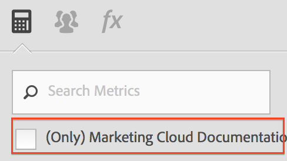

# Vanliga frågor

De här förändringarna av hur beräknade mätvärden fungerar i [!DNL Analytics] kan påverka dig.

[Hur får jag åtkomst till Calculated Metric Builder?](/help/components/c-calcmetrics/cm-transition.md#section_D9AE9A0ACF824BACB5D05F0C2F7E9CA1)

[Hur kommer jag åt Calculated Metric Manager?](/help/components/c-calcmetrics/cm-transition.md#section_DD0BD13E9EC940268EBE8BC88241A152)

[Varför ser jag så många beräknade värden med samma namn?](/help/components/c-calcmetrics/cm-transition.md#section_E15C5B6CCC58498CAEC3FBDA8988F0A1)

[Vad hände med mina globala beräknade värden?](/help/components/c-calcmetrics/cm-transition.md#section_7351D4C7361F4ABAA1B43F8E89AAD211)

[Vad hände med Global Calculated Metrics som delades mellan olika inloggningsföretag?](/help/components/c-calcmetrics/cm-transition.md#section_59E5CD948ED643AE9AD3D2E4277647F8)

[Vad hände med Beräknade mått med Numeric eller Numeric2-klassificering?](/help/components/c-calcmetrics/cm-transition.md#section_71AFE6C4A7CD4AA19AB3A9D3C41D115B)

[Vad hände med Life-Time Metrics?](/help/components/c-calcmetrics/cm-transition.md#section_AEDB02EF24584DAD8731BED9DDCE4F48)

[Vad behöver jag veta om beräknade mätvärden som baseras på unika besöksmätningar varje dag/vecka/månad/kvartal/år?](/help/components/c-calcmetrics/cm-transition.md#section_E9A77EBB41CE4881B196CC1C282B2DF3)

[Hur är det med Calculated Metrics som har skapats eller hanterats med de gamla API-metoderna för rapportsviten?](/help/components/c-calcmetrics/cm-transition.md#section_13ED1BAD02634674BDAEB479B060A4B6)

[Stöder aktuella data alla typer av beräknade värden?](/help/components/c-calcmetrics/cm-transition.md#section_1DAA718BB8DB4413BAF8AD4B4FAAFFA2)

[Vad betyder&quot;Inget namn angivet&quot; i samband med migrerade beräknade värden?](/help/components/c-calcmetrics/cm-transition.md#section_C90CBB72A67644F38D583301981F8D03)

[Vad händer med en användares beräknade värden om användaren tas bort?](/help/components/c-calcmetrics/cm-transition.md#section_42ED4C15830540879C4A161423690E5A)

[Varför ser jag &quot;Okända&quot; beräknade mätvärden som inte är &#39;giltiga&#39; för andra rapportsviter trots att de kan skapas och användas för dessa rapportsviter?](/help/components/c-calcmetrics/cm-transition.md#section_6772818EFDED46E9B7095D64C3B77211)

[Varför sparades inte ändringar som jag gjorde i mina äldre beräknade värden?](/help/components/c-calcmetrics/cm-transition.md#section_81CDEFCA1FD542579AF183DA1494EAF0)

[Varför visas inte mina beräknade värden i rapporten om marknadsföringskanaler?](/help/components/c-calcmetrics/cm-transition.md#section_FC350359A775433AB5F43C7CAB304D62)

[Varför visar vissa av de beräknade måtten formler utan de parenteser som jag har lagt till?](/help/components/c-calcmetrics/cm-transition.md#section_AC0D1E9714AD487F9A1C73359F518B5E)

[(Endast ad hoc-analys) Stöds fortfarande beräknade värden med inbäddade eller inbäddade segmentdefinitioner?](/help/components/c-calcmetrics/cm-transition.md#section_B25C924A282F49388AB604E3D826F44C)

[(Endast Report Builder) Varför har beräknade värden försvunnit från mina förfrågningar?](/help/components/c-calcmetrics/cm-transition.md#section_DA4792FE5D7945218CD5E6328DE08E82)

[Hur fungerar summor för beräknade värden?](/help/components/c-calcmetrics/cm-transition.md#section_57BA3A299C7948ABB82B0392A9B0F33E)

## Hur får jag åtkomst till Calculated Metric Builder? {#section_D9AE9A0ACF824BACB5D05F0C2F7E9CA1}

* Klicka **[!UICONTROL + Add]** högst upp i Beräknad metrisk hanterare, eller
* I en Analytics-rapport klickar du på Metrics-ikonen  till vänster om en rapport för att visa Metrics-spåret. Klicka sedan på **[!UICONTROL Add]**.

## Hur kommer jag åt Calculated Metric Manager? {#section_DD0BD13E9EC940268EBE8BC88241A152}

* Gå till **[!UICONTROL Analytics]** > **[!UICONTROL Components]** i den vänstra navigeringen. Klicka sedan på **[!UICONTROL Calculated Metrics]**.

* Klicka på Metrics-ikonen till vänster [!DNL Analytics] om en rapport för att visa måttspåret i en  rapport och klicka sedan på **[!UICONTROL Manage]**.

## Varför ser jag så många beräknade värden med samma namn? {#section_E15C5B6CCC58498CAEC3FBDA8988F0A1}

(Tidigare ägdes inte globala beräknade värden av någon specifik administratörsanvändare och var synliga för alla användare av rapportsviten. Mätvärdena delades upp av rapportsviten. Om ett mätvärde i en rapportserie hade samma namn som ett mätvärde i en annan rapportserie, skulle det bara visas för användarna som samma mätvärde när de bytte rapportsviter.)

Nu är mätvärden inte längre åtskilda av rapportsviter. Om ett mätvärde i en rapportserie har samma namn som ett mätvärde i en annan rapportserie, kommer de båda att vara synliga i beräkningsverktyget och mätväljaren och kan visas som dubblettmått även om de har samma definition eller inte.

Du skulle bara se ett antal beräknade mätvärden med samma namn (men som har skapats i olika rapportsviter) om du avmarkerade kryssrutan (endast `<report suite>`) enligt följande:

**Vad du behöver göra**

Överväg att konsolidera beräknade värden med liknande namn och definitioner, men var försiktig när du gör det. Du kan kontrollera om det finns beräknade värden i rapportsviten i hanteraren för beräknade mått om du vill verifiera den ursprungliga rapportsviten. Du bör också kontrollera måttdefinitionerna när du tar bort potentiella dubbletter för att vara säker på att du konsoliderar mätvärden korrekt.

> [!NOTE] Även om beräknade värden inte längre är bundna till en viss rapportserie och kan användas i alla rapportsviter som är synliga för inloggningsföretaget, är rapportsviten som beräkningarna skapades i eller senast sparades fortfarande synlig i Beräknade mätvärden.

> [!NOTE] Även om ett beräknat mått tas bort fungerar fortfarande bokmärken och kontrollpaneler som refererar till det måttet.

## Vad hände med mina globala beräknade värden? {#section_7351D4C7361F4ABAA1B43F8E89AAD211}

(Tidigare kunde en administratör skapa beräknade värden (s.k.&quot;global calculate metrics&quot; eller&quot;report suite calculate metrics&quot;) i en Report Suite via Admin Tools.

Globala beräknade värden ägs nu av den första Admin-användaren i inloggningsföretagets lista över Admin-användare. De delas som standard med &quot;Alla&quot;. Det här mönstret följer samma delningsmodell och migreringsplaner som segment.

**Vad du behöver göra**

Ingenting. Den nya administratörsägaren bör dock vara försiktig när de ändrar eller tar bort dessa beräknade värden. De kan användas i ett antal bokmärkta rapporter och instrumentpaneler.

> [!NOTE] Även om ett beräknat mått tas bort fungerar fortfarande bokmärken och kontrollpaneler som refererar till det måttet.

## Vad hände med Global Calculated Metrics som delades mellan olika inloggningsföretag? {#section_59E5CD948ED643AE9AD3D2E4277647F8}

(Tidigare kunde en administratör skapa beräknade värden (s.k.&quot;global calculate metrics&quot; eller&quot;report suite calculate metrics&quot;) i en Report Suite via Admin Tools. Dessa mätvärden kan sedan&quot;delas&quot; mellan inloggningsföretag genom att lägga till rapportsviten till flera inloggningsföretag.)

Globala beräknade värden kan inte längre delas mellan inloggningsföretag. De är inte längre bundna eller knutna till en viss rapportsserie utan är i stället kopplade till ett specifikt inloggningsföretag. Beräknade mätvärden som delats av olika inloggningsföretag

* Vi migrerade till alla inloggningsföretag med tillgång till den rapportsviten.
* Standardvärdet är &quot;delad med alla&quot;.
* Kopior kommer att vara oberoende av alla andra inloggningsföretag.

> [!NOTE] Om det beräknade måttet användes i ett bokmärke, en kontrollpanel, en avisering eller en schemalagd rapport kommer redigering av den nya kopian INTE att påverka det gamla beständiga beräknade måttet.

## Vad hände med Beräknade mått med Numeric eller Numeric2-klassificering? {#section_71AFE6C4A7CD4AA19AB3A9D3C41D115B}

(Tidigare var beräknade värden med en Numeric- eller Numeric2-klassificering bara synliga i [!UICONTROL Reports & Analytics], [!UICONTROL Report Builder]och API:erna.)

Beräknade mätvärden med en numerisk eller numerisk2-klassificering kommer nu även i fortsättningen att vara synliga i [!UICONTROL Reports & Analytics], [!UICONTROL Report Builder]och i API:erna. De stöds dock inte i någon rapport där ett segment används.

Dessutom stöds inte beräknade värden med en Numeric- eller Numeric2-klassificering i följande komponenter: [!UICONTROL Ad Hoc Analysis], [!UICONTROL Analysis Workspace], [!UICONTROL Real-Time] rapporter [!UICONTROL Anomaly Detection], och [!UICONTROL Contribution Analysis]. När du skapar eller redigerar ett beräknat mått med en numerisk eller numerisk2-klassificering visas en kompatibilitetsvarning om att det beräknade måttet inte är kompatibelt med vissa delar av produkten.

**Vad du behöver göra**

Undvik att skapa beräknade värden med Numeric1- eller Numeric2-klassificeringar om måttet är avsett att användas med ett segment eller med någon av de icke-kompatibla komponenterna.

## Vad hände med Life-Time Metrics? {#section_AEDB02EF24584DAD8731BED9DDCE4F48}

Livstidsstatistik (alias heltidsmått) stöds inte längre och visas inte längre i [!UICONTROL Reports & Analytics] användargränssnittet eller något annat användargränssnitt. De kan inte frågas av rapport-API:t.

Eventuella bokmärken, kontrollpaneler, schemalagda rapporter eller aviseringar som innehöll ett heltidsmått fortsätter att köras utan det måttet så länge som minst ett annat giltigt mått också finns i rapporten. Om det enda mätvärdet för bokmärket, kontrollpanelen, den schemalagda rapporten eller aviseringen är ett heltidsmått, kommer rapporten inte längre att köras.

## Vad behöver jag veta om beräknade mätvärden som baseras på unika besöksmätningar varje dag/vecka/månad/kvartal/år? {#section_E9A77EBB41CE4881B196CC1C282B2DF3}

Beräknade mätvärden som baseras på unika besökarmått visas i följande [!DNL Analytics] komponenter: [!UICONTROL Reports & Analytics]och [!UICONTROL Report Builder]rapporterings-API.

Dessa mått stöds dock inte i följande komponenter: [!UICONTROL Segments], [!UICONTROL Analysis Workspace], [!UICONTROL Real-Time] rapporter [!UICONTROL Anomaly Detection], och [!UICONTROL Contribution Analysis]. När du skapar eller redigerar ett beräknat mått baserat på Unika besökarvärden visas en kompatibilitetsvarning om att måttet inte är kompatibelt med vissa delar av produkten.

Du använder ett unikt basbesökarmått för en rapport med ett segment. Du kan skapa ett beräknat mått baserat på ett unikt besökarmått; Det beräknade måttet kan dock inte tillämpas på en rapport med ett segment, och det beräknade måttet kan inte heller ha ett inbäddat segment.

## Vad händer med beräknade värden som skapats eller hanterats med API-metoder för den gamla rapportsviten? {#section_13ED1BAD02634674BDAEB479B060A4B6}

Tidigare sparades ett beräknat mått med API-metoden (1.3 eller 1.4) ReportSuite.SaveCalculatedMetrics på samma sätt som när ett beräknat mått skapades eller uppdaterades i Admin Console. Samma sak gäller för ReportSuite.DeleteCalculatedMetrics. Listan med beräknade värden som visades i Admin Console eller när ReportSuite.GetCalculatedMetrics anropades var också densamma.

Nu kommer API-metoderna (1.3 eller 1.4) för ReportSuite CalculatedMetrics att fortsätta att spara, ta bort och hämta beräknade värden med den gamla butiken. Befintliga beräknade värden migreras och visas i nya Calculated Metrics Builder. **Nya beräknade mätvärden som skapats med API-metoder visas bara i API:t. De kan fortfarande användas i Rapporterings-API:t.**

**Vad du behöver göra**

Om du behöver använda både API:t och Calculated Metric Builder bör du sluta använda API-metoderna för ReportSuite CalculatedMetrics och i stället använda de nya API-metoderna för CalculatedMetrics (Get, Save, Delete och GetFunction).

## Stöder aktuella data alla typer av beräknade värden? {#section_1DAA718BB8DB4413BAF8AD4B4FAAFFA2}

Aktuella data stöder inte beräknade värden som innehåller segment eller statistiska funktioner. De enda funktioner som stöds är grundläggande matematiska funktioner som addition, delete, multiplikation, division och negation (-x).

## Vad betyder&quot;Inget namn angivet&quot; i samband med migrerade beräknade värden? {#section_C90CBB72A67644F38D583301981F8D03}

&quot;Inget namn har angetts&quot; betyder att inget måttnamn är associerat med det här migrerade måttet (bara en formel utan beskrivande namn).

## Vad händer med en användares beräknade värden om användaren tas bort? {#section_42ED4C15830540879C4A161423690E5A}

Alla beräknade värden som den här användaren har skapat tas också bort. Borttagna beräknade värden fungerar dock fortfarande som en del av sparade bokmärken, kontrollpaneler eller schemalagda rapporter.

## Varför ser jag &quot;Okända&quot; beräknade mätvärden som inte är &#39;giltiga&#39; för andra rapportsviter trots att de kan skapas och användas för dessa rapportsviter? {#section_6772818EFDED46E9B7095D64C3B77211}

Användargränssnittet visar &quot;unknown&quot; om det beräknade måttet innehåller basmått eller dimensioner som inte finns för den valda rapportsviten.

## Varför sparades inte ändringar som jag gjorde i mina äldre beräknade värden? {#section_81CDEFCA1FD542579AF183DA1494EAF0}

Detta kan bero på tidpunkten för migreringen till den nya beräknade mätdatabasen, som ägde rum mellan den 15 juni och den 18 juni 2015.

**Vad du behöver göra**

Du måste göra om de ändringar du har gjort i de gamla mätvärdena.

## Varför visas inte mina beräknade värden i rapporten om marknadsföringskanaler? {#section_FC350359A775433AB5F43C7CAB304D62}

(Tidigare listades alla beräknade värden i måttväljaren i rapporter om marknadsföringskanaler med alternativet First Touch och Last Touch.)

Nu är endast de beräknade mätvärden som har sin allokeringstyp specifikt inställd på First Touch eller Last Touch i verktyget Beräknade mätvärden tillgängliga i mätväljaren i rapporter om marknadsföringskanaler. Observera att alla beräknade mätvärden som redan tillämpas på Marketing Channel-rapporter kommer att fortsätta att användas och fungera som tidigare. Om du vill skapa ett beräknat mått för marknadsföringskanaler klickar du på konfigurationsikonen i måttverktyget och väljer antingen First Touch eller Last Touch som allokeringstyp. Kom ihåg att detta gör att det beräknade måttet endast är kompatibelt med Marketing Channel-rapporter och att det inte kan användas i någon annan rapport.

## Varför visar vissa av de beräknade måtten formler utan de parenteser som jag har lagt till? {#section_AC0D1E9714AD487F9A1C73359F518B5E}

Under migreringen tog Adobe bort överflödiga parenteser från vissa formler. Endast parenteser som inte påverkar hur måttet beräknas togs bort. Detta ändrar inte informationen - det förenklar bara formeln.

## (Endast Ad hoc-analys) Stöds även beräknade värden med inbäddade eller inbäddade segmentdefinitioner? {#section_B25C924A282F49388AB604E3D826F44C}

Beräknade mätvärden som skapats i Ad Hoc-analyser kan tidigare innehålla inlinesegmentdefinitioner. Detta är inte längre möjligt.

**Vad du behöver göra**

Du måste spara segmentet explicit. Befintliga beräknade mätvärden med interna segmentdefinitioner kommer att fortsätta att fungera korrekt och kan visas i Ad hoc-analys, men de kan inte sparas utan att segmentet sparas explicit.

## (Endast Report Builder) Varför har beräknade värden försvunnit från mina förfrågningar? {#section_DA4792FE5D7945218CD5E6328DE08E82}

Om begäran skapades i v5.2 och den innehåller beräknade värden, visas dessa värden inte i v5.1 (eller tidigare versioner). Detta beror på att beräknade värden nu använder globala ID:n (icke-rapportsvitspecifika ID:n).

**Vad du behöver göra**

Du måste uppgradera till v5.2 för att kunna se dessa mätvärden.

## Hur fungerar summor för beräknade värden? {#section_57BA3A299C7948ABB82B0392A9B0F33E}

När [!UICONTROL Reports & Analytics] en beräknad summa av mätvärden visas i [!UICONTROL Reports & Analytics]används formeln bara på summan. Summan för beräknade måttorder/besök tar till exempel totalt antal order och dividerar dem med totalt antal besök. I vissa fall är den beräknade summan inte bara summan av radobjekten, utan en summa för platsen.

Exempel 1: Besökare för en sökterm: samma besökare kan ha sökt efter flera termer, så i det här fallet är det totala antalet besökare som inte är lika med summan av radobjekten.

Exempel 2: Sidvisningar av produkter: i varukorgen kan det finnas flera produkter, så därför finns det flera sidvisningar för varukorgen. Mer information om hur du jämför summan av radobjekt för att rapportera summor finns i [den här kunskapsbasartikeln](https://helpx.adobe.com/analytics/kb/sum-line-items-different-from-total.html).
