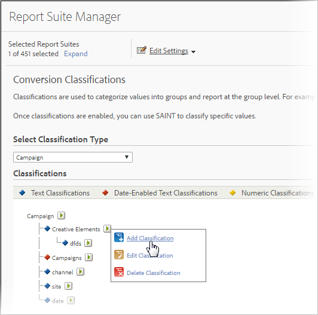

# Om klassificeringar

En klassificering är ett sätt att kategorisera Analytics-variabeldata och sedan visa data på olika sätt när du genererar rapporter.

Videoöversikt över [Analytics-klassificeringar](https://video.tv.adobe.com/v/16853/?captions=swe).

**[!UICONTROL Admin]** > **[!UICONTROL Report Suites]** > **[!UICONTROL Edit Settings]** > *`<Traffic or Conversion>`*

När du klassificerar etablerar du en relation mellan variabeln och de metadata som är relaterade till den variabeln. Klassificeringar används oftast i kampanjer. Data som samlas in med hjälp av variabelinformation (eVars, props och events) kan sammanställas genom att metadata tillämpas på de värden som samlas in i variablerna.

När de har klassificerats kan alla rapporter som du kan generera med nyckelvariabeln också genereras med de associerade attributen. Du kan till exempel klassificera [!UICONTROL Product IDs] med ytterligare produktattribut, som produktnamn, färg, storlek, beskrivning och SKU. Förstärkning av rapporterings- och analysdata med ytterligare attribut ger djupare och mer komplexa rapporteringsmöjligheter.

>[!IMPORTANT]
>
>Möjligheten att importera Numeric 2- och Date-Enabled-klassificeringar har tagits bort från kodbasen. Denna ändring träder i kraft i underhållsutgåvan från juni 2019. Om du har numeriska eller datumaktiverade kolumner i importfilen, ignoreras dessa celler och alla andra data i filen importeras som vanligt. Befintliga klassificeringar kan fortfarande exporteras via standardarbetsflödet för klassificering och kommer att vara tillgängliga i rapporter.

> [!NOTE] I Analytics Maintenance-utgåvan 10 maj 2018 började Adobe begränsa funktionaliteten för datumaktiverade och numeriska klassificeringar. Dessa klassificeringstyper har tagits bort från gränssnitten Admin och Klassificeringsimporter. Inga nya datumaktiverade och numeriska klassificeringar kan läggas till. Befintliga klassificeringar kan fortfarande hanteras (överföras till, tas bort) via standardarbetsflödet för klassificering, och kommer även i fortsättningen att vara tillgängliga vid rapportering.

När du har skapat klassificeringarna kan du utnyttja de nya dataattributen i hela Adobe Analytics.

**Exempel på spårningskoder**

Anta att ni i stället för att bara visa kampanjer med spårningskod vill se kampanjresultaten med sökmotorn, nyckelordet och kampanjkanalen. I stället för att avrunda konverteringsvariablerna för var och en av dem kan du skapa tre klassificeringar av kampanjvariabeln som representerar sökmotorn, nyckelordet och kampanjkanalen. Med den här strategin kan du se webbplatsens framgångshändelser med alla fyra variablerna, utan ytterligare taggning.

Rapportering och analys innehåller fördefinierade klassificeringar för spårningskodvariabeln, som erbjuder klassificeringsbaserade rapporter som kallas Creative Elements och Campaigns. Du måste konfigurera klassificeringar manuellt för alla andra konverterings- och trafikvariabler.

Se [Trafikklassificeringar](/help/admin/admin/c-traffic-variables/traffic-classifications.md) och [Konverteringsklassificeringar](https://marketing.adobe.com/resources/help/en_US/reference/conversion_classifications.html).

I följande tabell beskrivs de olika typer av klassificeringar som är tillgängliga och de variabeltyper som stöder dem. Granska informationen i den [allmänna filstrukturen](/help/components/c-classifications2/c-classifications-importer/c-saint-data-files.md) innan du överför datafiler.

<table id="table_279728C28D9C40EE832ACC9F211B5F17"> 
 <thead> 
  <tr> 
   <th colname="col1" class="entry"> 
TYP 
 </th> 
   <th colname="col2" class="entry"> 
TILLGÄNGLIGHET 
 </th> 
   <th colname="col3" class="entry"> 
BESKRIVNING 
 </th> 
  </tr> 
 </thead>
 <tbody> 
  <tr> 
   <td colname="col1"> 
  Text 
 </td> 
   <td colname="col2"> 
Konvertering och trafikvariabler 
 </td> 
   <td colname="col3"> 
Textklassificeringar definierar en kategori där du kan gruppera variabeldata för rapportering. 
 
Om du till exempel säljer skjortor kanske du vill kategorisera skjortförsäljningen (konverteringar) efter färg, storlek och stil så att du kan generera rapporter som visar skjortförsäljningen ordnade efter dessa kategorier. 
 </td> 
  </tr> 
  <tr> 
   <td colname="col1"> 
  Text aktiverad den 
 
Obs!  I Analytics Maintenance-utgåvan 10 maj 2018 började Adobe begränsa funktionaliteten för datumaktiverade klassificeringar. Dessa klassificeringstyper har tagits bort från gränssnitten Admin och Klassificeringsimporter. Inga nya datumaktiverade klassificeringar kan läggas till. Befintliga klassificeringar kan fortfarande hanteras (överföras till, tas bort) via standardarbetsflödet för klassificering, och kommer även i fortsättningen att vara tillgängliga vid rapportering. 
 </td> 
   <td colname="col2"> 
Konverteringsvariabler 
 </td> 
   <td colname="col3"> 
Med en datumaktiverad textklassificering kan du tilldela datumintervall till en textklassificering. Detta används vanligtvis med kampanjklassificeringar så att ni kan dra nytta av Gantt-diagramvyn i rapporten  Campaigns . 
 
Du kan inkludera faktiska kampanjdatum i den datafil som fyller i klassificeringsdata. 
 
Rapporter och analyser samlar in kampanjspårningskoder även om kampanjens slutdatum redan har passerats, men kampanjdata som samlas in efter kampanjens slutdatum är inte associerade med kampanjen. 
 </td> 
  </tr> 
  <tr> 
   <td colname="col1"> 
  Numeriskt 
Obs!  I Analytics Maintenance-utgåvan 10 maj 2018 började Adobe begränsa funktionaliteten för numeriska klassificeringar. Dessa klassificeringstyper har tagits bort från gränssnitten Admin och Klassificeringsimporter. Inga nya numeriska klassificeringar kan läggas till. Befintliga klassificeringar kan fortfarande hanteras (överföras till, tas bort) via standardarbetsflödet för klassificering, och kommer även i fortsättningen att vara tillgängliga vid rapportering. 
 
 </td> 
   <td colname="col2"> 
Konverteringsvariabler 
 </td> 
   <td colname="col3"> 
Med numeriska klassificeringar kan du använda fasta numeriska värden på  konverteringsrapporter . Dessa klassificeringar visas som mått i rapporter. 
 
När du överväger om du vill lägga till en  numerisk klassificering måste det numeriska värdet vara fast och oföränderligt över tiden. 
 </td> 
  </tr> 
 </tbody> 
</table>

