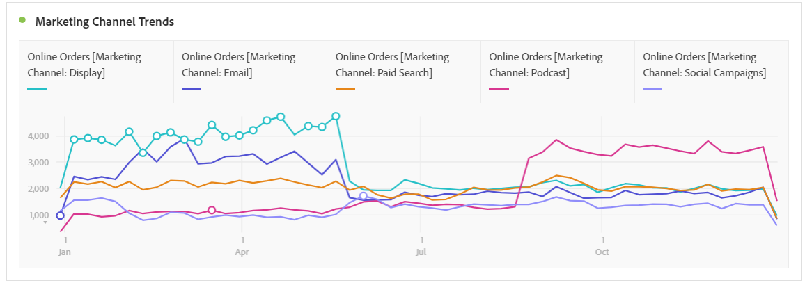

# Analysera marknadsföringskanaler

Ni vill antagligen veta vilka av era marknadsföringskanaler som är mest effektiva och med vilka ni kan inrikta er bättre och få bättre avkastning på era marknadsföringsinvesteringar. I Adobe Analytics är dimensionerna och måtten för marknadsföringskanalerna i Workspace ett av de verktyg som kan hjälpa er att spåra hur olika kanaler påverkar era order, intäkter osv. och ge er användbara kanalinsikter. Här är de mått och mätvärden du kan använda för marknadsföringskanaler:

| Mått | Definition |
|---|---|
| Marknadsföringskanal | Det här är den marknadsföringskanaldimension som vi rekommenderar att du använder. IQ-modeller för attribuering kan användas vid körning. Den generiska dimensionen för marknadsföringskanaler fungerar på samma sätt som dimensionerna för sista beröringskanalen, men har en annan etikett för att förhindra förvirring när den används med en annan attribueringsmodell. |
| Senaste beröringskanal | Äldre dimension, med attribueringsmodellen förtillämpad och oföränderlig. |
| Första beröringskanalen | Äldre dimension, med attribueringsmodellen förtillämpad och oföränderlig. |
| Instanser för marknadsföringskanal | Det här måttet.. |
| Nya åtaganden | Det här är ett äldre mått som bara ökas när en kanal har tilldelats &quot;första beröringen&quot;. |

## Grundläggande analys

I den här frihandstabellen visas mått för onlineorder, onlineintäkter och konverteringsgraden för var och en av marknadsföringskanalerna:

Här ser du varje Marketing Channel-kanals onlinebeställningar och onlineintäkter i ett diagram:

I det här linjediagrammet visas trender i onlinebeställningar för olika kanaler över tid:

## Avancerad analys

Marknadsföringskanaler Detaljerna rör sig djupare in i varje kanal för att visa specifika kampanjer, placeringar osv. Du kan dela upp varje marknadsföringskanal i detaljer:

## Använd attribueringsmodeller

Du kan använda [Attribution IQ](https://docs.adobe.com/content/help/en/analytics/analyze/analysis-workspace/panels/attribution/use-attribution.html) för att tillämpa olika attribueringsmodeller direkt:

Lägg märke till hur samma mått (onlineorder) genererar olika resultat när du använder olika attribueringsmodeller.

Här följer några videor som förklarar attribuerings-IQ i detalj: IQ-spellista för [attribut](https://www.youtube.com/playlist?list=PL2tCx83mn7GuDzYEZ8jQlaScruZr3tBTR).

## Flerfliksanalys

Med den äldre First Touch Channel och Last Touch Channel får du en användbar vy över kanalinteraktionerna:

Läs mer om flerfliksanalys i [den här videon](https://www.youtube.com/watch?v=M3EOdONa-3E).