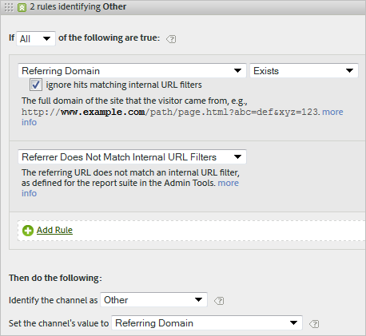

# Vanliga frågor om marknadsföringskanaler

>[!NOTE]
>
>För att maximera effekten av marknadsföringskanaler för attribuering och Customer Journey Analytics har vi publicerat [reviderade best practices](/help/components/c-marketing-channels/mchannel-best-practices.md).
>
>Analysadministratörer kan hantera marknadsföringskanaler för sina organisationer enligt beskrivningen i [Hantera marknadsföringskanaler](/help/admin/admin/c-manage-report-suites/c-edit-report-suites/marketing-channels/c-channels.md).

Vanliga frågor och svar om marknadsföringskanaler.

## Mina spårningskoder följer inget mönster och jag har tusentals som måste anges för min Filials-kanal.

* Använd elimineringsprocessen. Om kanalerna E-post och Filialer använder samma frågesträngsparameter, men du bara har ett fåtal e-postspårningskoder, kan du ange e-postspårningskoderna i en regeluppsättning som definierar e-post. Sedan klassificerar du alla andra spårningskoder med *`affiliates.`*
* I e-postsystemet lägger du till en frågesträngsparameter i alla URL-adresser för landningssidor, till exempel *`&ch=eml`*. Skapa en regeluppsättning som identifierar om ch-frågeparametern är lika med *`eml`*. Om den inte innehåller *`eml`* är det ett närstående bolag.

## Referensdomäner innehåller mer data än jag förväntade mig.

Referensdomäner kan vara för höga i listan över bearbetningsregler. Det ska vara en av de sista (eller sista) regeluppsättningarna, eftersom bearbetningsordningen är viktig.

## Jag har skapat en regel som matchar en frågesträngsparameter och som inte fungerar.

Kontrollera att parameternamnet har angetts i frågesträngsparameterfälten (vanligtvis ett alfanumeriskt värde). Kontrollera också att parametervärdet anges efter operatorn, vilket visas i följande exempel på en e-postregel.

## Varför tillskrivs all min trafik med sista handen en intern domän?

Du har en regel som matchar intern trafik. Kom ihåg att dessa regler gäller för varje träff som besökaren gör på er webbplats, inte bara för det första besöket. Om du har en regel som *`Page URL exists`* utan andra villkor, matchas den kanalen för varje efterföljande träff på din webbplats eftersom det alltid finns en sidadress.

## Hur felsöker jag trafik som visas i Ingen kanal identifierad i rapporten?

Regelprocessen är i ordning. Om inga specifika kriterier har matchats faller träffarna in i en av tre kategorier:

1. Ingen hänvisare (direktbesök).

2. Internt referenter, på första sidan av ett besök.

3. Ett bearbetningsfel på sidan.

Se till att du har en kanal för de här tre möjligheterna. Skapa till exempel regler som säger:

1. **[!UICONTROL Referrer]** och **[!UICONTROL Does Not Exist]** och **[!UICONTROL Is First Page of Visit]**. (Se [Direkt.](/help/components/c-marketing-channels/c-faq.md))

2. **[!UICONTROL Referrer Matches Internal URL Filters]** och **[!UICONTROL Is First page of Visit]**. (Se [Intern](/help/components/c-marketing-channels/c-faq.md).)

3. **[!UICONTROL Referrer]** och **[!UICONTROL Exists]** och **[!UICONTROL Referrer Does Not Match Internal URL Filters]**.

Skapa till sist en *annan*-kanal som fångar de återstående träffarna, enligt beskrivningen i [Ingen kanal identifierad](/help/components/c-marketing-channels/c-faq.md#no-channel-identified).

## Relation mellan första och sista beröringen

För att förstå interaktionen mellan äldre första och sista beröringsdimensioner och bekräfta att åsidosättningar fungerar som förväntat, kan du ta fram en första beröringskanalrapport, som är underrelaterad till en sista beröringskanalrapport, med nyckelresultatmåttet tillagt i (se exempel nedan). Exemplet visar interaktionen mellan den första och sista beröringskanalen.

Skärningen där den första motsvarar den sista beröringen är tabellens diagonala. Både Direct- och Session Refresh får bara sista-beröringen om de också var den första beröringskanalen, eftersom de inte kan ta åt sig meriter från andra beständiga kanaler (markerade rader).

## Orsaker till att ingen kanal har identifierats {#no-channel-identified}

Om dina regler inte samlar in data, eller om reglerna inte är korrekt konfigurerade, visar rapporten data på raden [!UICONTROL No Channel Identified] i rapporten. Du kan skapa en regeluppsättning med namnet *Annan*, till exempel i slutet av bearbetningsordningen, som även identifierar intern trafik.

Den här typen av regel fungerar som en catch-all-regel för att säkerställa att kanaltrafiken alltid matchar extern trafik, och hamnar vanligtvis inte i **[!UICONTROL No Channel Identified]**. Var försiktig så att du inte skapar en regel som även identifierar intern trafik. Att ange kanalens värde till **[!UICONTROL Referring Domain]** eller **[!UICONTROL Page URL]** är det vanligaste och mest användbara sättet att skapa en effektiv Andra regel.

>[!NOTE]
>
>Det kan fortfarande finnas kanaltrafik som kan ingå i kategorin Ingen kanal identifierad. Till exempel: En besökare kommer till webbplatsen och bokmärker en sida och på samma besök kommer tillbaka sidan via bokmärket. Eftersom detta inte är den första sidan av besöket kommer det inte att gå vare sig i direktkanalen eller i den andra kanalen eftersom det inte finns någon referensdomän.

## Orsaker till internt (sessionsuppdatering) {#internal}

Senaste beröring internt (sessionsuppdatering) kan bara inträffa om det också var den första beröringen - se Relation mellan första och sista beröringen ovan. Scenarierna nedan förklarar hur Sessionsuppdatering kan vara en kanal med första klicket.

* **Tidsgräns för session**: En besökare kommer till webbplatsen och lämnar sedan fliken öppen i webbläsaren för användning vid ett senare datum. Besökarens engagemangsperiod går ut (eller så tar de frivilligt bort sina cookies) och de använder den öppna fliken för att besöka webbplatsen igen. Eftersom den refererande URL:en är en intern domän kommer besöket att klassificeras som Sessionsuppdatering.

* **Alla webbplatssidor är inte taggade**: En besökare kommer till sida A som inte är taggad och går sedan till sida B som är taggad. Sidan A skulle ses som intern hänvisare och besöket skulle klassificeras som Sessionsuppdatering.

* **Omdirigerar**: Om en omdirigering inte är inställd för att skicka referensdata till den nya landningssidan, förloras den sanna postens referensdata och nu visas omdirigeringssidan (troligtvis en intern sida) som den refererande domänen. Besöken klassificeras som Sessionsuppdatering.

* **Cross-Domain Traffic**: En besökare flyttar från en domän som utlöses till Suite A till en andra domän som utlöses till Suite B. Om de interna URL-filtren i Suite B innehåller den första domänen kommer besöket i Suite B att registreras som Internal, eftersom Marketing Channels ser det som ett nytt besök i den andra sviten. Besöken klassificeras som Sessionsuppdatering.

* **Långa inläsningstider för startsidor**: En besökare hamnar på sidan A som har mycket innehåll och Adobe Analytics-koden finns längst ned på sidan. Innan allt innehåll (inklusive bildbegäran från Adobe Analytics) kan läsas in klickar besökaren på sida B. Sida B utlöser sin begäran om Adobe Analytics-bilder. Eftersom Page A:s bildförfrågan aldrig har lästs in visas den andra sidan som den första träffen vid besöket i Adobe Analytics, där Page A är hänvisare. Besöken klassificeras som Sessionsuppdatering.

* **Rensar cookies mitt på webbplatsen**: En besökare kommer till webbplatsen och mellansessionen rensar deras cookies. Både första- och sista-beröringskanalen återställs och besöket klassificeras som Sessionsuppdatering (eftersom referenten är intern).

Nedan visas ett exempel på intern (sessionsuppdatering) som ställs in både som den första beröringskanalen och den sista beröringskanalen:

* Dag 1: Användaren kommer till webbplatsen på skärmen. Första och sista-beröringskanalen ställs in på Visning.
* Dag 2: Användare kommer till webbplatsen för naturlig sökning. Första beröringen är fortfarande Visning och Sista beröringen är inställd på Naturlig sökning.
* Dag 35: Användaren har inte varit på webbplatsen på 33 dagar och kommer tillbaka med fliken som öppnats i webbläsaren. Om man utgår ifrån ett 30-dagars interaktionsfönster skulle fönstret ha stängts och cookies för marknadsföringskanaler skulle ha gått ut. Den första berörings- och den sista beröringskanalen återställs och ställs in på Sessionsuppdatering sedan användaren kom från en intern URL.

## Varför ändras vissa kanaler efter att ha ändrat reglerna för bearbetning av marknadsföringskanaler?

Ibland konfigureras regler för bearbetning av marknadsföringskanal felaktigt, vilket gör det nödvändigt att ändra bearbetningsreglerna. När du har tillämpat ändringarna kan du se en del mätdata fortfarande attributera data till en felaktig kanal. Det finns flera saker att tänka på:

* **Data för marknadsföringskanal samlas in i realtid**: Data för marknadsföringskanaler bearbetas vid datainsamling och är permanenta till 100 %. Om du ändrar bearbetningsregler påverkas inte data retroaktivt.
* **Ändring av bearbetningsregler påverkar inte direkt First Touch-data**: Till exempel:
   1. En användare kommer in via din e-postkanal eftersom den har konfigurerats felaktigt och sedan lämnar platsen.
   2. Nästa dag ändrar du din bearbetningsregel för e-post för att korrigera den.
   3. Användaren kommer tillbaka flera dagar senare genom naturlig sökning och gör ett inköp.
   4. E-postkanalen får First Touch-kredit och naturlig sökning får Last Touch-kredit.

  Även flera dagar efter att du ändrat bearbetningsreglerna kan data fortfarande samlas in i fel First Touch-kanal. Första beröringsdata samlas kontinuerligt in i fel kanal tills alla användares besökarengagemang upphör.

Det bästa sättet att åtgärda dessa skillnader är att göra något eller båda av följande:

* **Förfaller manuellt alla besökares interaktionsperioder**: Den här inställningen förfaller omedelbart alla första och sista beröringskanaler för alla besökare:
   1. Gå till Administratörsverktyg > Rapportsviter.
   2. Hovra över Inställningar för bildredigering > Marknadsföringskanaler > Förfallotid för besökarengagemang
   3. Klicka på Förfalla alla.
   4. Klicka på OK i popup-fönstret för varningar och bekräfta att du förstår vad det kommer att göra.

* **Visa endast senaste beröringsmått från den tidpunkt du korrigerade dina regler framåt**: Senaste beröringsmått följer alltid den aktuella regeluppsättningen. Om du visar tiden från när du ändrade bearbetningsregler framåt korrekt, visas de senaste bearbetningsreglerna.
