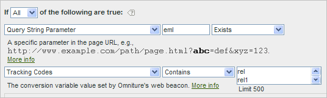

# Vanliga frågor och exempel om marknadsföringskanaler

Se [Skapa regler](/help/components/c-marketing-channels/c-rules.md) för bearbetning av marknadsföringskanaler för definitioner av fält som visas på [!UICONTROL Marketing Channel Processing Rules] sidan.

## Frågor och svar {#faq}

Alla implementeringar av regler för bearbetning av marknadsföringskanaler kan variera beroende på dina spårningskoder. Om du konfigurerar regler som ger resultat du är ute efter kan du behöva lite kreativt tänkande för att lösa problem.

**Fråga**: Mina spårningskoder följer inget mönster och jag har tusentals som måste anges för min Filials-kanal.

* Använd elimineringsprocessen. Om kanalerna E-post och Filialer använder samma frågesträngsparameter, men du bara har ett fåtal e-postspårningskoder, kan du ange e-postspårningskoderna i en regeluppsättning som definierar e-post. Sedan klassificerar du alla andra spårningskoder med *`affiliates.`*
* I e-postsystemet lägger du till en frågesträngsparameter i alla URL-adresser för landningssidor, till exempel *`&ch=eml`*. Skapa en regeluppsättning som identifierar om ch-frågeparametern är lika med *`eml`*. Om det inte innehåller något *`eml`*&#x200B;är det ett närstående bolag.

**Fråga**: Referensdomäner innehåller mer data än jag förväntade mig.

* Referensdomäner kan vara för höga i listan över bearbetningsregler. Det ska vara en av de sista (eller sista) regeluppsättningarna, eftersom bearbetningsordningen är viktig.

**Fråga**: Jag har skapat en regel som matchar en frågesträngsparameter och som inte fungerar.

* Kontrollera att parameternamnet har angetts i frågesträngsparameterfälten (vanligtvis ett alfanumeriskt värde). Kontrollera också att parametervärdet anges efter operatorn, vilket visas i följande exempel på en e-postregel.

   

**Fråga**: Varför tillskrivs all min trafik med sista handen en intern domän?

* Du har en regel som matchar intern trafik. Kom ihåg att dessa regler gäller för varje träff som besökaren gör på er webbplats, inte bara för det första besöket. Om du har en regel som *`Page URL exists`* utan andra villkor matchas kanalen för varje efterföljande träff på webbplatsen, eftersom det alltid finns en sidadress.

**Fråga**: Hur felsöker jag trafik som visas i Ingen kanal identifierad i rapporten?

* Regelprocessen är i ordning. Om inga specifika kriterier har matchats faller träffarna in i en av tre kategorier:

1. Ingen hänvisare (direktbesök).

2. Internt referenter, på första sidan av ett besök.

3. Ett bearbetningsfel på sidan.

Se till att du har en kanal för de här tre möjligheterna. Skapa till exempel regler som säger:

1. **[!UICONTROL Referrer]** och **[!UICONTROL Does Not Exist]** och **[!UICONTROL Is First Page of Visit]**. (Se [Direkt.](/help/components/c-marketing-channels/c-faq.md))

2. **[!UICONTROL Referrer Matches Internal URL Filters]** och **[!UICONTROL Is First page of Visit]**. (Se [Intern](/help/components/c-marketing-channels/c-faq.md).)

3. **[!UICONTROL Referrer]** och **[!UICONTROL Exists]** och **[!UICONTROL Referrer Does Not Match Internal URL Filters]**.

Skapa slutligen en *annan* kanal som fångar upp de återstående träffarna, enligt beskrivningen i [Ingen kanal identifierad](/help/components/c-marketing-channels/c-faq.md#no-channel-identified).

## Ingen kanal identifierad {#no-channel-identified}

Om reglerna inte samlar in data, eller om reglerna inte är korrekt konfigurerade, visar rapporten data på rapportraden i [!UICONTROL No Channel Identified] rapporten. Du kan skapa en regeluppsättning med namnet *Annan*, till exempel i slutet av bearbetningsordningen, som även identifierar intern trafik.

Den här typen av regel fungerar som en&quot;catch all&quot;-regel för att säkerställa att kanaltrafiken alltid matchar den externa trafiken, och hamnar vanligtvis inte i **[!UICONTROL No Channel Identified]**. Var försiktig så att du inte skapar en regel som även identifierar intern trafik. Att ange kanalens värde till **[!UICONTROL Referring Domain]** eller till **[!UICONTROL Page URL]** är det vanligaste och mest användbara sättet att skapa en effektiv Andra regel.

> [!NOTE] Det kan fortfarande finnas kanaltrafik som kan ingå i kategorin Ingen kanal identifierad. Till exempel: En besökare kommer till webbplatsen och bokmärker en sida, och på samma besök kommer sidan tillbaka via bokmärket. Eftersom detta inte är den första sidan av besöket kommer det inte att gå vare sig i direktkanalen eller i den andra kanalen eftersom det inte finns någon referensdomän.

## Betalsökning {#paid-search}

En betald sökning är ett ord eller en fras som du använder som sökmotor för placering i sökresultat. Marknadskanalen använder inställningar som är konfigurerade på [!UICONTROL Paid Search Detection] sidan för att matcha regler för betald sökningsidentifiering. ( **[!UICONTROL Admin]** > **[!UICONTROL Report Suites]** > **[!UICONTROL Edit Settings]** > **[!UICONTROL General]** > **[!UICONTROL Paid Search Detection]**). Mål-URL:en matchar den befintliga regeln för avkänning av betald sökning för den sökmotorn.

För marknadsföringskanalregeln är [!UICONTROL Paid Search] inställningarna följande:

Mer information finns i [Betalsökningsidentifiering](https://docs.adobe.com/content/help/en/analytics/admin/admin-tools/paid-search-detection/paid-search-detection.html) i Admin.

## Naturlig sökning {#natural-search}

En naturlig sökning sker när besökarna hittar din webbplats genom en webbsökning, där sökmotorn rankade din webbplats utan att du betalade för listan. Du kan styra den mål-URL som sökmotorn använder för att länka till webbplatsen. Med den här URL:en kan Analytics identifiera om en sökning är naturlig.

Det finns ingen naturlig sökidentifiering i Analytics. När du har konfigurerat betald sökidentifiering vet systemet att om en sökreferent inte var en betalande sökreferent måste det vara en naturlig sökreferent. För en naturlig sökning matchar mål-URL:en inte den befintliga regeln för avkänning av betald sökning för den sökmotorn.

För marknadsföringskanalregeln är de naturliga sökinställningarna följande:

Mer information finns i [Betalsökningsidentifiering](https://docs.adobe.com/content/help/en/analytics/admin/admin-tools/paid-search-detection/paid-search-detection.html) i Admin.

## Filialer {#afilliates}

En filialregel identifierar besökare som kommer från en angiven uppsättning refererande domäner. I regeln listas domänerna för filialer som du vill spåra enligt följande:

## Sociala nätverk {#social-networks}

Den här regeln identifierar besökare som kommer från ett socialt nätverk, t.ex. Facebook*. Inställningarna kan vara följande:

## Visa {#display}

Den här regeln identifierar besökare som kommer från banderollannonser. Den identifieras av en frågesträngsparameter i mål-URL:en, i det här fallet *`Ad_01`*.

## Intern {#internal}

Den här regeln identifierar besökare som kommer från en referent som matchar de interna URL-filtren för rapportsviten.

## E-post {#email}

Om du vill konfigurera den här regeln anger du frågesträngsparametern för din e-postkampanj. I det här exemplet är parametern *`eml`*:

Om regeln innehåller spårningskoder anger du ett värde per rad, så som visas här:

## Direkt {#direct}

Den här regeln identifierar besökare som inte har någon hänvisande domän. Den här regeln omfattar besökare som kommer direkt till webbplatsen, till exempel från en Favoriter-länk eller genom att klistra in en länk i webbläsaren.

