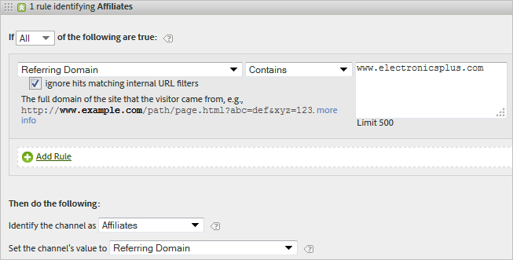
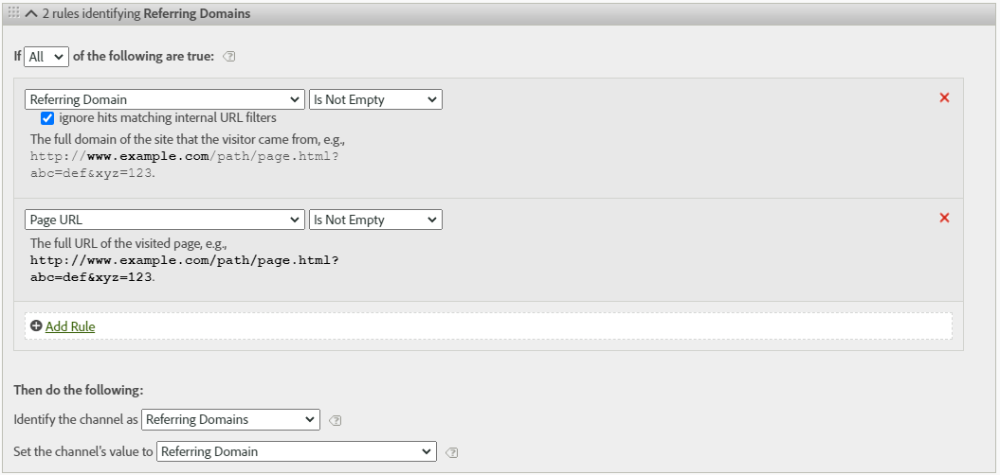

# Bearbetningsregler för marknadsföringskanaler

Bearbetningsreglerna för marknadsföringskanaler avgör om en besökare når upp till de kriterier som tilldelats en kanal genom att bearbeta varje träff en besökare gör på din webbplats. Reglerna bearbetas i den ordning som du anger, och när en regel uppfylls avbryts bearbetningen av de återstående reglerna.

Ytterligare information om bearbetning:

* Data som samlas in med dessa regler är helt permanenta, och regler som ändras efter det att data har samlats in är inte retroaktiva. Vi rekommenderar att du granskar och tar hänsyn till alla omständigheter innan du sparar [!UICONTROL Marketing Channel Processing Rules] för att minska risken för att data samlas in i felaktiga kanaler.
* Rapporten kan bearbeta upp till 25 kanaler i taget.
* Regler kan komma åt variabler som har angetts av VISTA, men de kan inte komma åt data som har tagits bort av VISTA.
* Två marknadsföringskanaler får aldrig någon kredit för samma event (som köp eller klick). På så sätt skiljer sig marknadsföringskanalerna från eVars (där två eVars kan få krediter för samma händelse).
* Om det finns en lucka i reglerna kan du se [Ingen kanal identifierad.](/help/components/c-marketing-channels/c-faq.md)

## Förutsättningar

* Granska den konceptuella informationen i [Komma igång med marknadsföringskanaler](/help/components/c-marketing-channels/c-getting-started-mchannel.md).
* Skapa en eller flera kanaler så att du kan tilldela regler till dem. Se [Lägg till marknadsföringskanaler.](/help/components/c-marketing-channels/c-channels.md)
* Granska de bästa sätten att använda [!UICONTROL Marketing Channels] med [!UICONTROL Attribution IQ].

## Skapa regler för bearbetning av marknadsföringskanal

Skapa regler för bearbetning av marknadsföringskanaler, som avgör om en besökarträff uppfyller kriterierna som tilldelats en kanal.

1. Klicka på **[!UICONTROL Analytics]** > **[!UICONTROL Admin]** > **[!UICONTROL Report Suites]**.
2. Välja en rapportsvit.

   Om din rapportserie inte har definierade kanaler visas sidan [!UICONTROL Marketing Channels: Auto Setup].

   Se [Kör de automatiska inställningarna](/help/components/c-marketing-channels/c-getting-started-mchannel.md).

3. Klicka på **[!UICONTROL Edit Settings]** > **[!UICONTROL Marketing Channels]** > **[!UICONTROL Marketing Channel Processing Rules]**. Om du har kört den automatiska konfigurationen har en uppsättning kanaler och regler definierats automatiskt åt dig.

   

4. Om du vill lägga till en ny regel väljer du den på menyn **[!UICONTROL Add New Rule Set]**. Om du väljer en kanal får du en regelmall och om du väljer Egen börjar du från en tom skiva. Med båda alternativen kan du ändra regeluppsättningen efter behov.

   

5. Klicka på **[!UICONTROL Add New Rule SetRule]** om du vill fortsätta skapa regler.
6. Om du vill prioritera regler drar och släpper du dem till önskad plats.
7. Klicka på **[!UICONTROL Save.]**

Fortsätt nedåt på den här sidan om du vill se rekommendationer för kanalregelordning samt fler definitionsexempel.

### Ange värdet för marknadsföringskanalen

**[!UICONTROL Set the channel's value]** definierar detaljdimensionen för marknadsföringskanalen som är tillgänglig för den kanalen. På så sätt kan ni dela upp dimensionerna för marknadsföringskanalen och se mer detaljerad information om kanalen.

Vi rekommenderar att kanalvärdet ställs in på samma villkor som används för att definiera själva kanalen. Om frågesträngsparametern till exempel används för att definiera kanalen anger du frågesträngsparametern som kanalvärde.

### Regelkriterier

Den här referenstabellen definierar de fält, alternativ och träffattribut som du kan använda för att definiera regler för bearbetning av marknadsföringskanaler.

>[!NOTE]
>
>Alla textfält som du definierar, till exempel frågesträngsparametrar eller listor med värden som ska matchas mot, utvärderas som **skiftlägesokänsliga**-värden. Om du till exempel har en regel där frågesträngsparametern cmp = abc123, kommer alla versioner av både &#39;cmp&#39; och &#39;abc123&#39; att matcha regeln. Du behöver inte lista flera versioner av dessa värden.

| Term | Definition |
|--- |--- |
| Alla | Aktiverar endast den här kanalen när alla regler i den numrerade regeln är sanna. |
| Alla | Aktiverar den här kanalen när någon av reglerna i regeluppsättningen är true. Det här alternativet är bara tillgängligt om det finns mer än en regel i den numrerade regeln. |
| AMO-ID | Den primära spårningskod som används av Advertising Cloud- och Advertising Analytics-integreringar. När en av dessa integreringar är aktiverad kan spårningskod-prefixet användas för att identifiera Advertising Cloud-specifika kanaler. Använd&quot;AMO ID&quot; börjar med&quot;AL&quot; för sökning,&quot;AC&quot; för visning eller&quot;AO&quot; för sociala medier. När AMO-ID används i marknadsföringskanaler kan värdena för klickning/kostnad/intryck tillskrivas rätt kanal (om de inte är konfigurerade går dessa värden till Direkt eller Ingen). |
| AMO ED ID | Den sekundära spårningskod som används av Advertising Cloud. Huvudsyftet med den här spårningskoden är att den ska fungera som nyckel för att skicka data tillbaka till Ad Cloud. Den kan dock även användas för att identifiera ClickThrottings jämfört med ViewThaves om du vill se dessa som två separata marknadsföringskanaler. Detta kan du göra genom att ställa in marknadsföringskanallogiken för&quot;AMO EF ID&quot; avslutas med &quot;:d&quot; för Display ClickTheves eller&quot;AMO EF ID&quot; slutar med &quot;:i&quot; för DisplayThrotts. Om du inte vill dela upp Visning i två kanaler använder du AMO ID-dimensionen i stället. |
| Konverteringsvariabler | Består av eVars som är aktiverade för den här rapportsviten och gäller bara när dessa variabler ställs in via Adobe-koden på sidan.  Se Implementeringshandboken . |
| Finns | Det finns flera tillgängliga markeringar, bland annat:<ul><li>**Finns** inte: Anger att träffattributet inte finns i begäran. Om användaren till exempel skriver en URL eller klickar på ett bokmärke i en hänvisande domän finns inte det refererande domänattributet.</li><li>**Är tom**: Anger att ett träffattribut finns, vanligtvis en eVar- eller frågesträngsparameter, men det finns inget värde som är associerat med träffattributet.</li><li>**Innehåller** inte: Här kan du till exempel ange att en hänvisande domän inte innehåller ett visst värde (till skillnad från att använda markeringen &quot;Innehåller&quot;).</li></ul> |
| Identifiera kanalen som | Associerar regeln med en marknadsföringskanal som du har lagt till på sidan för Marketing Channel Manager.  Se Lägga till marknadsföringskanaler. |
| Matchar regler för betald sökidentifiering | En betald sökning upptäcktes av Adobe. Betalda sökningar är när företag betalar en avgift för sökmotorn för att visa sin webbplats. Betalda sökningar visas vanligtvis högst upp eller till höger i sökresultaten. |
| Matchar reglerna för identifiering av naturlig sökning | En obetald sökning upptäcktes av Adobe. |
| Referenten matchar interna URL-filter | Ett besök vars sid-URL matchar ett internt URL-filter, enligt definition för rapportsviten i Admin Tools. |
| Referenten matchar inte interna URL-filter | Den refererande URL:en matchar inte ett internt URL-filter, som definierats för rapportsviten i Admin Tools. Du kan använda den här inställningen med sidans URL och Exists för att ställa in en regel för att spara alla, så att inga besök hamnar i rapportens avsnitt Ingen kanal identifierad. |
| Ignorera träffar som matchar interna URL-filter | (För referenter) Spårar bara träffar som kommer från externt refererade platser. Vanligtvis låter du den här inställningen vara aktiverad om du inte vill inkludera intern trafik. |
| Är första sidan av besök | Den första sidan av ett besök som Adobe rapporterar. |
| Sida | Sidnamnet på en webbsida på din webbplats som är taggad med Adobe webbfyr. Detta värde motsvarar s.pageName . Exempel är `Home Page` och `About Us`. |
| Siddomän | Domänen för den sida som besökaren kommer till, till exempel `products.example.co.uk`. |
| Siddomän och sökväg | Domän och sökväg, till exempel `products.example.co.uk/mens/pants/overview.html`. |
| Sidrotdomän (TLD+1) | Rotdomänen för den sida där besökaren pekar, till exempel example.co.uk . |
| Sidans URL | URL-adressen till en webbsida på webbplatsen. |
| Refererande domän | Vilken domän dina besökare kom ifrån innan de besökte din webbplats, till exempel referenter från `abcsite.com` jämfört med `xyzsite.com`. |
| Frågesträngsparameter | Om en sidadress på din webbplats ser ut som `https://example.com/?page=12345&cat=1` är både page och cat frågesträngsparametrar. (Se `https://en.wikipedia.org/wiki/Query_string`.)  Du kan bara ange en frågesträngsparameter per regeluppsättning. Om du vill lägga till ytterligare frågesträngsparametrar använder du `ANY` som operator och lägger sedan till nya frågesträngsparametrar i regeln. Frågesträngsparametrar utvärderas som skiftlägeskänsliga; &quot;cat&quot; och &quot;CAT&quot; kommer till exempel att utvärderas på samma sätt. |
| Referent | Webbsidans plats (fullständig URL) som besökarna var på innan de kom till webbplatsen. Det finns en referens utanför den definierade domänen. |
| Refererande domän och sökväg | En sammanfogning av den refererande domänen och URL-sökvägen. Exempel:    `www.example.com/products/id/12345` eller `ad.example.com/foo` |
| Refererande parameter | En frågesträngsparameter på referensens URL. Om besökarna till exempel kommer från `example.com/?page=12345&cat=1` är sidan och katten de refererande parametrarna. |
| Refererande rotdomän | Referensens rotdomän. Det finns en referent utanför den definierade domänen. |
| Sökmotor | En sökmotor som Google eller Yahoo! som förde besökare till er webbplats. |
| Sökord | Ett ord som används för att utföra en sökning med en sökmotor. |
| Sökmotor + nyckelord | En sammanfogning av söknyckelordet och sökmotorn för att unikt identifiera sökmotorn. Om du till exempel söker efter ordet dator identifieras sökmotorn och nyckelordet enligt följande: `Search Tracking Code = "<search_type>:<search engine>:<search keyword>" where    search_type = "n" or "p", search_engine = "Google", and search_keyword = "computer"`**Obs!** n = naturligt; p = Betalad |
| Ange kanalens värde till | Förutom att ni vet vilken marknadsföringskanal som för besökaren till er webbplats vet ni vilken banderollannons, söknyckelord eller e-postkampanj i kanalen som får tillgodoräkna er för besökarens webbplatsaktivitet. Detta ID är ett kanalvärde som lagras tillsammans med kanalen. Detta värde är ofta ett kampanj-ID som är inbäddat på landningssidan eller den refererande URL:en. i andra fall är det sökmotorn och nyckelordskombinationen för sökning, eller den refererande URL:en som identifierar besökaren från en viss kanal bäst. |

## Regelordning och definitioner för marknadsföringskanal {#channel-rules}

Kanalreglerna bearbetas i den ordning du anger. Ett rekommenderat tillvägagångssätt vid kanalorder är att placera betalda eller hanterade kanaler först (t.ex. betalsökningar, naturlig sökning, visning, e-post) så att de får kredit, följt av organiska kanaler (t.ex. direkta, interna, refererande domäner).

Nedan visas den rekommenderade ordningen för kanalregler samt exempeldefinitioner:

### Betalsökning {#paid-search}

Betalsökning är ett ord eller en fras som du betalar en sökmotor för placering i sökresultat. Den här kanalen definieras vanligtvis baserat på frågesträngsparametrar (se Exempel på visningskanal) eller regler för betalsökningsidentifiering. Beslutet beror på vilken detaljinformation om marknadsföringskanalen du vill spela in.

#### Betald sökdetektering

Marknadskanalen använder inställningar som är konfigurerade på sidan [!UICONTROL Paid Search Detection] för att matcha regler för betald sökningsidentifiering. ( **[!UICONTROL Admin]** > **[!UICONTROL Report Suites]** > **[!UICONTROL Edit Settings]** > **[!UICONTROL General]** > **[!UICONTROL Paid Search Detection]**). Mål-URL:en matchar den befintliga regeln för avkänning av betald sökning för den sökmotorn.

För marknadsföringskanalregeln är [!UICONTROL Paid Search]-inställningarna följande:

Mer information finns i [Betalsökningsidentifiering](https://docs.adobe.com/content/help/en/analytics/admin/admin-tools/paid-search-detection/paid-search-detection.html) i Admin.

### Naturlig sökning {#natural-search}

En naturlig sökning sker när besökarna hittar din webbplats genom en webbsökning, där sökmotorn rankade din webbplats utan att du betalade för listan.

Det finns ingen naturlig sökidentifiering i Analytics. När du har konfigurerat betald sökidentifiering vet systemet att om en sökreferent inte var en betalande sökreferent måste det vara en naturlig sökreferent. Mer information finns i [Betalsökningsidentifiering](https://docs.adobe.com/content/help/en/analytics/admin/admin-tools/paid-search-detection/paid-search-detection.html) i Admin.

För marknadsföringskanalregeln är de naturliga sökinställningarna följande:

### Visa {#display}

Den här regeln identifierar besökare som kommer från banderollannonser. Den identifieras av en frågesträngsparameter i mål-URL:en, i det här fallet *`Ad_01`*. Frågesträngsparametern och de värden den söker efter utvärderas som skiftlägeskänsliga värden.

### E-post {#email}

Den här regeln identifierar besökare som kommer från e-postkampanjer. Den identifieras av en frågesträngsparameter i mål-URL, i det här fallet *`eml`*:

### Filialer {#afilliates}

Den här regeln identifierar besökare som kommer från en angiven uppsättning referensdomäner. I regeln listas domänerna för filialer som du vill spåra enligt följande:

### Andra kampanjer {#other-campaigns}

Ett bra tillvägagångssätt är att inkludera en&quot;annan kampanjkanal&quot; som följer alla regler för betalda kanaler. Den här kanalen fungerar som en&quot;catch-all&quot; för okategoriserad betald trafik.

### Sociala nätverk {#social-networks}

Denna regel identifierar besökare som kommer från ett socialt nätverk, t.ex. Facebook;. Kanalen byter ofta namn till Organic Social. Inställningarna kan vara följande:

### Intern kanal (Sessionsuppdatering) {#internal}

Den här regeln används av besökare där den refererande URL:en matchar inställningen för interna URL-filter i Admin Console, vilket innebär att besökaren kom från webbplatsen för att påbörja sitt besök. Den här kanalen byter ofta namn till Sessionsuppdatering.

Se [Orsaker till intern (Sessionsuppdatering)](https://docs.adobe.com/content/help/en/analytics/components/marketing-channels/c-faq.html#internal) för mer information om varför den här kanalen inträffar.

### Direkt {#direct}

Den här regeln identifierar besökare som inte har någon hänvisande domän, vilket inkluderar besökare som kommer direkt till platsen, till exempel från en Favoriter-länk eller genom att klistra in en länk i webbläsaren. Den här kanalen byter ofta namn till Direct Typed/Bookmarked.

### Refererande domänkanal {#referring-domains}

Kanalen Refererande domäner identifierar besökare som har en refererande domän. Tillsammans fungerar domänkanalerna Internal, Direct och Referring som en catch-all för alla återstående träffar som ännu inte har kategoriserats i en kanal.

