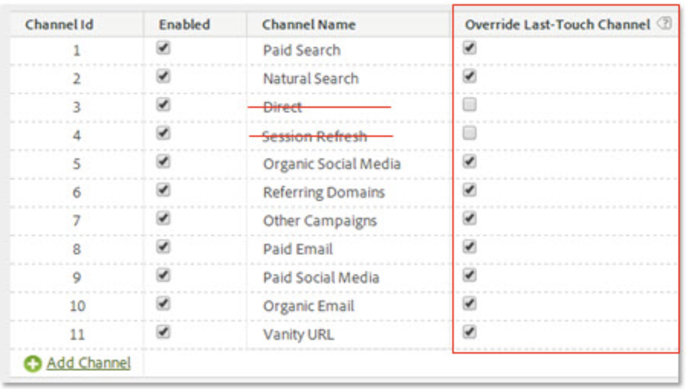

# Attribution IQ med marknadsföringskanaler - bästa praxis

[Marketing ](/help/components/c-marketing-channels/c-getting-started-mchannel.md) Channel är en värdefull och kraftfull funktion i Adobe Analytics. Den aktuella vägledningen för implementering av marknadsföringskanal formulerades vid en tidpunkt när varken [Attribution IQ](https://experienceleague.adobe.com/docs/analytics/analyze/analysis-workspace/attribution/overview.html?lang=en#analysis-workspace) eller [Customer Journey Analytics](https://experienceleague.adobe.com/docs/analytics-platform/using/cja-usecases/marketing-channels.html?lang=en#cja-usecases) fanns.

För att framtidssäkra implementeringen av era marknadsföringskanaler och säkerställa att det finns en konsekvens i rapporteringen med Attribution IQ och Customer Journey Analytics, håller vi på att ta fram en uppsättning uppdaterade metodtips. Om du redan använder marknadsföringskanaler kan du välja de bästa alternativen bland dessa nya riktlinjer. Om ni inte har använt Marketing Channels tidigare rekommenderar vi att ni följer alla nya bästa metoder.

När marknadsföringskanaler lanserades för första gången hade de bara första- och sista-beröringsdimensioner. Explicit första/sista beröringsdimensioner behövs inte längre med den aktuella versionen av attribuering. Adobe har allmänna mått för&quot;marknadsföringskanal&quot; och&quot;marknadsföringskanaldetaljer&quot; så att du kan använda dem med den önskade attribueringsmodellen. Dessa generiska dimensioner är identiska med Last-Touch Channel-dimensioner, men de har en annan etikett för att förhindra förvirring när du använder marknadsföringskanaler med en annan attribueringsmodell.

Eftersom dimensionerna för marknadsföringskanalen är beroende av en traditionell besöksdefinition (som definieras av deras bearbetningsregler), kan deras besöksdefinition inte ändras med hjälp av virtuella rapportsviter. Dessa reviderade rutiner möjliggör tydliga och kontrollerade uppslagsfönster med Attribution IQ och CJA.

## Bästa praxis nr 1: Utnyttja Attribution IQ för kontrollerad analys

Vi rekommenderar att du använder [Attribution IQ](https://experienceleague.adobe.com/docs/analytics/analyze/analysis-workspace/attribution/overview.html?lang=en#analysis-workspace) i stället för den befintliga attribueringen av marknadsföringskanalen för att finjustera analysen av marknadsföringskanalen. Följ andra metodtips för att försäkra dig om att analysen är konsekvent och att den har effektiva kontroller över Attribution IQ.

* Konfigurationen av dimensionerna Marketing Channel och Marketing Channel Detail fastställer kontaktytor som ska utvärderas, som motsvarar varje instans av marknadsföringskanalen.
* Vid mätanalys bör organisationen anpassa sig till en eller flera attribueringsmodeller. Spara anpassade mätvärden med den här modellen för enkel återanvändning.
* Som standard tilldelas data med hjälp av Senaste beröring och inställningen för besökaravtalsperioden. Med Attribution IQ-metriska modeller får du bättre kontroll över uppslagsfönstren och fler varianter, inklusive [algoritmisk attribuering](https://experienceleague.adobe.com/docs/analytics/analyze/analysis-workspace/attribution/algorithmic.html?lang=en#analysis-workspace).

## Best Practice #2: Inga kanaldefinitioner för direkt- och sessionsuppdatering

Direkta och interna uppdateringskanaler/sessioner rekommenderas inte för användning med anpassade attribueringsmodeller (Attribution IQ).

Vad händer om din organisation redan har Direct- och Session Refresh konfigurerat? I det här fallet rekommenderar vi att du [skapar en klassificering](https://experienceleague.adobe.com/docs/analytics/components/marketing-channels/classifictions-mchannel.html?lang=en) för First Touch/Last Touch och låter kanalerna Direct- och Session Refresh vara oklassificerade. Den klassificerade dimensionen ger samma Attribution IQ som om kanalerna aldrig hade konfigurerats.

## Bästa praxis nr 3: Aktivera Åsidosätt sista tryckkanal för alla kanaler

Anpassade attribueringsmodeller som används med marknadsföringskanaldimensionen i arbetsytan fungerar bäst när den här inställningen är aktiverad. Om du aktiverar den här inställningen räknas en instans av marknadsföringskanalen av när en ny kanal/detalj påträffas. Du bör aktivera detta för alla kanaler förutom för Direkt eller Intern/Sessionsuppdatering, som vi inte längre rekommenderar för användning med anpassade attribueringsmodeller (Attribution IQ).

## Bästa praxis nr 4: Minimera besökarengagemangsperioden

Om du ställer in besökarinteraktionsperioden på minst &quot;1 dag&quot; minimeras risken för bestående värden. Eftersom anpassade attribueringsmodeller (AIQ) tillåter flexibla sökningsfönster rekommenderar vi att du anger ett minimivärde för att minimera effekten av den här inställningen.

## Bästa praxis nr 5: Bearbetningsregler för marknadsföringskanaler ska bara finnas för aktiverade kanaler

Se till att du tar bort alla regler för bearbetning av marknadsföringskanaler för inaktiverade kanaler. Regler ska bara finnas för marknadsföringskanaler som är markerade som aktiverade.
