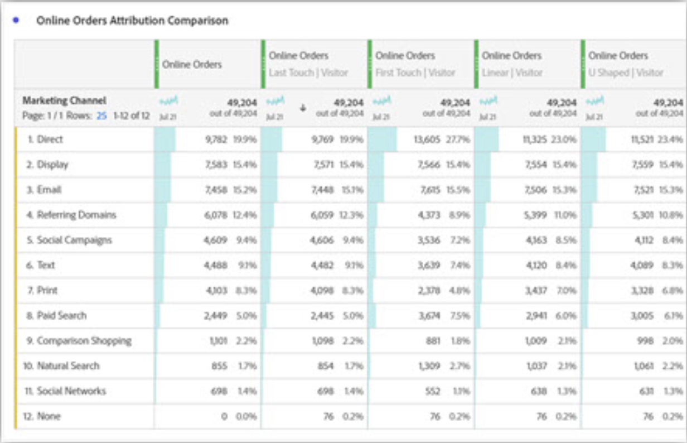

# Attribuering med marknadsföringskanaler - bästa praxis

[Marknadsföringskanaler](/help/components/c-marketing-channels/c-getting-started-mchannel.md) är en värdefull och kraftfull funktion i Adobe Analytics. Den aktuella vägledningen för implementering av marknadsföringskanaler har formulerats vid en tidpunkt när varken [Attribut](/help/analyze/analysis-workspace/attribution/overview.md)  eller [Customer Journey Analytics](https://experienceleague.adobe.com/docs/analytics-platform/using/cja-usecases/marketing-channels.html#cja-usecases) existerade.

För att framtidssäkra implementeringen av era marknadsföringskanaler och säkerställa att det finns en konsekvens i rapporteringen med Attribution och Customer Journey Analytics, håller vi på att utfärda en uppsättning uppdaterade bästa metoder. Om du redan använder marknadsföringskanaler kan du välja de bästa alternativen bland dessa nya riktlinjer. Om ni inte har använt Marketing Channels tidigare rekommenderar vi att ni följer alla nya bästa metoder.

När marknadsföringskanaler lanserades för första gången hade de bara första- och sista-beröringsdimensioner. Explicit första/sista beröringsdimensioner behövs inte längre med den aktuella versionen av attribuering. Adobe har allmänna dimensioner av typen&quot;Marknadsföringskanal&quot; och&quot;Marknadsföringskanal&quot; så att du kan använda dem med den önskade attribueringsmodellen. Dessa generiska dimensioner är identiska med Last-Touch Channel-dimensioner, men de har en annan etikett för att förhindra förvirring när du använder marknadsföringskanaler med en annan attribueringsmodell.

Eftersom dimensionerna för marknadsföringskanalen är beroende av en traditionell besöksdefinition (som definieras av deras bearbetningsregler), kan deras besöksdefinition inte ändras med virtuella rapportsviter. Dessa reviderade rutiner möjliggör tydliga och kontrollerade fönster för sökning med Attribution och med Customer Journey Analytics.

## Bästa praxis nr 1: Bruttoattribut för kontrollerad analys

Vi rekommenderar att du [Attribut](/help/analyze/analysis-workspace/attribution/overview.md) i stället för den befintliga marknadsföringskanalattribueringen för att finjustera er analys av marknadsföringskanalen. Följ andra metodtips för att säkerställa konsekvens och effektiva kontroller över analysen med Attribution.

* Konfigurationen av dimensionerna Marketing Channel och Marketing Channel Detail fastställer kontaktytor som ska utvärderas, som motsvarar varje instans av marknadsföringskanalen.
* Vid mätanalys bör organisationen anpassa sig till en eller flera attribueringsmodeller. Spara anpassade mätvärden med den här modellen för enkel återanvändning.
* Som standard tilldelas data med hjälp av Senaste beröring och inställningen för besökaravtalsperioden. Attribution metric models offers more control of lookback windows and more variety, including [algoritmisk attribuering](https://experienceleague.adobe.com/docs/analytics/analyze/analysis-workspace/attribution/algorithmic.html#analysis-workspace).

## Bästa praxis nr 2: Inga kanaldefinitioner för direkt- och sessionsuppdatering

Direkta och interna uppdateringskanaler/sessioner rekommenderas inte för användning med anpassade attribueringsmodeller.

Vad händer om din organisation redan har Direct- och Session Refresh konfigurerat? I det här fallet rekommenderar vi att du [skapa en klassificering](/help/admin/admin/c-manage-report-suites/c-edit-report-suites/marketing-channels/classifications-mchannel.md) för första beröring/sista beröring och lämna kanalerna för direkt och sessionsuppdatering oklassificerade. Den klassificerade dimensionen ger samma attribueringsresultat som om kanalerna aldrig hade konfigurerats.

## Bästa praxis nr 3: Aktivera åsidosättning av sista-beröringskanal för alla kanaler

Anpassade attribueringsmodeller som används med marknadsföringskanaldimensionen i arbetsytan fungerar bäst när den här inställningen är aktiverad. Om du aktiverar den här inställningen räknas en instans av marknadsföringskanalen av när en ny kanal/detalj påträffas. Du bör aktivera detta för alla kanaler utom för Direct- eller Internal/Session Refresh, som vi inte längre rekommenderar för anpassade attribueringsmodeller.

## Bästa praxis nr 4: Minimera besökarengagemangsperioden

Om du ställer in besökarinteraktionsperioden på minst &quot;1 dag&quot; minimeras risken för bestående värden. Eftersom anpassade attribueringsmodeller (AIQ) tillåter flexibla sökningsfönster rekommenderar vi att du anger ett minimivärde för att minimera effekten av den här inställningen.

## Bästa praxis nr 5: Bearbetningsregler för marknadsföringskanaler ska bara finnas för aktiverade kanaler

Se till att du tar bort alla regler för bearbetning av marknadsföringskanaler för inaktiverade kanaler. Regler ska bara finnas för marknadsföringskanaler som är markerade som aktiverade.
