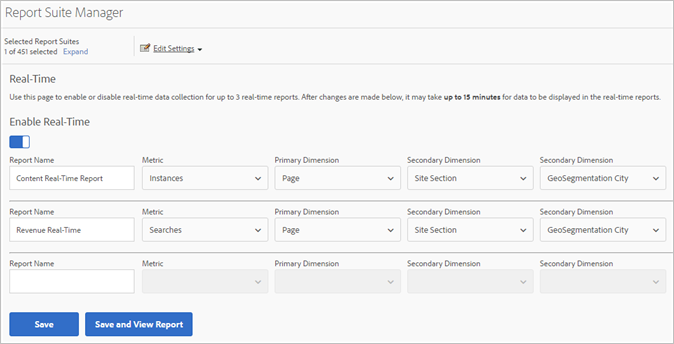
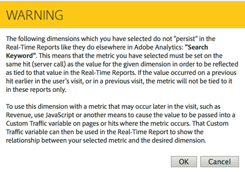

# Konfigurera realtidsrapporter

Administrativa steg för att skapa realtidsrapporter.

Att skapa realtidsrapporter i [!UICONTROL Reports & Analytics] består av att välja rapportsviten och konfigurera upp till tre rapporter för den.

1. Välj den rapportsvit som du vill aktivera realtidsrapporter för.

   Navigera till **[!UICONTROL Analytics]** > **[!UICONTROL Reports]** > **[!UICONTROL View All Reports > Site Metrics]** > **[!UICONTROL Real-Time]** och välj rapportsviten i listrutan högst upp:

   

   Om du försöker visa realtidsrapporter för en rapportserie som inte har konfigurerats för realtidsrapportering visas ett meddelande som gör att du kan konfigurera rapportsviten.

   

1. Klicka **[!UICONTROL Configure]** (kugghjulsikon) för att köra [!UICONTROL Report Suite Manager].

   (Även tillgängligt under **[!UICONTROL Analytics]** > **[!UICONTROL Admin > Report Suites]** > **[!UICONTROL Edit Settings]** > **[!UICONTROL Real-Time]**.)

1. Aktivera **[!UICONTROL Enable Real-Time]** inställningen.
1. Ställ in datainsamling i realtid för upp till tre rapporter, med ett mått och tre dimensioner eller klassificeringar per rapport.

   

   Information om vilka realtidsmått och -mått som stöds finns i [Metrisk och dimensioner](/help/components/c-real-time-reporting/realtime-metrics.md)som stöds.

   Om du har skapat klassificeringar visas de med indrag under den dimension som de definierats för:

   

   >[!NOTE]
   >
   >För en enda realtidsrapport stöder vi för närvarande inte aktivering av dubblettdimensioner, även om en annan klassificering väljs för varje dimension.

   Mer information om klassificeringar finns i [Om klassificeringar](/help/components/c-classifications2/c-classifications.md).

   >[!NOTE]
   >
   >Vissa dimensioner, till exempel&quot;Sök nyckelord&quot; eller&quot;Produkt&quot;, finns inte kvar i realtid på samma sätt som i andra delar av Adobe Analytics. När du väljer ett icke-beständigt mått visas följande varning:

   

1. Klicka på **[!UICONTROL Save]** eller **[!UICONTROL Save and View Report]**.

   Efter den här initiala rapportkonfigurationen kan det ta upp till 20 minuter innan data börjar strömmas. Från och med då blir data omedelbart tillgängliga. Mer information om hur du visar realtidsrapporter finns i [Köra en realtidsrapport](https://marketing.adobe.com/resources/help/en_US/sc/user/reports_realtime.html).

1. Som standard har alla användare åtkomst till realtidsrapporter.
