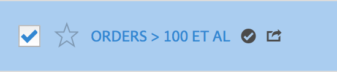

# Godkänn segment

I segmenthanteraren kan du konfigurera ett arbetsflöde som innefattar godkännande av segment för olika programnivåer, för specifika avdelningar eller grupper, och som är förenligt med rapporteringsprinciperna.

Så här flaggar du ett segment som godkänt:

1. Markera kryssrutan till vänster om segmenttiteln i segmenthanteraren.
1. Klicka **[!UICONTROL Approve]** i aktivitetsfältet för segmenthantering.
1. Överväg att dela de godkända segmenten med din organisation.
1. Klicka på **[!UICONTROL OK]**.
1. Lägg märke till godkännandeikonen bredvid segmentet i listan.

   

1. Du kan också avgodkänna ett godkänt segment genom att klicka **[!UICONTROL Unapprove]**.

