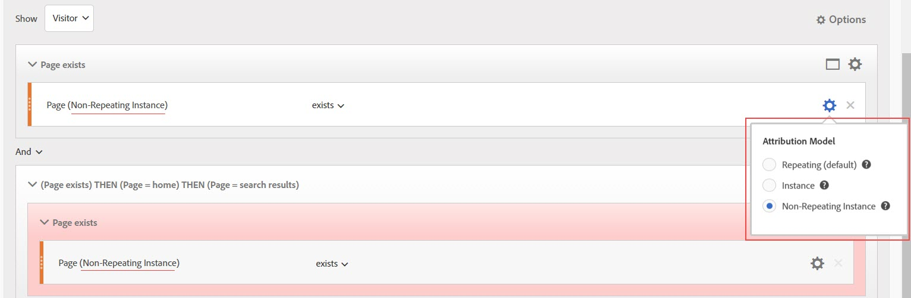
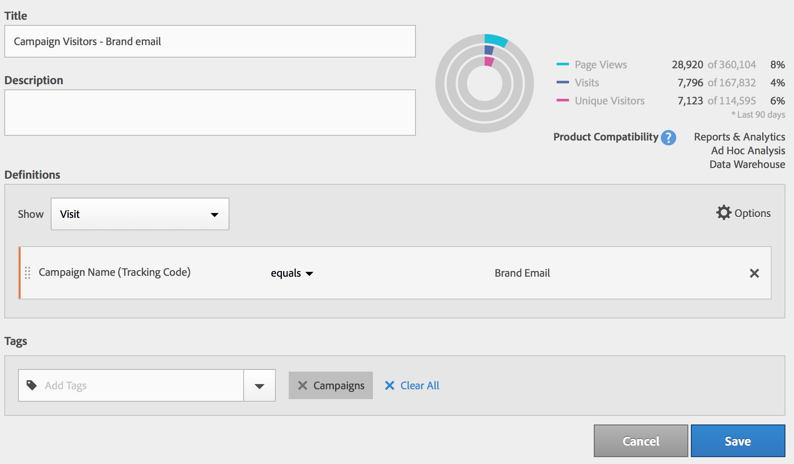

# Segment Builder

På arbetsytan [!UICONTROL Segment Builder] kan du dra och släppa mått, dimensioner, segment och händelser för att segmentera besökare baserat på behållarhierarkiens logik, regler och operatorer. Med det här integrerade utvecklingsverktyget kan du skapa och spara enkla eller komplexa segment som identifierar besökarattribut och -åtgärder för besök och sidträffar.

>[!IMPORTANT]
>
>Vi introducerade modeller för dimensionsattribuering i juniversionen 2019. Se #6 under Webbgränssnittsfunktioner nedan.

Det finns flera sätt att komma åt segmentbyggaren:

* **Övre navigering** i analyser: Klicka **[!UICONTROL Analytics]** > **[!UICONTROL Components]** > **[!UICONTROL Segments]**.
* **[!UICONTROL Analysis Workspace]**: Klicka **[!UICONTROL Analytics]** > **[!UICONTROL Workspace]**, öppna ett projekt och klicka **[!UICONTROL + New]** > **[!UICONTROL Create Segment]**.
* **[!UICONTROL Reports & Analytics]**: Klicka **[!UICONTROL Analytics]** > **[!UICONTROL Reports]**, öppna en befintlig rapport och klicka på segmentikonen  i den vänstra navigeringen och klicka sedan på **[!UICONTROL Add]**.
* **[!UICONTROL Ad Hoc Analysis]**: Skapa [segment i ad hoc-analys](/help/components/c-segmentation/c-segmentation-workflow/seg-build.md#build-segments).
* **[!UICONTROL Report Builder]**: Lägg [till eller redigera segment i Report Builder](https://marketing.adobe.com/resources/help/en_US/arb/segmentation.html).

## Användargränssnittet i Segment Builder {#concept_643F2DF74C544796B58F4656ABC5F726}

Med [!UICONTROL Segment Builder] verktyget kan du skapa enkla eller komplexa segment som identifierar besökarattribut och åtgärder för besökare och sidträffar. Det ger en arbetsyta att dra och släppa mått, händelser eller andra segment för att segmentera besökare baserat på hierarkilogik, regler och operatorer.

## Webbgränssnittsfunktioner {#section_F61C4268A5974C788629399ADE1E6E7C}

Med [!UICONTROL Segment Builder] kan du skapa och redigera segment i webbgränssnittet (eller i ett [Java-gränssnitt i Ad Hoc Analysis](/help/components/c-segmentation/c-segmentation-workflow/seg-workflow.md)). Du kan lägga till regeldefinitioner och behållare för att förfina segment, stacksegment och kapsla in dem för att förfina dem. Du kan också validera hur många sidvisningar, besök och unika besökare som din aktuella segmentdefinition ger. Spara sedan segmentet för framtida behov.

Öppna segmentbyggaren genom att:

* Visa en befintlig rapport och klicka på segmentikonen  i den vänstra navigeringen. Klicka på **[!UICONTROL Add]** i segmentlisten som visas.

* Klicka **[!UICONTROL + Add]** i segmenthanteraren.
* Klicka på en befintlig segmenttitel i segmenthanteraren för att redigera segmentet i segmentbyggaren.

1. **[!UICONTROL Title]**: Gör att du kan namnge eller byta namn på segmentet.
1. **[!UICONTROL Description]**: Ange en beskrivning av segmentet. Du måste ange en beskrivning om du vill dela segmentet.
1. **[!UICONTROL Tags]**: Du kan [tagga segmentet](/help/components/c-segmentation/c-segmentation-workflow/seg-workflow.md) genom att välja från en lista med befintliga taggar eller skapa en ny tagg.
1. **[!UICONTROL Definitions]**: Här [skapar och konfigurerar du segment](/help/components/c-segmentation/c-segmentation-workflow/seg-workflow.md), lägger till regler och kapslar in behållare och sekvensbehållare. Gör att du kan ange en beskrivning för det nya segmentet genom att markera behållaren och dra och släppa dimensioner, segment eller mått i definitionen.
1. **[!UICONTROL Show]**: (Översta behållarväljare.) Gör att du kan välja [behållaren](/help/components/c-segmentation/seg-overview.md) på den översta nivån ( [!UICONTROL Visitor], [!UICONTROL Visit], [!UICONTROL Hit]). Standardbehållaren på den översta nivån är Träff-behållaren.
1. **[!UICONTROL Options]**: (kugghjulsikon)

   * **[!UICONTROL + Add container]**: Gör att du kan lägga till en ny behållare (under behållaren på den översta nivån) till segmentdefinitionen.
   * **[!UICONTROL + Add container from selection]**: Gör att du kan skapa en ny behållare från det eller de element som du (multi-) har valt i fältet Definitioner.
   * **[!UICONTROL Exclude]**: Gör att du kan definiera segmentet genom att utesluta en eller flera dimensioner, segment eller mått.

1. **[!UICONTROL Attribution Models]**: För dimensionssegmentering. Dimensionsmodeller är särskilt användbara vid sekventiell segmentering, t.ex. för dem som stöder Flödesvisualiseringar:

   * **[!UICONTROL Repeating]** (standard): Inkluderar instanser och beständiga värden för dimensionen.
   * **[!UICONTROL Instance]**: Inkluderar instanser för dimensionen.
   * **[!UICONTROL Non-repeating instance]**: Inkluderar unika instanser (icke-upprepande) för dimensionen.
   

1. **[!UICONTROL Dimensions]**: Dimensionen dras och tas bort från dimensionslistan (orange sidofält).
1. **[!UICONTROL Comparison]**: Du kan jämföra och begränsa värden med valda operatorer.
1. **[!UICONTROL Value]**: Värdet som du angav eller valde för dimensionen, segmentet eller mätvärdet.
1. **[!UICONTROL And/Or/Then]**: Tilldelar operatorer mellan behållare eller regler [!UICONTROL AND/OR/THEN] . Med operatorn THEN kan du [definiera sekventiella segment](/help/components/c-segmentation/c-segmentation-workflow/seg-sequential-build.md).
1. **[!UICONTROL Metric]**: (Grönt sidofält) Mätvärden som har dragits och tagits bort från listan Metrisk.
1. **[!UICONTROL Comparison]** operator: Du kan jämföra och begränsa värden med valda operatorer.
1. **[!UICONTROL Value]**: Värdet som du angav eller valde för dimensionen, segmentet eller mätvärdet.
1. **[!UICONTROL X]**: (Ta bort) Du kan ta bort den här delen av segmentdefinitionen.
1. **[!UICONTROL Save]** eller **[!UICONTROL Cancel]**: Sparar eller avbryter segmentet. När du har klickat **[!UICONTROL Save]** kommer du till segmenthanteraren där du kan hantera segmentet.
1. **[!UICONTROL Search]**: Söker i listan över dimensioner, segment eller mått.
1. **[!UICONTROL Dimensions]**: (Lista) Klicka på rubriken för att expandera.
1. **[!UICONTROL Metrics]**: Klicka på rubriken för att expandera.
1. **[!UICONTROL Segments]**: Klicka på rubriken för att expandera.
1. **[!UICONTROL Report suite selector]**: Här kan du välja den rapportserie som det här segmentet ska sparas under. Du kan fortfarande använda segmentet i alla rapportsviter.
1. **[!UICONTROL Segment Preview]**: Här kan du förhandsgranska nyckelmåtten för att se om du har ett giltigt segment och hur brett segmentet är. Representerar den uppdelning av datauppsättningen som du kan förvänta dig att se om du använder det här segmentet. Visar 3 koncentriska cirklar och en lista som visar antalet och procentandelen matchningar för [!UICONTROL Hits], [!UICONTROL Visits]och [!UICONTROL Visitors] för ett segment som körs mot en datauppsättning. Diagrammet uppdateras omedelbart när du har skapat eller ändrat segmentdefinitionen.
1. **[!UICONTROL Product Compatibility]**: Innehåller en lista över vilka Adobe Analytics-produkter (Analysis Workspace, [!UICONTROL Reports & Analytics]Ad Hoc Analysis, Data Warehouse) som segmentet du skapade är kompatibelt med. De flesta segment är kompatibla med alla produkter. Alla operatorer och dimensioner är dock inte kompatibla med alla Analytics-produkter, särskilt [Data Warehouse](/help/components/c-segmentation/seg-reference/seg-compatibility.md). Diagrammet uppdateras omedelbart efter att du har gjort ändringar i segmentdefinitionen.

Segment med inbäddade datumintervall fungerar annorlunda i Analysis Workspace jämfört med [!UICONTROL Reports & Analytics]: I Arbetsyta åsidosätter ett segment med ett inbäddat datumintervall panelens datumintervall. I stället [!UICONTROL Reports & Analytics] visas skärningspunkten för rapportdatumintervallet och segmentets inbäddade datumintervall.

**[!UICONTROL Publish to Experience Cloud (for `<report suite name>`)]**: (Visas inte på skärmen) Det här alternativet visas bara om rapportsviten som du sparar det här segmentet i är [aktiverad för Experience Cloud](/help/components/c-segmentation/c-segmentation-workflow/seg-workflow.md). Genom att publicera ett segment i Experience Cloud kan ni använda segmentet för marknadsföringsaktiviteter i [!UICONTROL Audience Library], [!DNL Target]och [!DNL Audience Manager]. Du måste ange en segmenttitel och beskrivning.

> [!NOTE] I Analytics kan du redigera eller ta bort ett publicerat segment. Om segmentet används visas ett varningsmeddelande när du redigerar ett segment. Du kan inte ta bort ett publicerat segment som används av Adobe [!DNL Target].

>[!IMPORTANT]
>
>Ni måste begränsa antalet målgrupper som delas från Analytics till 20 för att undvika ytterligare förseningar. Målgrupper som delas med Experience Cloud från Analytics får inte överstiga 20 miljoner unika medlemmar. På grund av cachelagring kräver borttagna rapportsviter i Analytics 12 timmar innan borttagningen visas i Experience Cloud.

>[!IMPORTANT]
>
>När en besökare kvalificerar sig för den målgrupp som delas från Analytics, sker en 24-48 timmars fördröjning innan informationen kan användas i [!DNL Target], [!DNL Advertising Cloud]och [!DNL Campaign].

## Skapa segment {#build-segments}

1. Dra bara en dimension, ett segment eller en metrisk händelse från den vänstra rutan till [!UICONTROL Definitions] fältet.

   

   Standardbehållaren på den översta nivån [!UICONTROL Hit] visas när du har dragit ett element till [!UICONTROL Definitions]. Du kan ändra behållartypen till Besök eller Besök på den **[!UICONTROL Show]** nedrullningsbara menyn.

1. Ange [operatorn](/help/components/c-segmentation/seg-reference/seg-operators.md) i listrutan.
1. Ange eller välj ett värde för det markerade objektet.
1. Lägg till ytterligare behållare om det behövs, med **[!UICONTROL And]**, **[!UICONTROL Or]** eller **[!UICONTROL Then]** regler.
1. När du har placerat behållarna och angett reglerna ser du resultatet av segmentet i valideringsdiagrammet längst upp till höger. Valideraren anger det procentuella och absoluta antalet sidvisningar, besök och unika besökare som matchar segmentet som du skapade.
1. Under **[!UICONTROL Tags]** taggar du behållaren  genom att markera en befintlig tagg eller skapa en ny.
1. Klicka **[!UICONTROL Save]** för att spara segmentet.

Du kommer nu till [segmenthanteraren](/help/components/c-segmentation/c-segmentation-workflow/seg-manage.md)där du kan tagga, dela och hantera segment på flera olika sätt.

## Skapa och kapsla behållare {#section_1C38F15703B44474B0718CEF06639EFD}

Du kan [skapa ett ramverk med behållare](/help/components/c-segmentation/seg-overview.md) och sedan placera logikregler och operatorer mellan.

1. Klicka på **[!UICONTROL Options > Add Container]**.

   

   En ny [!UICONTROL Hit] behållare öppnas utan att en [!UICONTROL Hit] (sidvy) identifieras.

   

1. Ändra behållartypen efter behov.
1. Dra en dimension, ett segment eller en händelse från den vänstra rutan till behållaren.
1. Fortsätt med att lägga till nya behållare från den översta nivån **[!UICONTROL Options]** > **[!UICONTROL Add container]** längst upp i definitionen, eller lägg till behållare från en behållare för att kapsla logiken.

   **ELLER**

   Markera en eller flera regler och klicka sedan på **[!UICONTROL Options]** > **[!UICONTROL Add container from selection]**. Detta gör om markeringen till en separat behållare.

## Använd datumintervall i segment {#concept_252A83D43B6F4A4EBAB55F08AB2A1ACE}

Ni kan skapa segment som innehåller rullande datumintervall för att få svar på frågor om pågående kampanjer eller evenemang.

Du kan till exempel enkelt skapa ett segment som innehåller&quot;alla som har köpt något de senaste 60 dagarna&quot;.

Du skapar en besöksbehållare och i den lägger du till [!UICONTROL Last 60 days] tidsintervallet och måttet [!UICONTROL Orders is greater than or equal to 1]med operatorn AND:

## Stapla segment {#task_58140F17FFD64FF1BC30DC7B0A1B0E6D}

Stapla segment fungerar genom att kombinera villkoren i varje segment med hjälp av operatorn&quot;och&quot; och sedan använda de kombinerade kriterierna.

Om du till exempel staplar ett segment med&quot;mobilanvändare&quot; och ett&quot;USA-geografiskt&quot; segment returneras data endast för mobilanvändare i USA.

Tänk på dessa segment som byggstenar eller moduler som du kan inkludera i ett segmentbibliotek, så att användarna kan använda dem som de vill. På så sätt kan du dramatiskt minska antalet segment som behövs. Anta till exempel att du har 40 segment:

* 20 för mobilanvändare i olika länder (US_mobile, Germany_mobile, France_mobile, Brazil_mobile, osv.)
* 20 för surfplatteanvändare i olika länder (US_tablet, Germany_tablet, France_tablet, Brazil_tablet osv.)

Genom att använda segmentstackning kan du minska antalet segment till 22 och stapla dem efter behov. Du måste skapa följande segment:

* ett segment för mobilanvändare
* ett segment för surfplattor
* 20 segment för de olika geografiska områdena

> [!NOTE] När du staplar två segment förenas de som standard med en AND-sats. Detta kan inte ändras till en OR-sats.

1. Gå till Segment Builder.
1. Ange en rubrik och beskrivning för segmentet.

   Stegresultat 1. Klicka **[!UICONTROL Show Segments]** för att visa listan med segment i den vänstra navigeringen.

   Stegresultat 1. Dra och släpp de segment som du vill stapla på segmentdefinitionsytan. Här är ett exempel på ett segment som staplar de befintliga segmenten &quot;Besök från surfplattor&quot; och &quot;US Geo&quot;:

   

1. Spara segmentet.

   Stegresultat

## Använd segmentmallar {#concept_5098446CC78D441E93B8E4D1D1EA6558}

Mallar representerar de gamla förkonfigurerade segmenten och svitsegmenten.

Klicka i segmenthanteraren **[!UICONTROL Add]** så öppnas segmentbyggaren. Klicka nu på segmentikonen 

för att ta upp segmenträlen. Segmentmallarna visas längst ned i segmentlistan. De kan urskiljas med en mappikon till vänster om mallnamnet:

Du kan dra mallarna till arbetsytan Definitioner och använda dem som de har definierats, eller ändra dem.

<table id="table_98B87D807E9344C9BEBF072C65D87B1B"> 
 <thead> 
  <tr> 
   <th colname="col1" class="entry"> Mallnamn </th> 
   <th colname="col2" class="entry"> Definition </th> 
  </tr> 
 </thead>
 <tbody> 
  <tr> 
   <td colname="col1"> Abandon Cart </td> 
   <td colname="col2">Visa data för besökare som har lagt till artiklar i sina kundvagnar men inte beställt något. I segmentdefinitionen är behållaren Visit. Regeln för det här sekventiella segmentet är 
 Cart Additions är inte null 
 
Sedan 
 
Order är lika med 0. 
 </td> 
  </tr> 
  <tr> 
   <td colname="col1"> Första gången du besöker </td> 
   <td colname="col2">Visa data för besökare som har besökt högst en [1] gång. I segmentdefinitionen är behållaren Visit. Regeln är 
Besök Nummer är lika med 1. 
 </td> 
  </tr> 
  <tr> 
   <td colname="col1"> Icke-köpare </td> 
   <td colname="col2">Visa data för besökare som inte har deltagit i en orderhändelse. I segmentdefinitionen är behållaren Visitor. Det här segmentet använder exkluderingslogiken. Regeln är 
Beställningar är inte null. 
 </td> 
  </tr> 
  <tr> 
   <td colname="col1"> Besök ej enstaka sida (ej studsar) </td> 
   <td colname="col2">Visa data för besökare som har besökt mer än en gång. I segmentdefinitionen är behållaren Visitor. Det här segmentet använder exkluderingslogiken. Regeln är 
Enkel åtkomst är inte null. 
 </td> 
  </tr> 
  <tr> 
   <td colname="col1"> Betalsökning </td> 
   <td colname="col2">Visa data från besökare som kommer från en betald sökning. I segmentdefinitionen är behållaren Visit. Regeln är 
Betalsökning är lika med 1. 
 </td> 
  </tr> 
  <tr> 
   <td colname="col1"> Inköpare </td> 
   <td colname="col2">Visa data för besökare som har deltagit i en orderhändelse. I segmentdefinitionen är behållaren Visitor. Regeln är 
Beställningar är inte null. 
 </td> 
  </tr> 
  <tr> 
   <td colname="col1"> Returbesök </td> 
   <td colname="col2">Visa data från besökare som har besökt minst en gång. I segmentdefinitionen är behållaren Visit. Regeln är 
Besöksnumret är större än 1. 
 </td> 
  </tr> 
  <tr> 
   <td colname="col1"> Besök på en sida </td> 
   <td colname="col2"> Visa data från besök där du ser ett enda sidvärde, även om du kan skicka in flera sidvisningar under besöket. Enkelsidiga besök med avslutningslänkshändelser ingår i segmentet. I segmentdefinitionen är behållaren Visit. Regeln är 
Enkelsidiga besök är lika med 1. 
 </td> 
  </tr> 
  <tr> 
   <td colname="col1"> Den visade produkten lades inte till i kundvagnen </td> 
   <td colname="col2">Visa data för besökare som visade produkter men inte hade några kundvagnstillägg. I segmentdefinitionen är behållaren Visit. Regeln för det här sekventiella segmentet är 
Produktvyer är inte null 
 
Sedan 
 
 Cart Additions är lika med 0. 
 </td> 
  </tr> 
  <tr> 
   <td colname="col1"> Besök från Campaign </td> 
   <td colname="col2">Visa data från besökare som refereras av kampanjer. I segmentdefinitionen är behållaren Visit. Regeln är 
Spårningskod är inte null. 
 </td> 
  </tr> 
  <tr> 
   <td colname="col1"> Besök från mobila enheter </td> 
   <td colname="col2">Visa data från besökare som använder mobila enheter. I segmentdefinitionen är behållaren Visit. Regeln är 
Mobilenheten är inte null. 
 </td> 
  </tr> 
  <tr> 
   <td colname="col1"> Besök från naturlig sökning </td> 
   <td colname="col2">Visa data från besökare som inte kommer från en betald sökning. I segmentdefinitionen är behållaren Visit. Regeln är 
Betalsökning är lika med 0. 
 </td> 
  </tr> 
  <tr> 
   <td colname="col1"> Besök från icke-mobil enhet </td> 
   <td colname="col2">Visa data från besökare som inte använder mobila enheter. I segmentdefinitionen är behållaren Visit. Det här segmentet använder exkluderingslogiken. Regeln är 
Mobilenhetstyp är lika med mobiltelefon 
 
eller 
 
Mobilenhetstyp är lika med surfplatta. 
 </td> 
  </tr> 
  <tr> 
   <td colname="col1"> Besök från telefoner </td> 
   <td colname="col2">Visa data från besökare som använder telefoner. I segmentdefinitionen är behållaren Visit. Regeln är 
Enhetstypen är lika med mobiltelefonen. 
 </td> 
  </tr> 
  <tr> 
   <td colname="col1"> Besök från sökmotorer </td> 
   <td colname="col2">Visa data från besökare som sökmotorer refererar till. I segmentdefinitionen är behållaren Visit. Regeln är 
Refererartyp är lika med sökmotorer. 
 </td> 
  </tr> 
  <tr> 
   <td colname="col1"> Besök från sociala webbplatser </td> 
   <td colname="col2">Visa data från besökare som hänvisas till av sociala webbplatser. I segmentdefinitionen är behållaren Visit. Regeln är 
Refererartypen är lika med sociala nätverk. 
 </td> 
  </tr> 
  <tr> 
   <td colname="col1"> Besök från surfplattor </td> 
   <td colname="col2">Visa data från besökare med surfplattor. I segmentdefinitionen är behållaren Visit. Regeln är 
Enhetstyp är lika med surfplatta. 
 </td> 
  </tr> 
  <tr> 
   <td colname="col1"> Besök med Visitor ID Cookie </td> 
   <td colname="col2">Visa data från besökare till er webbplats, där en beständig cookie krävs. I segmentdefinitionen är behållaren Visit. Regeln är 
Beständig cookie är lika med 1. 
 </td> 
  </tr> 
 </tbody> 
</table>

## Exempel: Kampanjbesökarsegment {#concept_61AC6115097B4EB3AEFE8CE98F38315D}

Visar ett exempel på det segment som används ofta.

Många kunder vill se statistik från besökare som svarat på specifika kampanjer. Att skapa ett kampanjbesökssegment är ett enkelt sätt att få fram dessa data.

Om du skapar det här segmentet i segmentbyggaren innebär det att du från en besöksbehållare på den översta nivån drar i en kampanjdimension, i det här fallet Campaign Name:

(Valfritt) Du kan också använda en Campaigns-tagg på det här segmentet om du enkelt vill filtrera på alla kampanjrelaterade segment.
