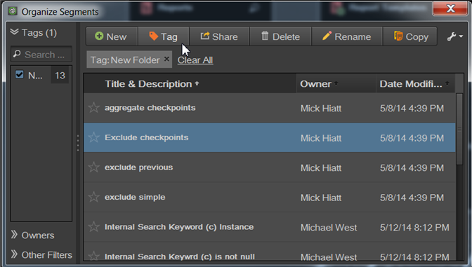

# Hantera segment

Segmenthanteraren erbjuder många sätt att strukturera segment, som att dela, filtrera, tagga, godkänna, kopiera, ta bort och markera som favoriter.

Segmenthanteraren i Analytics visar alla segment som du äger och som har delats med dig. Administratörsnivåanvändare kan se alla segment i organisationen. I den här översikten presenteras användargränssnittet och funktionerna i segmenthanteraren. Åtkomst till segmenthanteraren via

* Gå till **[!UICONTROL Analytics]** > **[!UICONTROL Components]** > **[!UICONTROL Segments]** i den övre navigeringen.
* Visa en befintlig rapport och klicka på segmentikonen  i den vänstra navigeringen. Klicka sedan på **[!UICONTROL Manage]**.

## Videoinstruktion {#section_B3C5DA22DC5248DBA17C56E03DA2D4F2}

Den här [Adobe Analytics YouTube-videon](https://www.youtube.com/watch?v=CdfOq98PTrg&index=6&list=PL2tCx83mn7GtHqZicFTa--aE6d02BvvTd) ger en kort översikt över hur du använder segmenthanteraren.

## Användargränssnitt för segmenthanteraren {#section_7FDCD12949BE4741A402DB83AB7B37DF}

| # | Gränssnittsfunktion | Beskrivning |
|---|---|---|
| 1 | Verktygsfält för segmenthantering | När du har markerat ett segment visas det här verktygsfältet. De flesta hanteringsåtgärder kan utföras från det här verktygsfältet. |
| 2 | Visa filter | När du klickar på filterikonen visas filtermenyn. Du kan filtrera efter taggar, ägare, Visa alla (endast administratör), Min, Favoriter, Godkänd och Delade med mig. |
| 3 | Kryssrutor | Kontrollera ett segment för att hantera det. |
| 4 | Favoriter | Om du klickar på stjärnan bredvid ett segment ändras stjärnans gula färg och segmentet markeras som en favorit. |
| 5 | Segmenttitlar och beskrivningar | Tillhandahålls i Segment Builder. Om du vill redigera titeln och beskrivningen klickar du på titellänken. Då återgår du till segmentbyggaren. |
| 6 | Rapportsviter | Den här kolumnen anger i vilken rapportsserie segmentet senast sparades. |
| 7 | Ägare | Anger vem som äger segmentet. Som icke-administratör kan du bara se segment som du äger eller de som delats med dig. |
| 8 | Taggar (inte incheckad i kolumnväljare, därför visas inte kolumnen) | Taggar som har tillämpats på segmentet, antingen av dig eller av personer som delat segmentet med dig. |
| 9 | Delas med | Visar enskilda personer eller grupper (endast Admin) eller Alla (endast Admin) som du har delat segmentet med. |
| 10 | Ändringsdatum | Visar datumet då segmentet senast ändrades. |
| 11 | Kolumnväljare | Gör att du kan markera eller avmarkera kolumner i segmenthanteraren. |
| 12 | Ikon för delad | Anger att det här segmentet delas av dig eller med dig. |
| 13 | Ikonen Godkänd | Anger att det här segmentet har godkänts av en administratör. |
| 14 | Filter | Gör att du kan visa och välja filter under Taggar, Rapportsviter, Ägare och Annat (Visa alla, Min, Dela med mig, Godkänd, Favoriter). |

## Segmenthanteraren i Ad hoc-analys {#section_CC8BDC968EBC4BC1919870869D8443A9}

Segmentsorteraren i ad hoc-analyser visar alla segment som du äger och de som delas med dig.

Så här öppnar du segmentSorteraren i [!DNL ad hoc analysis]:

* Gå till **[!UICONTROL Segments]** fliken i den vänstra panelen och klicka sedan på skiftnyckelsikonen  och välj **[!UICONTROL Organize Segments]** från menyn.

I likhet med segmenthanteraren i webbanvändargränssnittet innehåller den här konsolen flera funktioner, bland annat segmentdelning, filtrering, taggning, godkännande, kopiering, borttagning och markering som favoriter.
