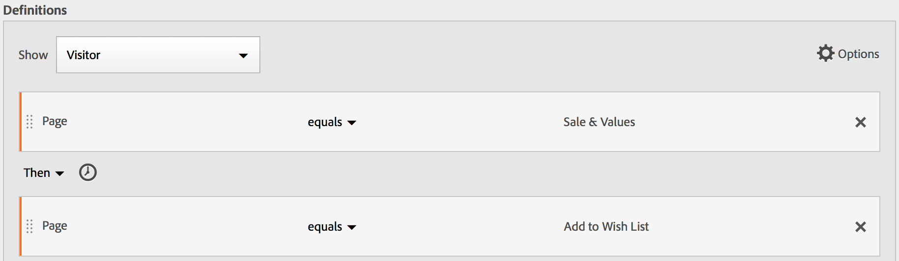
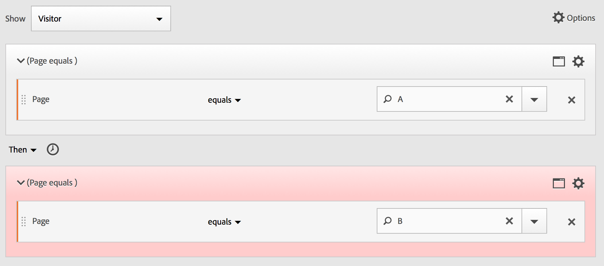
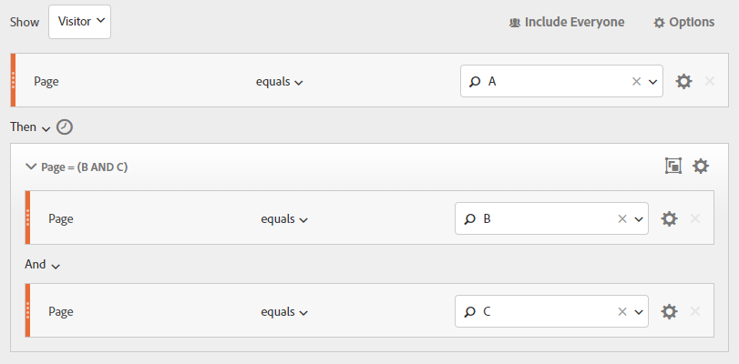

# Skapa sekventiella segment

Sekventiella segment skapas med operatorn THEN i stället för AND eller OR. DÄREFTER betyder det att ett segmentvillkor är uppfyllt, följt av ett annat. Som standard identifierar ett sekventiellt segment alla matchande data och visar filtret Inkludera alla. Sekventiella segment kan filtreras ytterligare till en delmängd av matchande träffar med alternativen Endast före sekvens och Endast efter sekvens.

Dessutom kan du begränsa sekventiella segment till en viss tidslängd, granularitet och antal mellan kontrollpunkter med operatorerna Efter och Inom.

## Inkludera alla {#section_75ADDD5D41F04800A09E592BB2940B35}

När du skapar ett segment där Inkludera alla är angivet identifierar segmentet banor som matchar det angivna mönstret som helhet. Detta är ett exempel på ett grundläggande sekvenssegment som söker efter en träff (sida A) följt av en annan (sida B) som besökts av samma besökare. Segmentet är inställt på Inkludera alla.

| Om resultatet.. | Sekvens |
|--- |--- |
| Matchar | A then BA then (in a different visit) BA then D then B |
| Matchar inte | B och A |

## Endast före sekvens och Endast efter sekvens {#section_736E255C8CFF43C2A2CAAA6D312ED574}

Alternativen **[!UICONTROL Only Before Sequence]** och **[!UICONTROL Only After Sequence]** filtrera segmentet till en delmängd av data före eller efter den angivna sekvensen.

* **Endast före sekvens**: Innehåller alla träffar före en sekvens + den första träffen i själva sekvensen (se exempel 1, 3). Om en sekvens visas flera gånger i en bana innehåller&quot;Endast före sekvens&quot; den första träffen av den sista sekvensen i sekvensen och alla tidigare träffar (se exempel 2).
* **Endast efter sekvens**: Innehåller alla träffar efter en sekvens + den sista träffen i själva sekvensen (se exempel 1, 3). Om en sekvens visas flera gånger i en bana innehåller&quot;Endast efter&quot; den senaste träffen av den första sekvensen och alla efterföljande träffar (se exempel 2).

Ta till exempel en sekvens av B -> D. De tre filtren identifierar träffar på följande sätt:

**Exempel 1: B och D visas en gång**

| Exempel | A | B | C | D | E | F |
|---|---|---|---|---|---|---|
| Inkludera alla | A | B | C | D | E | F |
| Endast före sekvens | A | B |  |  |  |  |
| Endast efter sekvens |  |  |  | D | E | F |

**Exempel 2: B och D visas flera gånger**

| Exempel | A | B | C | D | B | C | D | E |
|---|---|---|---|---|---|---|---|---|
| Inkludera alla | A | B | C | D | B | C | D | E |
| Endast före sekvens | A | B | C | D | B |  |  |  |
| Endast efter sekvens |  |  |  | D | B | C | D | E |

Låt oss även sätta ihop konceptet med djupdimensionen.

**Exempel 3: Träff Djup 3 och 5**

## Dimensionsbegränsningar {#section_EAFD755F8E674F32BCE9B642F7F909DB}

I en&quot;inom&quot;-sats mellan THEN-programsatser kan du lägga till, till exempel,&quot;inom en nyckelordsinstans för sökning&quot;,&quot;inom en eVar 47-instans&quot;. Detta begränsar segmentet till en instans av en dimension.

Genom att ställa in en &#39;Inom dimension&#39;-sats mellan regler kan ett segment begränsa data till sekvenser där den satsen uppfylls. Se exemplet nedan, där begränsningen är inställd på &quot;Inom 1 sida&quot;:

| Om resultatet.. | Sekvens |
|--- |--- |
| Matchar | A och sedan B |
| Matchar inte | A then C then B (because B was not within 1 page of A) **Note:**Om dimensionsbegränsningen tas bort kommer både&quot;A, B&quot; och&quot;A, sedan C, B&quot; att matcha. |

## Enkel sidvisningssekvens

Identifiera besökare som visade en sida och sedan visade en annan sida. Data på träffnivå filtrerar den här sekvensen oavsett tidigare, tidigare eller tillfälliga besökssessioner eller tidpunkten eller antalet sidvisningar som inträffar mellan.

**Exempel**: Besökaren visade sida A och visade sedan sida B i samma eller ett annat besök.

**Användningsexempel**

Här följer några exempel på hur segmentet kan användas.

1. Besökarna på en sportsajt kan se landningssidan för fotboll och sedan se landningssidan för basketboll i sekventiell ordning, men inte nödvändigtvis på samma besök. Detta får en kampanj för att göra basketinnehåll till fotbollstittare under fotbollssäsongen.
1. Bilhandlarna ser en relation mellan dem som landar på kundlojalitetssidan och sedan går till videon när som helst under besöket eller vid ett annat besök.

**Skapa det här segmentet**

Du kapslar in två sidlinjaler i en behållare på den översta nivån och [!UICONTROL Visitor] följer sidans träffar med hjälp av [!UICONTROL THEN] operatorn.

## Besökssekvens mellan besök

Identifiera de besökare som föll ned från en kampanj men sedan återvände till sekvensen av sidvisningar i en annan session.

**Exempel**: Besökaren visade sida A vid ett besök och visade sedan sida B vid ett annat besök.

**Användningsexempel**

Här följer några exempel på hur den här typen av segment kan användas:

* Besökarna på Sports-sidan på en nyhetsplats går sedan igenom Sports-sidan i en annan session.
* En klädhandlare ser en relation mellan besökare som landar på en landningssida under en session och sedan går direkt till utcheckningssidan under en annan session.

**Skapa det här segmentet**

I det här exemplet kapslas två **[!UICONTROL Visit]** behållare in på den översta **[!UICONTROL Visitor]** behållaren och segmentet sekventieras med hjälp av [!UICONTROL THEN] operatorn.

## Sekvens på blandnivå

Identifiera besökare som tittar på två sidor över ett obestämt antal besök, men sedan visa en tredje sida vid ett separat besök.

**Exempel**: Besökarna besöker sida A och sedan sida B i ett eller flera besök, följt av ett besök på sida C i ett separat besök.

**Användningsexempel**

Här följer några exempel på hur den här typen av segment kan användas:

* Besökarna besöker först en nyhetssajt och ser sedan sportsidan i samma besök. På ett annat besök besöker besökaren vädersidan.
* Återförsäljaren definierar besökare som går in på huvudsidan och sedan går till sidan Mitt konto. De besöker även sidan Visa kundvagn.

**Skapa det här segmentet**

1. Släpp två siddimensioner från de vänstra rutorna i en behållare på den översta nivån [!UICONTROL Visitor] .
1. Lägg till operatorn THEN mellan dem.
1. Klicka **[!UICONTROL Options]** > **[!UICONTROL Add container]** och lägg till en [!UICONTROL Visit] behållare under [!UICONTROL Visitor] nivån och sekvensen med [!UICONTROL THEN] -operatorn.

## Sammanställningsbehållare

Genom att lägga till flera [!UICONTROL Hit] behållare i en [!UICONTROL Visitor] behållare kan du använda lämpliga operatorer mellan samma typ av behållare och använda regler och dimensioner som Sida och Besöksnummer för att definiera sidvyn och ange en sekvensdimension i [!UICONTROL Hit] behållaren. Genom att lägga på logik på träffnivå kan du begränsa och kombinera matchningar på samma träffnivå i [!UICONTROL Visitor] behållaren för att skapa olika segmenttyper.

**Exempel**: Besökarna besökte sida A efter den första träffen i sidvysekvensen (sida D i exemplet) och besökte sedan antingen sida B eller sida C utan hänsyn till antalet besök.

**Användningsexempel**

Här följer några exempel på hur den här typen av segment kan användas:

* Identifiera besökare som går till huvudlandningssidan på ett besök, och se sedan sidan med kläder för män på ett annat besök, och titta sedan på antingen Womans eller Children&#39;s landningssida vid ett annat besök.
* Ett e-zine fångar de besökare som går till hemsidan vid ett besök, på en annan sajt och på en annan besökssida.

**Skapa det här segmentet**

1. Välj [!UICONTROL Visitor] behållaren som behållare på den översta nivån.
1. Lägg till behållare på två [!UICONTROL Hit]nivåer - en dimension med en lämplig numerisk dimension som förenas på samma [!UICONTROL Hit] nivå av operatorn [!UICONTROL AND] och [!UICONTROL OR] .
1. Lägg till ytterligare en [!UICONTROL Visit] behållare i [!UICONTROL Hit] behållaren och kapsla in ytterligare två [!UICONTROL Hit] behållare som är kopplade till en [!UICONTROL OR] - eller [!UICONTROL AND] -operator.

   Sekvens för dessa kapslade [!UICONTROL Hit] behållare med [!UICONTROL THEN] operatorn .

## &quot;Kapsling&quot; i sekventiella segment

Genom att placera kontrollpunkter på både [!UICONTROL Visit] - och [!UICONTROL Hit] -nivå kan du begränsa segmentets storlek så att det uppfyller kraven inom ett visst besök eller en viss träff.

**Exempel**: Besökaren besökte sida A och besökte sedan sida B under samma besök. Vid ett nytt besök gick besökaren till sida C.

**Skapa det här segmentet**

1. Under en behållare på den översta nivån [!UICONTROL Visit] drar du i två sidstorlekar.
1. Markera båda reglerna flera gånger, klicka **[!UICONTROL Options]** > **[!UICONTROL Add container from selection]** och ändra den till en [!UICONTROL Visit] behållare.
1. Förena dem med en [!UICONTROL THEN] operator.
1. Skapa en Träff-behållare som en peer-dator till [!UICONTROL Visit] behållaren och dra i en siddimension.
1. Koppla den kapslade sekvensen i [!UICONTROL Visit] behållaren till [!UICONTROL Hit] behållaren med en annan [!UICONTROL THEN] -operator.

## Exkludera träffar

Segmentregler inkluderar alla data såvida du inte uttryckligen utesluter [!UICONTROL Visitor], [!UICONTROL Visit]eller [!UICONTROL Hit] data med hjälp av [!UICONTROL Exclude] regeln. Det gör att ni kan avfärda vanliga data och skapa segment med mer fokus. Eller så kan du skapa segment som utesluter hittade grupper för att identifiera den återstående datauppsättningen, till exempel skapa en regel som innefattar framgångsrika besökare som lade order och sedan exkludera dem för att identifiera&quot;icke-köpare&quot;. I de flesta fall är det dock bättre att skapa regler som utesluter breda värden i stället för att använda [!UICONTROL Exclude] regeln för att ange specifika inkluderingsvärden som mål.

Exempel:

* **Uteslut sidor**. Använd en segmentregel om du vill ta bort en viss sida (till exempel *`Home Page`*) från en rapport, skapa en träff-regel där sidan är lika med&quot;hemsida&quot; och sedan utesluta den. Den här regeln inkluderar automatiskt alla värden förutom hemsidan.
* **Uteslut refererande domäner**. Använd en regel som endast inkluderar refererande domäner från Google.com och utesluter alla andra.
* **Identifiera icke-köpare**. Identifiera när order är större än noll och exkludera sedan [!UICONTROL Visitor].

Operatören kan [!UICONTROL Exclude] användas för att identifiera en sekvens där specifika besök eller träffar inte utförs av besökaren. [!UICONTROL Exclude Checkpoints] kan också ingå i en [logikgrupp](/help/components/c-segmentation/c-segmentation-workflow/seg-sequential-build.md).

### Uteslut mellan kontrollpunkter

Använd logik för att segmentera besökare där en kontrollpunkt inte uttryckligen förekommer mellan två andra kontrollpunkter.

**Exempel**: Besökare som besökt sida A och sedan besökt sida C - men som inte besökt sida B.

**Användningsexempel**

Här följer några exempel på hur den här typen av segment kan användas:

* Besökare på en livsstilssida och sedan på Theatre utan att gå till Arts-sidan.
* En bilhandlare ser en relation mellan dem som besöker landningssidan och sedan går direkt till kampanjen&quot;Inget intresse&quot; utan att gå till sidan&quot;Fordon&quot;.

**Skapa det här segmentet**

Skapa ett segment på samma sätt som för ett enkelt, blandat eller kapslat sekventiellt segment och ange sedan [!UICONTROL EXCLUDE] operatorn för behållarelementet. Exemplet nedan är ett sammanställningssegment där de tre [!UICONTROL Hit] behållarna dras till arbetsytan, den [!UICONTROL THEN] operator som har tilldelats för att sammanfoga behållarlogiken, och sedan utelämnar den mellersta sidvisningsbehållaren så att endast besökare som har gått från sida A till sida C inkluderas i sekvensen.

### Uteslut i början av sekvensen

Om kontrollpunkten för uteslutning är i början av ett sekventiellt segment ser den till att en utesluten sidvy inte inträffade före den första icke-uteslutna träffen.

**Exempel**: Besökaren besökte sida A och inte sida B.

**Användningsexempel**

Här följer några exempel på hur den här typen av segment kan användas:

* Besökare som besökt sida A och inte besökt sida B.
* En restaurang vill att användarna ska hitta rätt och slippa landningssidan och gå direkt till sidan Beställ ute.

**Skapa det här segmentet**

Skapa två separata träff-behållare i en besöksbehållare på den översta nivån. Ange sedan [!UICONTROL EXCLUDE] operatorn för den första behållaren.

### Uteslut vid sekvensslut

Om den utelämnade kontrollpunkten finns i slutet av en sekvens ser det till att kontrollpunkten inte inträffade mellan den sista icke-utelämnade kontrollpunkten och slutet av besökarsekvensen.

**Exempel**: Besökarna besöker sida A och besöker sedan inte sida B vid de aktuella eller efterföljande besöken.

**Användningsexempel**

Här följer några exempel på hur den här typen av segment kan användas:

* Besökare som besökt sida A och inte besökt sida B.
* En restaurang vill att användarna ska hitta rätt och slippa landningssidan och gå direkt till sidan Beställ ute.

**Skapa det här segmentet**

Skapa ett enkelt sekvenssegment genom att dra två [!UICONTROL Hit] behållare till arbetsytan och koppla dem med [!UICONTROL THEN] -operatorn. Tilldela sedan operatorn [!UICONTROL EXCLUDE] till den andra [!UICONTROL Hit] behållaren i sekvensen.

## Behållare för logikgrupp

Behållare för logikgrupp krävs för att gruppera villkor i en enda kontrollpunkt för sekventiellt segment. Den speciella logikgruppsbehållaren är endast tillgänglig i sekventiell segmentering för att säkerställa att villkoren uppfylls efter en sekventiell kontrollpunkt och före efterföljande kontrollpunkter. Villkoren i Logic Group-kontrollpunkten kan uppfyllas i vilken ordning som helst. Icke-sekventiella behållare (träff, besök, besökare) kräver däremot inte att deras villkor uppfylls i den övergripande sekvensen, vilket ger ointuitiva resultat om de används med en THEN-operator.
Behållaren [!UICONTROL Logic Group] är utformad för att hantera *flera kontrollpunkter som en grupp*, *utan någon ordning* mellan de grupperade kontrollpunkterna. Med andra ord, vi bryr oss inte om ordningen på kontrollpunkterna i den gruppen. Du kan till exempel inte kapsla en [!UICONTROL Visitor] behållare i en [!UICONTROL Visitor] behållare. I stället kan du kapsla en [!UICONTROL Logic Group] behållare i en [!UICONTROL Visitor] behållare med specifika kontrollpunkter [!UICONTROL Visit]på nivå och [!UICONTROL Hit]nivå.

> [!NOTE] En [!UICONTROL Logic Group] kan bara definieras i ett sekventiellt segment, vilket innebär att [!UICONTROL THEN] operatorn används i uttrycket.

| Behållarhierarki | Illustration | Definition |
|---|---|---|
| Standardbehållarhierarki |  | Inom [!UICONTROL Visitor] behållaren kapslas behållarna [!UICONTROL Visit] och [!UICONTROL Hit] behållarna i sekvens för att extrahera segment baserat på träffar, antalet besök och besökaren. |
| Logikbehållarhierarki |  | Standardbehållarhierarkin krävs även utanför [!UICONTROL Logic Group] behållaren. Men i [!UICONTROL Logic Group] behållaren kräver kontrollpunkterna inte någon etablerad ordning eller hierarki. Dessa kontrollpunkter måste bara uppfyllas av besökaren i valfri ordning. |

Logikgrupper kan verka skrämmande - här följer några tips om hur du använder dem:

**Logic Group eller Hit/Visit container?**
Om du vill gruppera sekventiella kontrollpunkter är din&quot;behållare&quot; logikgrupp. Om dessa sekventiella kontrollpunkter måste finnas inom ett enda träffs- eller besöksomfång, krävs dock en träff- eller besöksbehållare. (En träff passar förstås inte för en grupp av sekventiella kontrollpunkter, när en träff inte kan kreditera mer än en kontrollpunkt).

**Förenklar logikgrupper skapandet av sekventiella segment?**
Ja, det kan de. Låt oss anta att du försöker svara på den här frågan: **Såg besökaren sida B, sida C eller sida D efter sida A?**

Du kan skapa det här segmentet utan en logikgruppsbehållare, men det är komplicerat och mödosamt:
* `Visitor Container [Page A THEN Page B THEN Page C THEN Page D] or`
* `Visitor Container [Page A THEN Page B THEN Page D THEN Page C] or`
* `Visitor Container [Page A THEN Page C THEN Page B THEN Page D] or`
* `Visitor Container [Page A THEN Page C THEN Page D THEN Page B] or`
* `Visitor Container [Page A THEN Page D THEN Page B THEN Page C] or`
* `Visitor Container [Page A THEN Page D THEN Page C THEN Page B]`

En logikgruppsbehållare förenklar byggandet av det här segmentet avsevärt, vilket visas här:

### Bygg ett logikgruppssegment {#section_A5DDC96E72194668AA91BBD89E575D2E}

Precis som andra behållare kan [!UICONTROL Logic Group] behållare byggas på flera olika sätt i [!UICONTROL Segment Builder]. Här är ett sätt att kapsla [!UICONTROL Logic Group] behållare:

1. Dra mått, händelser eller segment från de vänstra rutorna.
1. Ändra den övre behållaren till en [!UICONTROL Visitor] behållare.
1. Ändra operatorn [!UICONTROL AND] eller [!UICONTROL OR] infogad som standard till operatorn THEN.
1. Markera [!UICONTROL Hit] behållarna (dimension, händelse eller objekt) och klicka på **[!UICONTROL Options]** > **[!UICONTROL Add container from selection]**.
1. Klicka på behållarikonen och välj **[!UICONTROL Logic Group]**.  
1. Du kan nu ange [!UICONTROL Hit] inuti [!UICONTROL Logic Group] behållaren utan hänsyn till hierarkin.

### Kontrollpunkter för logikgrupp i vilken ordning som helst

Med hjälp av [!UICONTROL Logic Group] kan du uppfylla villkoren i den gruppen som ligger utanför sekvensen. På så sätt kan du skapa segment där en [!UICONTROL Visit] eller [!UICONTROL Hit] en behållare inträffar oavsett den normala hierarkin.

**Exempel**: Besökare som besökt sida A, besökte sedan sida B och sida C i valfri ordning.

**Skapa det här segmentet**

Sida B och C kapslas i en [!UICONTROL Logic Group] behållare i den yttre [!UICONTROL Visitor] behållaren. Behållaren [!UICONTROL Hit] för A följs sedan av [!UICONTROL Logic Group] behållaren med B och C som identifieras med [!UICONTROL AND] -operatorn. Eftersom den finns i [!UICONTROL Logic Group]är sekvensen inte definierad och om du trycker på både sida B och C i någon ordning blir argumentet true.

**Ett annat exempel**: Besökare som besökt sida B eller sida C och sedan besökt sida A:

Segmentet måste matcha minst en av logikgruppens kontrollpunkter (B eller C). Logikgruppsvillkor kan även uppfyllas i samma träff eller över flera träffar. &#x200B;

### Logggruppsmatchning

Med hjälp av [!UICONTROL Logic Group] kan du uppfylla villkoren i den gruppen som ligger utanför sekvensen. I det här oordnade första matchningssegmentet identifieras reglerna först som antingen en sidvy av sida B eller sida C och därefter som en vy av sida A. [!UICONTROL Logic Group]

**Exempel**: Besökare som besökt antingen sida B eller sida C, besökte sedan sida A.

**Skapa det här segmentet**

Dimensionerna för sida B och C grupperas i en [!UICONTROL Logic Group] behållare med [!UICONTROL OR] operatorn markerad, och sedan [!UICONTROL Hit]behållaren som identifierar en sidvy av sida A som värde.

### Logikgrupp exkluderar OCH

Bygg segment med hjälp av den [!UICONTROL Logic Group] plats där flera sidvyer sammanställs för att definiera vilka sidor som ska mötas medan andra sidor specifikt missas. ****

**Exempel**: Besökaren besökte sida A och besöker sedan uttryckligen inte sida B eller C, utan träffsida D.

**Skapa det här segmentet**

Bygg det här segmentet genom att dra Dimensions, Events och förbyggda Segments från de vänstra rutorna. Se [Skapa ett logikgruppssegment](/help/components/c-segmentation/c-segmentation-workflow/seg-sequential-build.md).

När du har kapslat värdena i [!UICONTROL Logic Group]klickar du på **[!UICONTROL Exclude]** -knappen i [!UICONTROL Logic Group] behållaren.

### Logikgrupp exkluderad ELLER

Bygg segment med hjälp av den [!UICONTROL Logic Group] plats där flera sidvyer sammanställs för att definiera vilka sidor som ska mötas medan andra sidor specifikt missas.

**Exempel**: Besökare som besökt sida A, men inte besökt sida B eller sida C före sida A.

**Skapa det här segmentet**

De första B- och C-sidorna identifieras i en [!UICONTROL Logic Group] behållare som inte ingår och följs sedan av besökaren en träff till sida A.

Bygg det här segmentet genom att dra Dimensions, Events och förbyggda Segments från de vänstra rutorna.

När du har kapslat värdena i [!UICONTROL Logic Group]klickar du på **[!UICONTROL Exclude]** -knappen i [!UICONTROL Logic Group] behållaren.

## Bygg tidsbesparande och tidsbesparande segment

Använd operatorerna [!UICONTROL Within] och [!UICONTROL After] är inbyggda i huvudet för varje behållare för att definiera tid, händelser och antal.

Du kan begränsa matchningen till en viss tidsperiod genom att använda behållarna [!UICONTROL Within] och [!UICONTROL After] genom att ange en granularitet och ett antal. Operatorn [!UICONTROL Within] används för att ange en maxgräns för hur lång tid det tar mellan två kontrollpunkter. Operatorn [!UICONTROL After] används för att ange en minimigräns för hur lång tid det tar mellan två kontrollpunkter.

### Efter och inom operatorer {#section_CCAF5E44719447CFA7DF8DA4192DA6F8}

Längden anges med en versal som representerar granulariteten följt av en siffra som representerar repetitionsantalet för granulariteten.

**[!UICONTROL Within]** innehåller slutpunkten (mindre än eller lika med).

**[!UICONTROL After]** innehåller inte slutpunkten (större än).

| Operatorer | Beskrivning |
|--- |--- |
| EFTER | Operatorn Efter används för att ange en minimigräns för hur lång tid det tar mellan två kontrollpunkter. När du anger After-värdena börjar tidsgränsen när segmentet används. Om till exempel operatorn Efter är inställd på en behållare för att identifiera besökare som besöker sida A men inte återvänder till sida B förrän efter en dag, börjar den dagen när besökaren lämnar sida A.  För att besökaren ska kunna inkluderas i segmentet måste minst 1440 minuter (en dag) visas efter att sidan A har lämnat sidan till sidan B. |
| INOM | Operatorn Inom används för att ange en maximal tidsgräns mellan två kontrollpunkter. Om till exempel operatorn Inom är inställd på en behållare för att identifiera besökare som besöker sida A och sedan återgår till sida B inom en dag, börjar den dagen när besökaren lämnar sida A. För att inkluderas i segmentet får besökaren högst en dag innan sidan B öppnas.   För att besökaren ska kunna delta i segmentet måste besöket på sida B äga rum inom högst 1440 minuter (en dag) efter att sidan A har lämnat sidan B. |
| EFTER/INOM | När du använder operatorerna Efter och Inom är det viktigt att du förstår att båda operatorerna börjar och slutar parallellt, inte sekventiellt.   Om du till exempel skapar ett segment med behållaren inställd på: `After = 1 Week(s) and Within = 2 Week(s)` då uppfylls villkoren för att identifiera besökare i segmentet endast mellan 1 och 2 veckor. Båda villkoren tillämpas från och med den första sidträffen. |

### Använda operatorn Efter

* Med Tid efter kan du spåra efter år, månad, dag, timme och minut för att matcha besöken.
* Tid efter kan bara användas för en [!UICONTROL Hit] behållare eftersom det är den enda nivån för vilken sådan fin granularitet har definierats.

**Exempel**: Besökare som besökt sida A besökte sedan sida B först efter 2 veckor.***

**Skapa segmentet**: Det här segmentet skapas genom att en [!UICONTROL Visitor] behållare med två [!UICONTROL Hit] behållare läggs till. Sedan kan du ange [!UICONTROL THEN] operator, öppna listrutan [!UICONTROL AFTER] operator och ange antalet veckor.

**Matchar**

Om en träff på sida A inträffar den 1 juni 2019, kl. 00:01, kommer följande träff på sida B att matchas så länge som det kommer före den 15 juni 2019 kl. 00:01 (14 dagar senare).

| Tryck på A | Träff B | Matchande |
|--- |--- |--- |
| **En** träff: 1 juni 2019 00:01 | **B** -träff: 15 juni 2019 00:01 | **Matchar:** Tidsbegränsningen matchar eftersom den är efter 1 juni 2019 (två veckor). |
| **En** träff: 1 juni 2019 00:01 | **B** -träff: 8 juni 2019 kl. 00:01 15 juni 2019 00:01 | **Matchar inte:** Den första träffen på sida B matchar inte eftersom den står i konflikt med begränsningen som kräver den efter två veckor. |

### Använda operatorn Inom

* [!UICONTROL Within] Med kan du spåra efter år, månad, dag, timme och minut för att matcha besöken.
* [!UICONTROL Within] kan bara användas på en [!UICONTROL Hit] behållare eftersom det är den enda nivån för vilken sådan fin granularitet har definierats.

>[!IMPORTANT]
>
>I en&quot;inom&quot;-sats mellan THEN-programsatser kan du lägga till, till exempel,&quot;inom en nyckelordsinstans för sökning&quot;,&quot;inom en eVar 47-instans&quot;. Detta begränsar segmentet till en instans av en dimension.

**Exempel**: Besökare som besökt sida A och sedan besökt sida B inom fem minuter.

**Skapa segmentet**: Det här segmentet skapas genom att en [!UICONTROL Visitor] behållare läggs till och sedan dras med två [!UICONTROL Hit] behållare. Du kan sedan ange [!UICONTROL THEN] operatorn och öppna listrutan [!UICONTROL AFTER] operatorer och ange intervallet: träffar, sidvisningar, besök, minuter, timmar, dagar, veckor, månader, kvartal eller år.

**Matchar**

Matchningar måste ske inom tidsgränsen. Om en besökare träffar sida A inträffar klockan 00:01 för uttrycket kommer nästa träff på sida B att matcha så länge som det kommer på eller före 00:06 (fem minuter senare, inklusive samma minut). Träffar inom samma minut kommer också att matcha.

### Operatorerna Inom och efter

Använd [!UICONTROL Within] och [!UICONTROL After] ange en högsta och lägsta slutpunkt i båda ändar av ett segment.

**Exempel**: Besökare som besökte sida A besökte sedan sida B efter två veckor, men inom en månad.

**Skapa segmentet**: Skapa segmentet genom att sekvensera två [!UICONTROL Hit] behållare i en [!UICONTROL Visitor] behållare. Ange sedan operatorerna [!UICONTROL After] och [!UICONTROL Within] .

**Matchar**

Alla besökare som träffar sida A den 1 juni 2019 återvänder efter den 15 juni 2019 kl. 00:01, men *före* den 1 juli 2019 ingår i segmentet. Jämför med [Tid mellan undantag](/help/components/c-segmentation/c-segmentation-workflow/seg-sequential-build.md).

Operatorerna [!UICONTROL After] och [!UICONTROL Within] kan användas tillsammans för att definiera ett sekventiellt segment.

I det här exemplet avbildas ett andra besök för att gå till sida B efter två veckor, men inom en månad.
