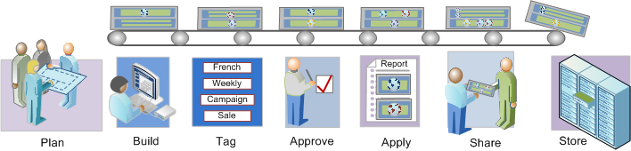

# Översikt över segmenteringsarbetsflöde

Beskriver ett föreslaget arbetsflöde för segment som skapats med segmentbyggaren och hanteras med segmenthanteraren.

## Översikt över segmenteringsarbetsflöde

Beskriver ett föreslaget arbetsflöde för segment som skapats med segmentbyggaren och hanteras med segmenthanteraren.

<!-- 

seg_workflow.xml

 -->

 [ Planera segment](/help/components/c-segmentation/c-segmentation-workflow/seg-plan.md)

Har ni ställt rätt frågor innan ni bygger segment och skapar en segmenthanteringsmiljö? Har du utformat segmentet med dess avsedda syfte och tydliga användning i åtanke?

Se checklistan för segmentplanering för hjälp med att planera och organisera era segment.

 [Skapa segment](/help/components/c-segmentation/c-segmentation-workflow/seg-build.md)

Bygg och redigera segment för användning i alla Analytics-funktioner.

Se [Skapa sekventiella segment](/help/components/c-segmentation/c-segmentation-workflow/seg-sequential-build.md) för hur du skapar segment med operatorn THEN.

 [ Tagga segment](/help/components/c-segmentation/c-segmentation-workflow/seg-tag.md)

Märk upp segment för enkel organisering och delning. Taggning ersätter mapphierarkier i ad hoc-analyser. Se hur du planerar och tilldelar taggar för enkla och avancerade sökningar och organisation.

 [ Godkänn segment](/help/components/c-segmentation/c-segmentation-workflow/seg-approve.md)

Godkänn segment för att göra dem kanoniska.

 [ Använd segment](/help/components/c-segmentation/c-segmentation-workflow/t-seg-apply.md)

Du kan använda segment direkt från en rapport, från segmentlisten ( Visa segment).

 [ Dela segment](/help/components/c-segmentation/c-segmentation-workflow/t-seg-share.md)

Dela era segment med den avsedda målgruppen i andra analysverktyg och med Adobe Target och Adobe Experience Cloud.

 [ Filtrera segment](/help/components/c-segmentation/c-segmentation-workflow/t-seg-filter.md)

Filtrera efter taggar, ägare och andra filter (Visa alla, Min, Delas med mig, Favoriter och Godkänd).

 [ Markera segment som favoriter](/help/components/c-segmentation/c-segmentation-workflow/t-seg-favorite.md)

Att markera segment som favoriter är ett annat sätt att ordna dem så att de blir lätta att använda.

[Hantera segment](/help/components/c-segmentation/c-segmentation-workflow/seg-manage.md)

Segmenthanteraren erbjuder många sätt att strukturera segment, som att dela, filtrera, tagga, godkänna, kopiera, ta bort och markera som favoriter.
