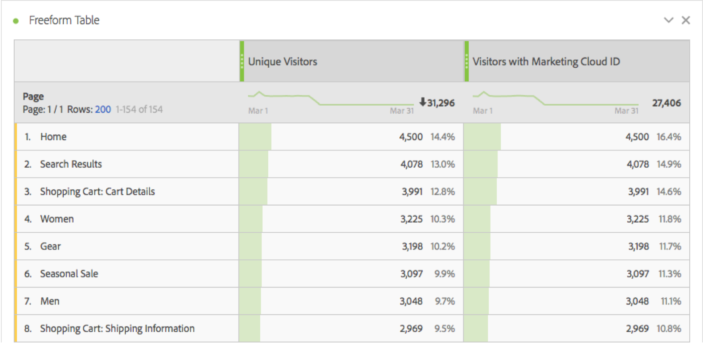
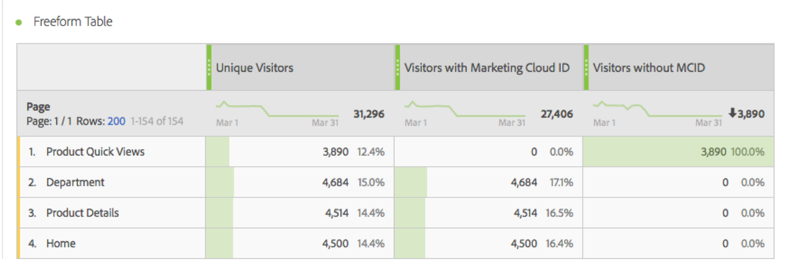
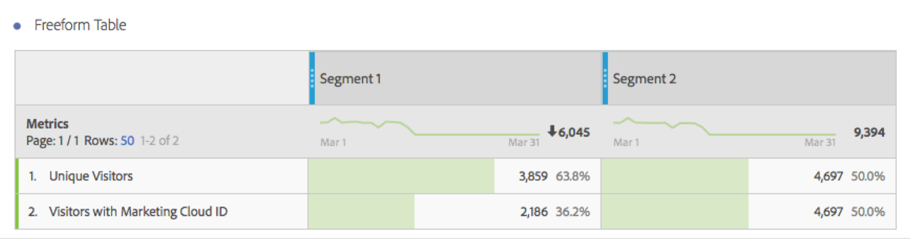

# Besökare med Experience Cloud ID

Finns i Analysis Workspace och Segment Builder.

Visar antalet besökare som har ett Experience Cloud ID. Ni kan förstå vilka sidor som har identitetstjänsten distribuerad och ni kan förstå hur många besökare som kan delas med andra Experience Cloud-lösningar. Ni kan också använda detta mått i segment som delas med Experience Cloud.

>[!IMPORTANT]
>
>För att det här måttet ska visas måste du ha [identitetstjänsten](https://marketing.adobe.com/resources/help/en_US/mcvid/) igång för rapportsviten.

## Felsök konfigurationen av Experience Cloud ID {#section_679E62142A3E46548FF8FBDA46568005}

Måtten är ett användbart mått i Adobe Analytics som hjälper dig att hitta och felsöka [!UICONTROL Visitors with Experience Cloud ID] [!UICONTROL Identity Service]konfigurationen. Måttet är antalet besökare i en rapportserie som har tilldelats ett Experience Cloud-ID från identitetstjänsten. Detta mått kan vara mycket användbart för att diagnostisera varför vissa Experience Cloud-integreringar kanske inte delar så många besökare som förväntat, eller för att identifiera områden på din webbplats som kanske inte har MCID än.

Om du vill använda besökarna med Experience Cloud ID-mätvärden drar du dem bara till valfri rapport som mätvärden, som den här [!UICONTROL Pages] rapporten:

I det här exemplet observerar du att varje sida har samma antal unika besökare som besökare med ett Experience Cloud ID. Det totala antalet unika besökare är dock större än det totala antalet besökare med Experience Cloud ID. Om du vill hitta sidor som inte anger MCID för alla besökare [skapar du ett beräknat mått](https://marketing.adobe.com/resources/help/en_US/analytics/calcmetrics/cm_build_metrics.html) med den här definitionen:

Genom att lägga till det beräknade måttet i rapporten kan du sortera sidrapporten så att sidor med det högsta antalet besökare utan ett MCID visas:

Nu kan du snabbt se att&quot;produktsnabbvyer&quot; inte implementeras korrekt med identitetstjänsten och bör uppdateras så snart som möjligt. En liknande rapport kan utformas runt alla typer av dimensioner, till exempel webbläsartyp, webbplatsavsnitt eller innehållstyper.

När du har identifierat sidor som har besökare utan ett MCID bör du kunna återta det till ditt implementeringsteam så att de kan åtgärda de sidorna.

I vissa fall kanske du märker att ett litet antal MCID inte är inställda för vissa besökare trots att MCID-tjänsten har implementerats på sidan. I dessa fall beror detta troligen på en vanlig felkonfiguration av JavaScript- eller DTM-konfigurationen för Analytics i vilken AppMeasurement-funktionen anropas innan en rapportserie tillhandahålls. För att undvika detta måste du [infoga AppMeasurement-kärnkoden](https://marketing.adobe.com/resources/help/en_US/sc/implement/dtm/t_appmeasurement-code.html) korrekt.

Observera att alla segment som baseras på sidan&quot;Produktsnabbvyer&quot; (som visas ovan) som du delar med Experience Cloud troligen har en mycket låg matchningsfrekvens med andra Experience Cloud-lösningar. Om du vill kontrollera MCID-täckningen för ett segment kan du skapa en rapport enligt följande:

I den här tabellen, där antalet unika besökare jämförs med besökarna med ett Experience Cloud ID, är det enkelt att se att&quot;Segment 1&quot; inte har 100 % MCID-täckning, medan&quot;Segment 2&quot; gör det. Det innebär att om jag delar segment 1 med Experience Cloud är bara 2 186 av de 3 859 besökarna berättigade till delning.
