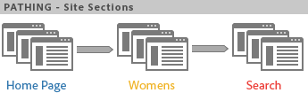

# Pathing

En grupp rapporter baserade på sökvägsanalys. Tekniskt sett innebär det att klippa ut från ett sidnamn till ett annat (från ett värde till ett annat).

Använd [Analys Workspace Flow](https://marketing.adobe.com/resources/help/en_US/analytics/analysis-workspace/flow.html) för flexiblare målningsalternativ.

> [!NOTE] Om du vill aktivera en bana går du till **[!UICONTROL Admin > Report Suites > Edit Settings > Traffic > Traffic Variables]**. Kontakta kundtjänst om du vill aktivera delning av plats och serverrapporter.

Om du behöver veta i vilken ordning värdena samlas in måste du aktivera sökvägen för variabeln som samlar in dessa värden. Banan är aktiverad som standard för sidor. Pathing is not enabled for any props as as default, because it is only appropriate in certain cases. Kontakta Kundtjänst om du vill aktivera en kundtjänst.

> [!NOTE] När du aktiverar klassificeringar för ett prop i Ad Hoc Analysis blir kundvägsstatistik tillgängliga för alla klassificeringar som har ställts in för det aktiverade proppet.

**Exempel - Måla på webbplatsavsnitt**

Genom att aktivera en plats för variabeln kan du spåra hur besökare på platsen rör sig mellan webbplatsavsnitt (när värdet ändras). *`s.channel`*



Sökvägen är sedan tillgänglig i olika sökvägsrapporter, t.ex. [!UICONTROL Next Site Section Flow]som visar hur besökarna rör sig mellan sidgrupper eller avsnitt på webbplatsen.


**Exempel - Måla vid sökningar**

Samma koncept med att gå från ett värde till ett annat gäller även andra trafikvariabler, inklusive *`s.props`*. Om du t.ex. aktiverar Sökväg för den interna söktermen *`s.prop`* kan du se den väg besökarna tar genom söktermerna.

**Exempel - Sökväg per inloggningsstatus**

Du kanske vill veta hur människor går igenom webbplatsen baserat på besökarens inloggningsstatus. Om du vill se den här informationen ska du inte titta på pausrapporterna för inloggningsstatus, eftersom de skulle visa hur besökarna ändrade värden i rapporten eller hur besökarna kunde ha ändrat sig från inloggad till utloggad. I stället sammanfogar du segmentvärdet med *`s.pageName`* -variabeln och söker sedan efter den resulterande variabeln. Här följer exempelkod för sidindelning per medlemsstatus:

```js
s.pageName="Home Page"; 
s.prop18="Gold"; // Member Status 
s.prop19=s.prop18 + ":" + s.pageName;
```

Aktivera sedan en bana för *`s.prop19`* att se hur medlemmarna går igenom sidorna.

> [!NOTE] Om du gör ad hoc-analyser kan du segmentera sidbanor utan att behöva sammanfoga segmentvärden, och tillämpa valfritt segment i kundvägsrapporter.

