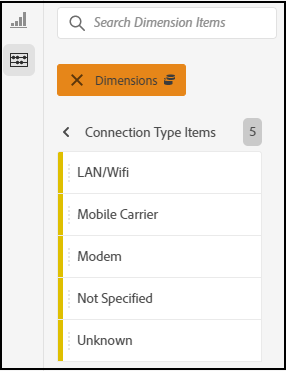
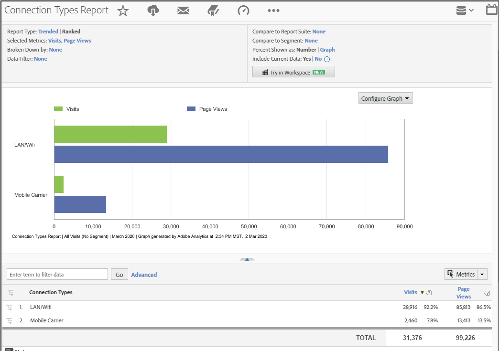

# Anslutningstyp

Visar mått för internetanslutningstyp, inklusive modem, LAN/Wifi, mobiloperatör och så vidare.

## Exempel

I följande rapport jämförs anslutningstyper för måttbesök [och](https://docs.adobe.com/content/help/en/analytics/components/variables/metrics/metrics-visit.html) sidvyer :

Du kan hitta ytterligare insikter om mobiloperatörens anslutningstyp genom att visa [**mobiloperatörsrapporten **](https://docs.adobe.com/content/help/en/analytics/components/variables/dimensions-reports/reports-mobile-carrier.html).
