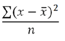

# Grundfunktioner


Med verktyget [Beräknade mätvärden](/help/components/calculated-metrics/workflow/c-build-metrics/cm-build-metrics.md) kan du använda statistiska och matematiska funktioner. I den här artikeln visas en alfabetisk lista över funktionerna och deras definitioner.

>[!NOTE]
>
>Där [!DNL metric] identifieras som ett argument i en funktion tillåts även andra uttryck för mätvärden. Till exempel tillåter [COLUMN MAXIMUM(metrics)](#column-maximum) även [COLUMN MAXIMUM(PageViews + Visits)](#column-maximum).


## Tabellfunktioner jämfört med radfunktioner

En tabellfunktion är en funktion där utdata är desamma för alla rader i tabellen. En radfunktion är en funktion där utdata är olika för alla rader i tabellen.

Om det är tillämpligt och relevant kommenteras en funktion med funktionstypen: [!BADGE Tabell]{type="Neutral"} eller [!BADGE Rad]{type="Neutral"}

## Vad betyder parametern include-zeros?

Den anger om nollor ska inkluderas i beräkningen. Ibland betyder noll *ingenting*, men ibland är det viktigt.

Om du till exempel har ett intäktsmått och sedan lägger till ett sidvymått i rapporten finns det plötsligt fler rader för dina intäkter, som alla är noll. Du vill förmodligen inte att det ytterligare måttet ska påverka några **[MEAN](cm-functions.md#mean)**, **[ROW MINIMUM](cm-functions.md#row-min)**, **[QUARTILE](cm-functions.md#quartile)** och fler beräkningar som du har i intäktskolumnen. I det här fallet kontrollerar du parametern `include-zeros`.

Ett alternativt scenario är att du har två intressanta mätvärden och ett har ett högre genomsnitt eller minimum eftersom några av raderna är nollor.  I så fall kan du välja att inte kontrollera parametern så att den innehåller nollor


## Absolut värde {#absolute-value}

<!-- markdownlint-disable MD034 -->

>[!CONTEXTUALHELP]
>id="functions-abs"
>title="Absolut värde"
>abstract="Returnerar det absoluta värdet av ett tal. Det absoluta värdet för ett tal är talet med ett positivt värde."

<!-- markdownlint-enable MD034 -->


 **[!UICONTROL ABSOLUTE VALUE(metric)]**

[!BADGE Rad]{type="Neutral"} Returnerar det absoluta värdet av ett tal. Det absoluta värdet för ett tal är talet med ett positivt värde.

| Argument | Beskrivning |
|---|---|
| mått | Det mått som du vill beräkna det absoluta värdet för. |


## Högsta kolumn {#column-maximum}

<!-- markdownlint-disable MD034 -->

>[!CONTEXTUALHELP]
>id="functions-col-max"
>title="Högsta kolumn"
>abstract="Returnerar det största värdet i en uppsättning dimensionselement för en måttkolumn. MAXV utvärderas lodrätt i en enda kolumn (mått) över dimensionselement."

<!-- markdownlint-enable MD034 -->

 **[!UICONTROL COLUMN MAXIMUM(metric, include_zeros)]**

Returnerar det största värdet i en uppsättning dimensionselement för en måttkolumn. MAXV utvärderas lodrätt i en enda kolumn (mått) över dimensionselement.

| Argument | Beskrivning |
|---|---|
| mått | Kräver minst ett mått men kan ta valfritt antal mått som parametrar. |
| include_zeros | Om nollvärden ska inkluderas eller inte i beräkningarna. |


## Minsta kolumn {#column-minimum}

<!-- markdownlint-disable MD034 -->

>[!CONTEXTUALHELP]
>id="functions-col-min"
>title="Minsta kolumn"
>abstract="Returnerar det minsta värdet i en uppsättning dimensionselement för en måttkolumn. MINV utvärderas lodrätt i en enda kolumn (mått) över dimensionselement."

<!-- markdownlint-enable MD034 -->


 **[!UICONTROL COLUMN MINIMUM(metric, include_zeros)]**

Returnerar det minsta värdet i en uppsättning dimensionselement för en måttkolumn. MINV utvärderas lodrätt i en enda kolumn (mått) över dimensionselement.

| Argument | Beskrivning |
|---|---|
| mått | Kräver minst ett mått men kan ta valfritt antal mått som parametrar. |
| include_zeros | Om nollvärden ska inkluderas eller inte i beräkningarna. |


## Kolumnsumma {#column-sum}

<!-- markdownlint-disable MD034 -->

>[!CONTEXTUALHELP]
>id="functions-col-sum"
>title="Kolumnsumma"
>abstract="Lägger till alla numeriska värden för ett mått i en kolumn (över elementen i en dimension)."

<!-- markdownlint-enable MD034 -->


 **[!UICONTROL COLUMN SUM(metric)]**

Lägger till alla numeriska värden för ett mått i en kolumn (över elementen i en dimension).

| Argument | Beskrivning |
|---|---|
| mått | Kräver minst ett mått men kan ta valfritt antal mått som parametrar. |


## Antal {#count}

<!-- markdownlint-disable MD034 -->

>[!CONTEXTUALHELP]
>id="functions-count"
>title="Antal"
>abstract="Returnerar antalet, eller antalet, värden som inte är noll för ett mätvärde i en kolumn (antalet unika element som rapporteras inom en dimension)."

<!-- markdownlint-enable MD034 -->


 **[!UICONTROL COUNT(metric)]**

[!BADGE Tabell]{type="Neutral"} Returnerar antalet, eller antalet, värden som inte är noll för ett mätvärde i en kolumn (antalet unika element som rapporteras i en dimension).

| Argument | Beskrivning |
|---|---|
| mått | Det mätvärde som du vill räkna. |


## Exponent {#exponent}

<!-- markdownlint-disable MD034 -->

>[!CONTEXTUALHELP]
>id="functions-exp"
>title="Exponent"
>abstract="Returnerar e upphöjt till ett angivet tal. Konstanten e är lika med 2,71828182845904, basen för den naturliga logaritmen. EXPONENT är den inverterade LN, den naturliga logaritmen av ett tal."

<!-- markdownlint-enable MD034 -->

 **[!UICONTROL EXPONENT(metric)]**

[!BADGE Rad]{type="Neutral"} Returnerar e upphöjt till ett angivet tal. Konstanten e är lika med 2,71828182845904, basen för den naturliga logaritmen. EXPONENT är den inverterade LN, den naturliga logaritmen av ett tal.

| Argument | Beskrivning |
|---|---|
| mått | Exponenten som används på basen e. |


## Medel {#mean}

<!-- markdownlint-disable MD034 -->

>[!CONTEXTUALHELP]
>id="functions-mean"
>title="Medel"
>abstract="Returnerar det aritmetiska medelvärdet, eller medelvärdet, för ett mått i en kolumn"

<!-- markdownlint-enable MD034 -->


 **[!UICONTROL MEAN(metric, include_zeros)]**

[!BADGE Tabell]{type="Neutral"} Returnerar det aritmetiska medelvärdet, eller medelvärdet, för ett mått i en kolumn.

| Argument | Beskrivning |
|---|---|
| mått | Det mätvärde som du vill beräkna genomsnittet för. |
| include_zeros | Om nollvärden ska inkluderas eller inte i beräkningarna. |


## Median {#median}

<!-- markdownlint-disable MD034 -->

>[!CONTEXTUALHELP]
>id="functions-median"
>title="Median"
>abstract="Returnerar medianvärdet för ett mått i en kolumn. Medianvärdet är talet i mitten av en sifferuppsättning. Det innebär att hälften av talen har värden som är större än eller lika med medianen och hälften är mindre än eller lika med medianen."

<!-- markdownlint-enable MD034 -->


 **[!UICONTROL MEDIAN(metric, include_zeros)]**

[!BADGE Tabell]{type="Neutral"} Returnerar medianen för ett mätvärde i en kolumn. Medianvärdet är talet i mitten av en sifferuppsättning. Det innebär att hälften av talen har värden som är större än eller lika med medianen och hälften är mindre än eller lika med medianen.

| Argument | Beskrivning |
|---|---|
| mått | Det mätvärde som du vill beräkna medianvärdet för. |
| include_zeros | Om nollvärden ska inkluderas eller inte i beräkningarna. |


## Modulo {#modulo}

<!-- markdownlint-disable MD034 -->

>[!CONTEXTUALHELP]
>id="functions-modulo"
>title="Modulo"
>abstract="Returnerar resten efter division av x med y med division Euclidean. "

<!-- markdownlint-enable MD034 -->


 **[!UICONTROL MODULO(metric_X, metric_Y)]**

Returnerar resten efter division av x med y med division Euclidean.

| Argument | Beskrivning |
|---|---|
| metric_X | Det första mätvärdet som du vill dela. |
| metric_Y | Det andra mätvärdet som du vill dela. |

### Exempel

Returvärdet har samma tecken som indata (eller är noll).

```
MODULO(4,3) = 1
MODULO(-4,3) = -1
MODULO(-3,3) = 0
```

För att vara säker på att du alltid får ett positivt tal använder du

```
MODULO(MODULO(x,y)+y,y)
```

## Procent {#percentile}

<!-- markdownlint-disable MD034 -->

>[!CONTEXTUALHELP]
>id="functions-percentile"
>title="Procent"
>abstract="Returnerar den n:e percentilen, som är ett värde mellan 0 och 100. När n &lt; 0 används noll. När n > 100 returneras 100."

<!-- markdownlint-enable MD034 -->


 **[!UICONTROL PERCENTILE(metric, k, include_zeros)]**

[!BADGE Tabell]{type="Neutral"} Returnerar den n:e percentilen, som är ett värde mellan 0 och 100. När n &lt; 0 används noll. När n > 100 returneras 100.

| Argument | Beskrivning |
|---|---|
| mått | Procentvärdet i intervallet 0 till 100. |
| k | Den måttkolumn som definierar relativ position. |
| include_zeros | Om nollvärden ska inkluderas eller inte i beräkningarna. |


## Strömoperator {#power-operator}

<!-- markdownlint-disable MD034 -->

>[!CONTEXTUALHELP]
>id="functions-pow"
>title="Strömoperator"
>abstract="Returnerar x upphöjt till y-potensen."

<!-- markdownlint-enable MD034 -->

 **[!UICONTROL POWER OPERATOR(metric_X, metrix_Y)]**

Returnerar x upphöjt till y-potensen.

| Argument | Beskrivning |
|---|---|
| metric_X | Det mått som du vill upphöja till måttet metric_Y. |
| metric_Y | Den kraft som du vill upphöja metric_X till. |


## Quartile {#quartile}

<!-- markdownlint-disable MD034 -->

>[!CONTEXTUALHELP]
>id="functions-quartile"
>title="Quartile"
>abstract="Returnerar kvartilen med värden för ett mått. Du kan till exempel använda kvartilarna för att hitta de 25 % av de bästa produkterna som genererar störst intäkter."

<!-- markdownlint-enable MD034 -->


 **[!UICONTROL QUARTILE(metric, quartile, include_zeros)]**

[!BADGE Tabell]{type="Neutral"} Returnerar kvartilen med värden för ett mätresultat. Du kan till exempel använda kvartilarna för att hitta de 25 % av de bästa produkterna som genererar störst intäkter. [KOLUMN MINIMUM](#column-minimum), [MEDIAN](#median) och [COLUMN MAXIMUM](#column-maximum) returnerar samma värde som [QUARTILE](#quartile) när kvartilen är lika med `0` (noll), `2` respektive `4`.

| Argument | Beskrivning |
|---|---|
| mått | Måttet som du vill beräkna kvartilvärdet för. |
| kvartil | Anger vilket kvartilvärde som ska returneras. |
| include_zeros | Om nollvärden ska inkluderas eller inte i beräkningarna. |


## Ansökningstillfälle {#round}

<!-- markdownlint-disable MD034 -->

>[!CONTEXTUALHELP]
>id="functions-round"
>title="Ansökningstillfälle"
>abstract="Rund utan parametern *number* är samma som rund med parametern *number* på 0, det vill säga rund till närmaste heltal.  Med parametern *number* returnerar ROUND siffrorna *number* till höger om decimaltalet.  Om *number* är negativt returneras 0 till vänster om decimaltalet."

<!-- markdownlint-enable MD034 -->

 **[!UICONTROL ROUND(metric, number)]**

Rund utan parametern *number* är samma som rund med parametern *number* på 0, det vill säga rund till närmaste heltal.  Med parametern *number* returnerar ROUND siffrorna *number* till höger om decimaltalet.  Om *number* är negativt returneras 0 till vänster om decimaltalet.

| Argument | Beskrivning |
|---|---|
| mått | Det mätvärde som du vill runda av. |
| tal | Hur många siffror till höger om decimaltecknet som ska returneras. (Om värdet är negativt returneras nollor till vänster om decimaltecknet). |

### Exempel

```
ROUND( 314.15, 0) = 314
ROUND( 314.15, 1) = 314.1
ROUND( 314.15, -1) = 310
ROUND( 314.15, -2) = 300
```

## Antal rader {#row-count}

<!-- markdownlint-disable MD034 -->

>[!CONTEXTUALHELP]
>id="functions-count-rows"
>title="Antal rader"
>abstract="Returnerar antalet rader för en given kolumn (antalet unika element som rapporteras inom en dimension). *Unique-värden som överstiger* räknas som 1."

<!-- markdownlint-enable MD034 -->

 **[!UICONTROL ROW COUNT()]**

Returnerar antalet rader för en given kolumn (antalet unika element som rapporteras inom en dimension). *Unique-värden som överstiger* räknas som 1.


## Max rad {#row-max}

<!-- markdownlint-disable MD034 -->

>[!CONTEXTUALHELP]
>id="functions-row-max"
>title="Max rad"
>abstract="Maximalt antal kolumner för varje rad."

<!-- markdownlint-enable MD034 -->

 **[!UICONTROL ROW MAX(metric, include_zeros)]**

Maximalt antal kolumner för varje rad.

| Argument | Beskrivning |
|---|---|
| mått | Kräver minst ett mått men kan ta valfritt antal mått som parametrar. |
| include_zeros | Om nollvärden ska inkluderas eller inte i beräkningarna. |


## Min rad {#row-min}

<!-- markdownlint-disable MD034 -->

>[!CONTEXTUALHELP]
>id="functions-row-min"
>title="Min rad"
>abstract="Minsta antal kolumner för varje rad."

<!-- markdownlint-enable MD034 -->

 **[!UICONTROL ROW MIN(metric, include_zeros)]**

Minsta antal kolumner för varje rad.

| Argument | Beskrivning |
|---|---|
| mått | Kräver minst ett mått men kan ta valfritt antal mått som parametrar. |
| include_zeros | Om nollvärden ska inkluderas eller inte i beräkningarna. |


## Radsumma {#row-sum}

<!-- markdownlint-disable MD034 -->

>[!CONTEXTUALHELP]
>id="functions-row-sum"
>title="Radsumma"
>abstract="Summan av kolumnerna i varje rad."

<!-- markdownlint-enable MD034 -->

 **[!UICONTROL ROW SUM(metric, include_zeros)]**

Summan av kolumnerna i varje rad.

| Argument | Beskrivning |
|---|---|
| mått | Kräver minst ett mått men kan ta valfritt antal mått som parametrar. |


## Kvadratrot {#square-root}

<!-- markdownlint-disable MD034 -->

>[!CONTEXTUALHELP]
>id="functions-sqrt"
>title="Kvadratrot"
>abstract="Returnerar den positiva kvadratroten av ett tal. Kvadratroten av ett tal är värdet av talet upphöjt till 1/2."

<!-- markdownlint-enable MD034 -->


 **[!UICONTROL SQUARE ROOT(metric, include_zeros)]**

[!BADGE Rad]{type="Neutral"} Returnerar den positiva kvadratroten av ett tal. Kvadratroten av ett tal är värdet av talet upphöjt till 1/2.

| Argument | Beskrivning |
|---|---|
| mått | Måttet som du vill beräkna kvadratroten för. |


## Standardavvikelse {#standard-deviation}

<!-- markdownlint-disable MD034 -->

>[!CONTEXTUALHELP]
>id="functions-stdev"
>title="Standardavvikelse"
>abstract="Returnerar standardavvikelsen, eller kvadratroten av variansen, baserat på en exempelpopulation med data."

<!-- markdownlint-enable MD034 -->

 **[!UICONTROL STANDARD DEVIATION(metric, include_zeros)]**

[!BADGE Tabell]{type="Neutral"} Returnerar standardavvikelsen, eller kvadratroten av variansen, baserat på en exempelpopulation med data.

| Argument | Beskrivning |
|---|---|
| | Det mått som du vill beräkna standardavvikelsen för. |
| include_zeros | Om nollvärden ska inkluderas eller inte i beräkningarna. |


## Varians {#variance}

<!-- markdownlint-disable MD034 -->

>[!CONTEXTUALHELP]
>id="functions-variance"
>title="Varians"
>abstract="Returnerar variansen baserat på en exempelpopulation med data."

<!-- markdownlint-enable MD034 -->

 **[!UICONTROL VARIANCE(metric, include_zeros)]**

[!BADGE Tabell]{type="Neutral"} Returnerar variansen baserat på en exempelpopulation med data.

| Argument | Beskrivning |
|---|---|
| mått | Det mått som du vill beräkna variansen för. |
| include_zeros | Om nollvärden ska inkluderas eller inte i beräkningarna. |


Ekvationen för VARIANS är:

{width="100"}

Där *x* är samplingsmedelvärdet är [MEAN(*metric*)](#mean) och *n* samplingsstorleken.


Om du vill beräkna en varians tittar du på en hel sifferkolumn. Från den listan med tal beräknar du först medelvärdet. När du har fått medelvärdet går du igenom varje post och gör följande:

1. Subtrahera medelvärdet från talet.

1. Fyrkantiga resultatet.

1. Lägg till det till summan.

När du har itererat över hela kolumnen får du en totalsumma. Sedan dividerar du summan med antalet objekt i kolumnen. Talet är variansen för kolumnen. Det är ett enda tal. Den visas dock som en kolumn med siffror.

I exemplet med följande kolumn med tre objekt:

| kolumn |
|:---:|
| 1 |
| 2 |
| 3 |

Medelvärdet för den här kolumnen är 2. Kolumnens varians är ((1 - 2)<sup>2</sup> + (2 - 2)<sup></sup> + (3 - 2)<sup> </sup>/3) = 2/3.

<!--

## Absolute Value (Row)

Returns the absolute value of a number. The absolute value of a number is the number with a positive value.

```
ABS(metric)
```

|  Argument  | Description  |
|---|---|
|  *metric* | The metric for which you want the absolute value.  |

## Column Maximum

Returns the largest value in a set of dimension elements for a metric column. MAXV evaluates vertically within a single column (metric) across dimension elements.

```
MAXV(metric)
```

|  Argument  | Description  |
|---|---|
|  *metric* | A metric that you would like to have evaluated.  |

## Column Minimum 

Returns the smallest value in a set of dimension elements for a metric column. MINV evaluates vertically within a single column (metric) across dimension elements.

```
MINV(metric)
```

|  Argument  | Description  |
|---|---|
|  *metric* | A metric that you would like to have evaluated.  |

## Column Sum 

Adds all of the numeric values for a metric within a column (across the elements of a dimension).

```
SUM(metric)
```

|  Argument  | Description  |
|---|---|
|  *metric* | The metric for which you want the total value or sum.  |

## Count (Table) 

Returns the number, or count, of non-zero values for a metric within a column (the number of unique elements reported within a dimension).

```
COUNT(metric)
```

|  Argument  | Description  |
|---|---|
|  *metric* | The metric that you want to count.  |

## Exponent (Row) 

Returns *e* raised to the power of a given number. The constant *e* equals 2.71828182845904, the base of the natural logarithm. EXP is the inverse of LN, the natural logarithm of a number.

```
EXP(metric)
```

|  Argument  | Description  |
|---|---|
|  *metric* | The exponent applied to the base *e*.  |

## Exponentiation 

Power Operator


pow(x,y) = x<sup>y</sup> = x*x*x*… (y times)


## Mean (Table) 

Returns the arithmetic mean, or average, for a metric in a column.

```
MEAN(metric)
```

|  Argument  | Description  |
|---|---|
|  *metric* | The metric for which you want the average.  |

## Median (Table) 

Returns the median for a metric in a column. The median is the number in the middle of a set of numbers—that is, half the numbers have values that are greater than or equal to the median, and half are less than or equal to the median.

```
MEDIAN(metric)
```

|  Argument  | Description  |
|---|---|
|  *metric* | The metric for which you want the median.  |

## Modulo 

The remainder of col1 / col2, using Euclidean division.

Returns the remainder after dividing x by y.

```
x = floor(x/y) + modulo(x,y)
```

The return value has the same sign as the input (or is zero).

```
modulo(4,3) = 1 
modulo(-4,3) = -1 
modulo(-3,3) = 0
```

To always get a positive number, use 

```
modulo(modulo(x,y)+y,y)
```

## Percentile (Table) 

Returns the k-th percentile of values for a metric. You can use this function to establish a threshold of acceptance. For example, you can decide to examine dimension elements who score above the 90  percentile.

```
PERCENTILE(metric,k)
```

<table id="table_35CD840ACFB44CD9979881DB8823CC53"> 
 <thead> 
  <tr> 
   <th colname="col1" class="entry"> Argument </th> 
   <th colname="col2" class="entry"> Description </th> 
  </tr> 
 </thead>
 <tbody> 
  <tr> 
   <td colname="col1"> <i>metric</i> </td> 
   <td colname="col2"> The metric column that defines relative standing. </td> 
  </tr> 
  <tr> 
   <td colname="col1"> <p>k </p> </td> 
   <td colname="col2"> The percentile value in the range 0 to 100, inclusive. </td> 
  </tr> 
 </tbody> 
</table>

## Quartile (Table) 

Returns the quartile of values for a metric. For example, quartiles can be used to find the top 25% of products driving the most revenue. MINV, MEDIAN, and MAXV return the same value as QUARTILE when quart is equal to 0 (zero), 2, and 4, respectively.

```
QUARTILE(metric,quart)
```

<table id="table_64EA3DAAE77541439D59FAF0353F83A2"> 
 <thead> 
  <tr> 
   <th colname="col1" class="entry"> Argument </th> 
   <th colname="col2" class="entry"> Description </th> 
  </tr> 
 </thead>
 <tbody> 
  <tr> 
   <td colname="col1"> <i>metric</i> </td> 
   <td colname="col2"> The metric for which you want the quartile value. </td> 
  </tr> 
  <tr> 
   <td colname="col1"> <p>quart </p> </td> 
   <td colname="col2"> Indicates which *value to return. </td> 
  </tr> 
 </tbody> 
</table>

&#42;If *quart* = 0, QUARTILE returns the minimum value. If *quart* = 1, QUARTILE returns the first quartile (25 percentile). If *quart* = 2, QUARTILE returns the first quartile (50 percentile). If *quart* = 3, QUARTILE returns the first quartile (75 percentile). If *quart* = 4, QUARTILE returns the maximum value.

## Round 

Returns the nearest integer for a given value. For example, if you want to avoid reporting currency decimals for revenue and a product has $569.34, use the formula Round( *Revenue*) to round revenue to the nearest dollar, or $569. A product reporting $569.51 will be round to the nearest dollar, or $570.

```
ROUND(metric)
```

|  Argument  | Description  |
|---|---|
|  *number* | The metric you want to round.  |

Round without a digits parameter is the same as round with a digits parameter of 0, namely round to the nearest integer. With a digits parameter it returns that many digits to the right of the decimal. If digits is negative, it returns 0's to the left of the decimal.

```
round( 314.15, 0) = 314 
round( 314.15, 1) = 314.1 
round( 314.15, -1) = 310 
round( 314.15, -2) = 300
```

## Row Count 

Returns the count of rows for a given column (the number of unique elements reported within a dimension). "Uniques exceeded" is counted as 1.

## Row Max 

The maximum of the columns in each row.

## Row Min 

The minimum of the columns in each row.

## Row Sum

The sum of the columns of each row.

## Square Root (Row) 

Returns the positive square root of a number. The square root of a number is the value of that number raised to the power of 1/2.

```
SQRT(metric)
```

|  Argument  | Description  |
|---|---|
|  *number* | The metric for which you want the square root.  |

## Standard Deviation (Table) 

Returns the standard deviation, or square root of the variance, based on a sample population of data.

The equation for STDEV is:


where x is the sample mean (*metric*) and *n* is the sample size.

```
STDEV(metric)
```

<table id="table_8BCF2E4B02434AABAAD026FB3C4E8B2F"> 
 <tbody> 
  <tr> 
   <td> <b> Argument</b> </td> 
   <td> <b> Description</b> </td> 
  </tr> 
  <tr> 
   <td> <b> <i> metric</i> </b> </td> 
   <td> <p> The metric for which you want for standard deviation. </p> </td> 
  </tr> 
 </tbody> 
</table>

## Variance (Table) 

Returns the variance based on a sample population of data.

The equation for VARIANCE is:


where x is the sample mean, MEAN(*metric*), and *n* is the sample size.

```
VARIANCE(metric)
```

|  Argument  | Description  |
|---|---|
|  *metric* | The metric for which you want the variance.  |

In order to calculate a variance you look at an entire column of numbers. From that list of numbers you first calculate the average. Once you have the average you go through each entry and do the following:

1. Subtract the average from the number.

2. Square the result.

3. Add that to the total.

Once you have iterated over the entire column you have a single total. You then divide that total by the number of items in the column. That number is the variance for the column. It is a single number. It is, however, displayed as a column of numbers.

In case of a three-item column:

1

2

3

The average of this column is 2. The variance for the column will be ((1 - 2)<sup>2</sup> + (2 - 2)<sup>2</sup> + (3 - 2)<sup>2</sup>/3 = 2/3.

-->