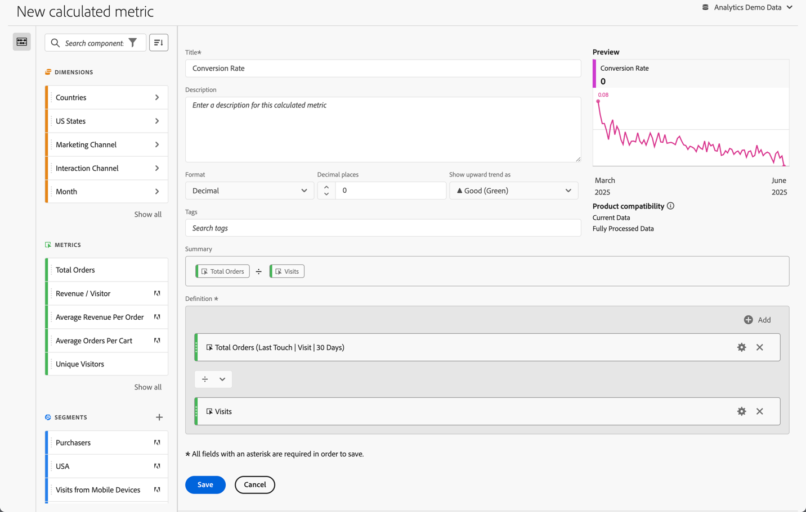

# Bygg beräknade värden {#build-metrics}

Adobe Analytics har en arbetsyta där du kan dra och släppa dimensioner, mätvärden, segment och funktioner för att skapa anpassade mätvärden baserade på behållarhierarkilogik, regler och operatorer. Med det här integrerade utvecklingsverktyget kan du skapa och spara enkla eller komplexa beräknade mätvärden.

Du kan använda verktyget för beräknade mätvärden för att skapa eller redigera beräknade mätvärden. När de skapas på det här sättet är beräknade värden tillgängliga i komponentlistan och kan sedan användas i projekt i hela organisationen. Du kan också snabbt skapa ett beräknat mått som bara är tillgängligt för det projekt där det skapades, vilket beskrivs i [Skapa beräknade värden för ett enskilt projekt](/help/analyze/analysis-workspace/components/apply-create-metrics.md#create-calculated-metrics-for-a-single-project) i [Metrisk](/help/analyze/analysis-workspace/components/apply-create-metrics.md).

[Skapa ett beräknat mått](../cm-workflow.md) beskriver de olika alternativ som är tillgängliga för att skapa ett nytt beräknat mått.

## Områden för verktyget för beräknade mätvärden

Dialogrutan **[!UICONTROL Calculated metric builder]** används för att skapa nya eller redigera befintliga beräknade värden. Dialogrutan heter **[!UICONTROL New calculated metric]** eller **[!UICONTROL Edit calculated metric]** för mått som du skapar eller hanterar från [[!UICONTROL Calculated metrics]-hanteraren ](../cm-manager.md).

>[!BEGINTABS]

>[!TAB Bygg beräknade mätvärden]

>[!TAB Skapa eller redigera beräknade mått]

>[!ENDTABS]

1. Ange följande information ( krävs):

   | Element | Beskrivning |
   | --- | --- |
   | **[!UICONTROL Report suite]** | Du kan välja rapportsviten för det beräknade måttet.  Det beräknade mätvärde som du definierar är tillgängligt i Workspace-projekt baserat på den valda rapportsviten. |
   | **[!UICONTROL Project-only metric]** | En informationsruta visas högst upp i den här dialogrutan när du redigerar ett beräknat mått som har skapats för ett enskilt projekt, vilket beskrivs i [Skapa beräknade värden för ett enskilt projekt](/help/analyze/analysis-workspace/components/apply-create-metrics.md#create-calculated-metrics-for-a-single-project). 
Om du vill göra det här beräknade måttet tillgängligt för alla projekt väljer du alternativet **[!UICONTROL Make this metric available to all your projects and add it to your component list]**.
 |
   | **[!UICONTROL Title]**  | Namnge det beräknade måttet, till exempel `Conversion Rate`. |
   | **[!UICONTROL Description]** | Ange en beskrivning för segmentet, till exempel `Calculated metric to define the conversion rate.` Det finns ingen anledning att beskriva formeln för det beräknade måttet eftersom formeln redan är automatiskt tillgänglig i [!UICONTROL Summary]. |
   | **[!UICONTROL Format]** | Välj ett format för det beräknade måttet: Du kan välja mellan **[!UICONTROL Decimal]**, **[!UICONTROL Time]**, **[!UICONTROL Percent]** och **[!UICONTROL Currency]**. |
   | **[!UICONTROL Decimal places]** | Ange antalet decimaler för det valda formatet. Endast aktiverat när det valda formatet är Decimal, Currency och Percent. |
   | **[!UICONTROL Show upward trend as]** | Ange om en uppåtgående trend för det beräknade måttet visas som ▲ **[!UICONTROL Good (Green)]** eller som ▼ **[!UICONTROL Bad (Red)]**. |
   | **[!UICONTROL Currency]** | Ange valutan för det beräknade måttet. Endast aktiverat när det valda formatet är Valuta. |
   | **[!UICONTROL Tags]** | Organisera det beräknade måttet genom att skapa eller använda en eller flera taggar. Börja skriva för att hitta befintliga taggar som du kan markera. Eller tryck på **[!UICONTROL ENTER]** för att lägga till en ny tagg. Välj  om du vill ta bort en tagg. |
   | **[!UICONTROL Preview]** | Förhandsvisningen täcker de senaste 90 dagarna och är ett sätt att mäta om du har definierat mätvärdena korrekt. |
   | **[!UICONTROL Summary]** | Visar en sammanfattning av definitionen av det beräknade måttet.  Till exempel:  **[!UICONTROL Total Orders]**   **[!UICONTROL Sessions]**. |
   | **[!UICONTROL Definition]**  | Definiera ditt segment med [Definitionsverktyget](#definition-builder). |

1. Om du vill verifiera om den beräknade måttdefinitionen är korrekt använder du den ständigt uppdaterade **[!UICONTROL Preview]** av resultaten för det beräknade måttet. **[!UICONTROL Preview]** täcker de senaste 90 dagarna och utvärderar definitionen av ditt beräknade mått kontinuerligt.

   **[!UICONTROL Product compatibility]** anger det beräknade måttets kompatibilitet med Adobe Analytics-funktioner. Mer information finns i [Mätkompatibilitet](/help/components/calculated-metrics/cm-compatibility.md).

1. Välj:
   * **[!UICONTROL Save]** om du vill spara det beräknade måttet.
   * **[!UICONTROL Save As]** om du vill spara en kopia av det beräknade måttet.
   * **[!UICONTROL Cancel]** om du vill avbryta alla ändringar du har gjort i det beräknade måttet eller avbryta skapandet av ett nytt beräknat mätvärde.

## Definition builder

Du använder Definitionsverktyget för att dra och släppa dimensioner, mått, segment och funktioner för att skapa anpassade mätvärden baserat på behållarhierarkilogik, regler och operatorer. I den konstruktionen kan du använda standardvärden, Adobe-definierade mått, beräknade värden, segment, dimensioner och funktioner. Alla de här komponenterna är tillgängliga från komponentpanelen i verktyget Beräknade mått. Dessutom kan du använda operatorer och behållare i definitionen.

Endast mätvärden definieras som enskilda komponenter i området **[!UICONTROL Definition]**. Alla andra komponenter definieras som en behållare, radbrytningsmått eller andra behållare. Mer information finns i [Behållare](#containers).

### Mätvärden

Så här lägger du till ett mått:

* Dra och släpp en  **[!UICONTROL Metrics]**-komponent från komponentpanelen till **[!UICONTROL Drag and drop metrics, dimensions, dimension items, segments, and/or functions here]**. Du kan använda  i komponentfältet för att söka efter specifika komponenter.

När du använder ett beräknat mätvärde som en del av definitionen expanderas det beräknade mätvärdet.

Så här ändrar du ett mått:

1. Välj  i en måttkomponent i området **[!UICONTROL Definition]**.
1. I popup-dialogrutan kan du definiera typen av mätvärden och en attribueringsmodell. Se [Mättyp och Attribution](m-metric-type-alloc.md).

Så här tar du bort ett mått:

* Välj  i måttet.

### Operatorer

Med operatorer kan du ange operatorn mellan komponenter eller behållare. Operatorer visas automatiskt mellan

* två eller flera mätvärden i en behållare,
* två eller flera behållare i en behållare,
* en eller flera mätvärden och en eller flera behållare i en behållare.

Du kan välja:

| Symbol | Operator |
|:---:|---|
|  | Dela (standard) |
|  | Multiplicera |
|  | Ta bort |
|  | Lägg till |

### Statiskt nummer

Du kan lägga till ett statiskt tal i den beräknade måttdefinitionen. Så här lägger du till ett statiskt nummer:

* Välj  **[!UICONTROL Add]** inifrån en behållare.
* Välj **[!UICONTROL Static number]**. En statisk nummerbehållare visas.
* Välj [!UICONTROL *Klicka för att lägga till ett värde*] och skriv ett värde.

### Behållare

Du lägger till dimensioner, segment och funktioner som behållare i en beräknad måttdefinition. Du kan också lägga till en allmän behållare. Behållare fungerar som ett matematiskt uttryck och avgör ordningen på operationerna. Allt i en behållare bearbetas före nästa komponent eller behållare.

#### Segmentbehållare

Du använder konceptet med en segmentbehållare för att skapa ett [segmenterat mått](metrics-with-segments.md). Du kan skapa en segmentbehållare med ett segment eller med ett segment som du skapar från en dimension.

* Så här lägger du till en segmentbehållare från en dimension:

   1. Dra och släpp en  **[!UICONTROL Dimensions]**-komponent från komponentpanelen till **[!UICONTROL Drag and drop metrics, dimensions, dimension items, segments, and/or functions here]**. Du kan använda  i komponentfältet för att söka efter specifika komponenter.
   1. Ange villkoret för segmentet i popup-menyn **[!UICONTROL Create Segment from Dimension]**. Välj i listan med operatorer och välj ett värde eller ange ett värde. Till exempel **[!UICONTROL Month]** **[!UICONTROL equals]**  `Sep 2024`.
   1. Välj **[!UICONTROL Done]**. En segmentbehållare läggs till i **[!UICONTROL Definition]**.

* Om du vill lägga till en segmentbehållare från ett segment kan du använda:

   * Dra och släpp en  **[!UICONTROL Segments]** från komponentpanelen till **[!UICONTROL Drag and drop metrics, dimensions, dimension items, segments, and/or functions here]**. Du kan använda  i komponentfältet för att söka efter specifika segment.
En segmentbehållare läggs automatiskt till i **[!UICONTROL Definition]** med segmentets namn.

   * Dra och släpp en  **[!UICONTROL Segment]** från komponentpanelen till en generisk behållare. Behållaren ändras till en segmentbehållare.

   * Välj  **[!UICONTROL Add]** inifrån en behållare:

      1. Välj **[!UICONTROL Segment]**. En segmentbehållare läggs till i **[!UICONTROL Definition]**.
      1. I den nya segmentbehållaren väljer du ett segment i listrutan [!UICONTROL *Markera...*].

  >[!TIP]
  >
  >Du kan lägga till mer än ett segment i en behållare.

  Segmenten i behållaren namnges efter segmentkomponenten. Exempel:  **[!UICONTROL Web sessions]**. Välj  om du vill visa ett popup-fönster med information om segmentet. I popup-fönstret väljer du  för att redigera segmentdefinitionen.

Så här tar du bort ett segment från en behållare:

* Välj  bredvid segmentnamnet.

Mer information och exempel finns i [Segmenterade mätvärden](metrics-with-segments.md).

#### Funktionsbehållare

Om du vill lägga till en funktionsbehållare kan du använda:

* Dra och släpp:

   1. Dra och släpp en  **[!UICONTROL Functions]**-komponent från komponentpanelen till **[!UICONTROL Drag and drop metrics, dimensions, dimension items, segments, and/or functions here]**. Du kan använda  i komponentfältet för att söka efter specifika funktioner.
   1. En funktionsbehållare läggs automatiskt till i **[!UICONTROL Definition]** med funktionens namn.

* Välj  **[!UICONTROL Add]** inifrån en behållare:

   1. Välj **[!UICONTROL Function]**.
   1. Välj en funktion i listrutan [!UICONTROL *Välj...*] i behållaren.

Funktionsbehållaren namnges efter funktionskomponenten. Exempel:  **[!UICONTROL SQUARE ROOT (metric)]**. Välj  om du vill visa ett popup-fönster med information om funktionen. Välj **[!UICONTROL Learn more]** om du vill ha mer information om funktionen.

Mer information om hur du använder funktioner och vilka funktioner som är tillgängliga för att skapa ett beräknat mått finns i [Använd funktioner](cm-using-functions.md).

#### Allmän behållare

Så här lägger du till en allmän behållare:

* Välj  **[!UICONTROL Add]** inifrån en behållare
* Välj **[!UICONTROL Container]**. En ny tom generisk behållare läggs till i **[!UICONTROL Definition]**. Du kan använda en generisk behållare för att kapsla in eller skapa en hierarki i definitionen av det beräknade måttet.

#### Ta bort en behållare

Om du vill ta bort en behållare väljer du  på behållarnivå.

>[!MORELIKETHIS]
>
>[Använda funktioner](cm-using-functions.md)
>[Segment](/help/components/segmentation/seg-overview.md)
>

<!--

Adobe Analytics provides a canvas to drag and drop dimensions, metrics, segments, and functions to create custom metrics based on container hierarchy logic, rules, and operators. This integrated development tool lets you build and save simple or complex calculated metrics.

## Begin building a calculated metric

You can use the calculated metric builder to create or edit calculated metrics. When created in this way, calculated metrics are available in the component list and can then be used in projects throughout your organization. Alternatively, you can quickly create a calculated metric that is available only for the project where it was created, as described in [Create calculated metrics for a single project](/help/analyze/analysis-workspace/components/apply-create-metrics.md#create-calculated-metrics-for-a-single-project) in [Metrics](/help/analyze/analysis-workspace/components/apply-create-metrics.md).

Access the calculated metric builder to begin creating a calculated metric that is available in the component list. 

1. Access the calculated metric builder in any of the follows ways:

   * In Analysis Workspace, open a project, then select **[!UICONTROL Components]** > **[!UICONTROL Create metric]**.
   * In Analysis Workspace, open a project, then select the **Plus** icon next to the [!UICONTROL **Metrics**] section in the left rail.
   * In [!DNL Adobe Analytics], go to **[!UICONTROL Components]** > **[!UICONTROL Calculated metrics]**, then select **[!UICONTROL + Add]** at the top of the Calculated metrics page.

1. Continue with [Areas of the calculated metric builder](#areas-of-the-calculated-metrics-builder).

## Areas of the Calculated metrics builder

The following image and accompanying table explain some of the main areas and features of the Calculated metrics builder.

| Location in image  | Name and function  |
|---|---|
| 1 | **Title:** Naming the metric is mandatory. You cannot save the metric unless it is named.  |
| 2 | **Description:** Give it a user-friendly description to show what it's used for and to distinguish it from similar ones. 
The description also appears within a report. It's best NOT to put the formula into the description - instead, describe what this metric should and should not be used for. (The formula is generated as you build the metric, underneath the Summary heading. As a result, there is no need to add the formula to the description.) 
  |
| 3 | **Format:** Choices include Decimal, Time, Percent, and Currency.  |
| 4 | **Decimal Places:** Shows how many decimal places will be shown in the report. The maximum number of decimal places you can specify is 10.  |
| 5| **Show Upward Trend As:** This metric polarity setting shows whether Analytics should consider an upward trend in the metric as good (green) or bad (red). As a result, the report's graph will show as green or red when it's going up.  |
| 6 | **Tags:** Tagging is a good way to organize metrics. All users can create tags and apply one or more tags to a metric. However, you can see tags only for those segments that you own or that have been shared with you. What kinds of tags should you create? Here are some suggestions for useful tags:<ul><li>**Team names**, such as Social Marketing, Mobile Marketing.</li><li>**Projects** (analysis tags), such as Entry-page analysis.</li><li>**Categories**, such as Women's; Geography.</li><li>**Workflows**, such as To be approved; Curated for (a specific business unit)</li></ul> |
| 7 | **Summary:** 
The Summary formula updates anytime you make a change to the metric definition. This formula also shows up in the metrics rail on the left when you hover over a metric and click the  icon. 
  |
| 8 | **Definition:** This is where you drag in metrics/calculated metrics, segments, and/or functions to build the calculated metric. <ul><li>If you drag in a calculated metric, it will expand its metric definition automatically. </li> <li>You can nest definitions with containers. However, unlike segment containers, these containers function like a math expression and determine the order of operations. </li> </ul>  |
| 9 | **Operator:** Divided by (  ) is the default operator, plus there are the +, -, and x operators. |
| 10 | **Preview:** Provides a quick read on any possible errors. The preview covers the last 90 days. This is a way of initially gauging whether you have selected the right components for your metric. An unexpected result would mean you need to take a second look at the metric definition.  |
| 11 | **Product compatibility:** Product compatibility shows you whether the metric is compatible with <a href="/help/analyze/reports-analytics/current-data.md"  > Current Data </a>, with Fully Processed Data, or only with Marketing Channel reports (first-touch allocation). 
Note:  Current Data does not support all metrics. Metrics that contain segments or functions are not compatible with current data. <a href="/help/components/calculated-metrics/cm-compatibility.md"  > More... </a> 
 
  |
| 12 | **Add:** For all types of calculated metrics, you can add containers and static numbers to the definition. For advanced calculated metrics, you can also add segments and functions. <ul><li>Containers function like a math expression and determine the order of operations. So anything in a container will get processed before the next operation.</li><li>Dragging a segment onto a container segments everything in that container. (Advanced calculated metrics only)</li><li>You can stack multiple segments in a container.</li></ul> |
| 13 | **Gear icon (Metric Type, Attribution):** Selecting the gear icon next to a metric lets you specify the <a href="/help/components/calculated-metrics/workflow/c-build-metrics/m-metric-type-alloc.md"  > metric type and attribution models </a>. |
| 14 | **New:** Lets you create a new component, such as a new segment (which takes you to the <a href="/help/components/segmentation/segmentation-workflow/seg-build.md"  > Segment Builder </a>.) |
| 15 | **Search Components:** This search bar lets you search for dimensions, metrics, segments (advanced calculated metrics only), and functions (advanced calculated metrics only). |
| 16 | **List of Dimensions:** Rather than leaving the Calculated Metric Builder in order to build a simple segment (in the Segment Builder), e.g. "Page = Homepage", you can drag in Page and select Homepage directly from the Calculated Metric Builder.
This results in a much more streamlined workflow for creating segmented calculated metrics.
 |
| 17 | **List of Metrics:** Metrics come in 3 categories: <ul> <li>Standard metrics () </li><li>Calculated metrics ( ) </li><li id="li_8735E76637ED4C3F983731A66E04C93E">Metrics templates ( ) - at the bottom of the list. </li> </ul> 
When you hover over a metric, you can see the Info icon to the right of it: . Clicking this icon gives you the following information: 
<ul> <li>The formula of how it is calculated. </li><li>A preview trend of the metric. </li><li>An edit (pencil) icon  at the top right that will take you to the Calculated Metrics Builder where you can edit this calculated metric. </li></ul> |
| 18 | **List of Segments:** (Advanced calculated metrics only) As an Admin, this list shows all segments created in your login company. If you are a non-Admin user, this list shows segments you own and those shared with you. <a href="/help/components/segmentation/segment-reference/seg-rights.md"  > More... </a> |
| 19 | **List of Functions:** (Advanced calculated metrics only) Functions are divided into two lists: <a href="/help/components/calculated-metrics/cm-reference/cm-functions.md"  > Basic </a> (used most often) and <a href="/help/components/calculated-metrics/cm-reference/cm-adv-functions.md"  > Advanced </a>. |
| 20 | **Report Suite selector:** Lets you switch to a different report suite. |

{style="table-layout:auto"}

-->
