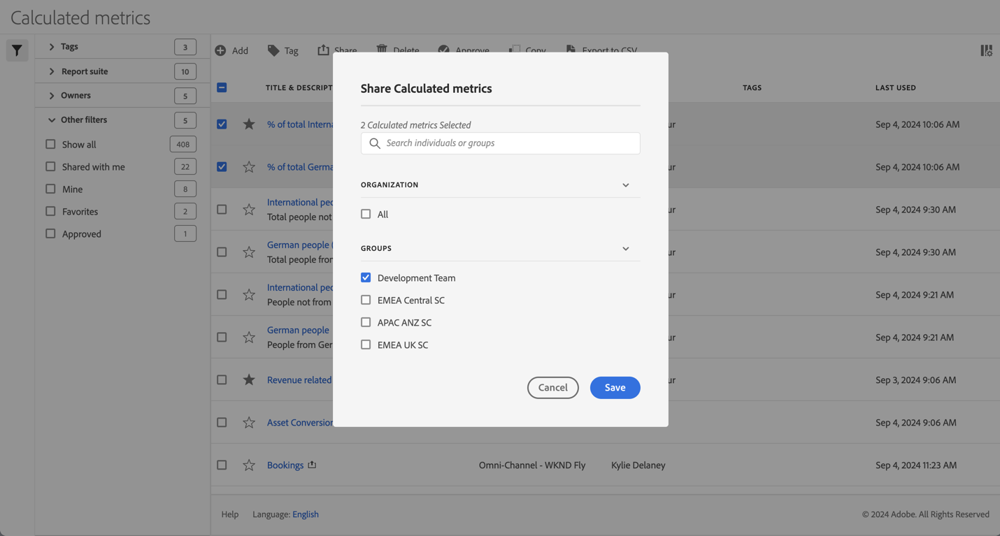

# Dela beräknade värden

I [hanteraren för beräknade värden](cm-manager.md) kan du dela beräknade värden. Beroende på dina behörigheter kan du dela beräknade värden med hela organisationen, grupper eller enskilda användare:

* **Administratörer**: Administratörer kan dela beräknade värden med hela organisationen, med grupper inom en organisation och med enskilda användare. Mer information finns i [Admin Console-dokumentationen](https://helpx.adobe.com/enterprise/using/manage-products.html).
* **Icke-administratörer**: Icke-administratörer kan bara dela det beräknade mått som de har skapat och endast med enskilda användare.

Så här delar du ett eller flera beräknade mått:

1. Välj en eller flera av de beräknade mätvärden som du vill dela i [hanteraren för beräknade mätvärden](cm-manager.md).
1. Välj  **[!UICONTROL Share]** i åtgärdsfältet.
1. I dialogrutan **[!UICONTROL Share Calculated metric]**:

   

   1. (valfritt) Använd  för att *söka efter enskilda personer eller grupper* och begränsa listan med grupper eller individer som du vill dela beräknade värden med.

   1. Välj ett eller flera alternativ i avsnittet **[!UICONTROL Organization]** eller **[!UICONTROL Groups]** eller sök efter och markera en eller flera personer. Vilka alternativ som är tillgängliga beror på din roll.

   1. Välj **[!UICONTROL Save]** om du vill dela beräknade värden. Välj **[!UICONTROL Cancel]** om du vill avbryta.

## Bästa praxis

Nedan följer några tips om hur du bör dela beräknade värden med andra och med vilka du bör dela beräknade värden.

* Som administratör kan du bara dela ett beräknat mått med Alla om du är övertygad om att någon i organisationen känner sig bekväm med att använda det beräknade måttet. Du kan också överväga att prioritera dessa beräknade värden. Mer information finns i [Markera ett beräknat mått som favorit](cm-favorite.md).

* Som administratör kan du dela ett beräknat mått med en viss grupp om det beräknade måttet ger affärsvärde för användarna i den gruppen.

* Som administratör eller enskild användare kan du dela ett beräknat mått med en eller flera personer för att validera ett beräknat mått. Om segmenten inte visar sig vara användbara kan du ta bort det beräknade måttet.

<!--
Depending on your permissions, you can share metrics with your whole organization, groups, or individual users.

|  Role | Permissions |
|---|---|
|  Administrator  | Can share metrics with All, with Groups, and with Users. Groups are set up as permission groups in the Admin Console. |
|  Non-Administrator  | Can share metrics only with individual users.  |

To share a calculated metric:

1. In Adobe Analytics, select the **[!UICONTROL Components]** tab, then select **[!UICONTROL Calculated metrics]**. 

1. In the Calculated metrics manager, select the checkbox to the left of any metrics that you want to share. 

1. Select the **[!UICONTROL Share]** icon. 
   
   The Share Calculated metric dialog box displays.

   

1. Select **[!UICONTROL Share]**.

1. Choose who you want to share with:

   * **[!UICONTROL All]** (Administrators only): Shares with all users in the organization.

     Consider sharing with all only if it's of use to the entire company and everyone is comfortable using it. In this case, you should also consider making it an [approved metric](/help/components/calculated-metrics/workflow/cm-approving.md).
   
   * **[!UICONTROL Groups]** (Administrators only): Select any groups you want to share with.

     Consider sharing with a group if the metric provides good business value for that team.
   
   * **[!UICONTROL Individual users]**: Search for and select the individual users you want to share with.

      This is the only share option available to all users. Administrators might want to use this option to vet and validate a metric prior to making it available to a group or to everyone. If the metric isn't useful, it can be discarded. Administrators should not officially approve this type of metric.

1. Select **[!UICONTROL Share]**.

   The Shared icon appears next to the metric: .

1. You can filter on metrics shared with you by going to **[!UICONTROL Filters]** > **[!UICONTROL Other Filters]** > **[!UICONTROL Shared with Me]**.

1. (Optional) To filter the list of calculated metrics in the Calculated metrics manager to show only metrics that are shared with you, select the **Filter** icon, expand **[!UICONTROL Other filters]**, then select **[!UICONTROL Shared with me]**.
-->
