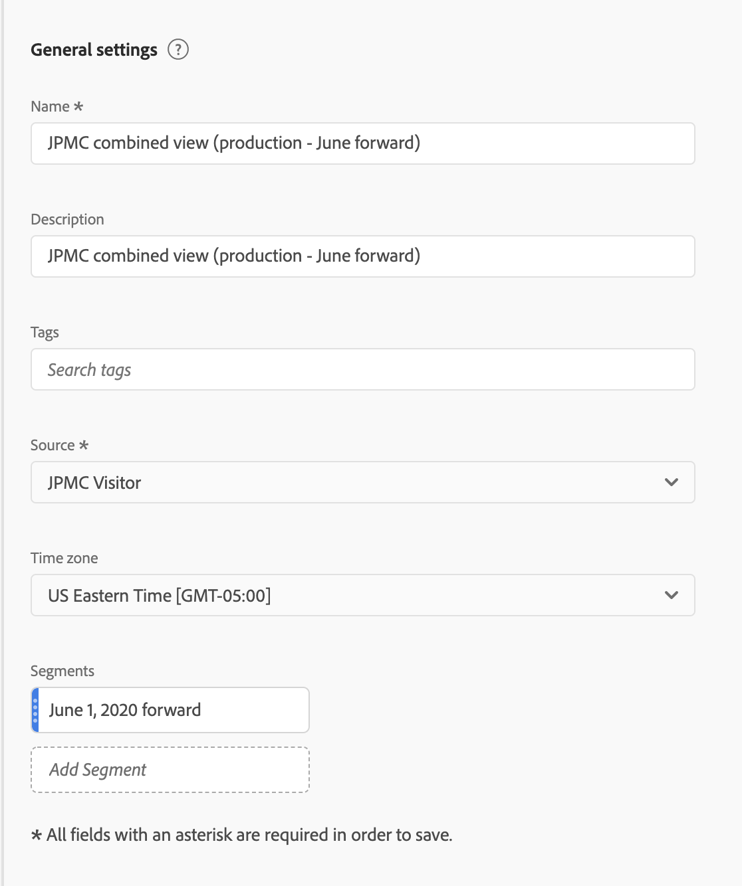
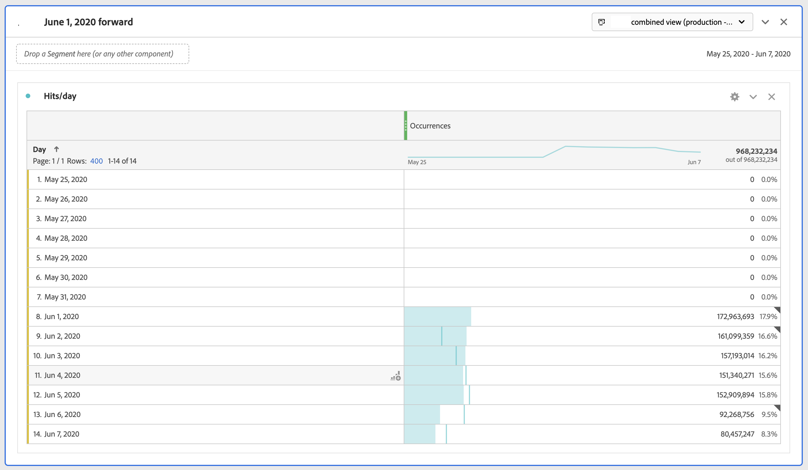

# Begränsa ett VRS till vissa datum

När vi aktiverar stygn börjar stygn på ett visst datum. Låt oss anta att datumet är 1 juni. CDA VRS kommer att innehålla oförsydda data före den 1 juni. Du kanske vill dölja data i det virtuella systemet före 1 juni så att din analys kan fokusera på datumintervall efter sammanfogningen.

Du kan begränsa VRS-data till vissa datum genom att göra följande:

## Steg 1: Skapa VRS med rullande datumintervall

När du ställer in VRS, under Komponenter, lägger du till i ett datumintervall som har en fast start med ett rullande datumintervall. Den fasta början bör vara dagen då sammanfogningen började.

## Steg 2: Skapa ett exkluderingssegment

Skapa sedan ett träffsegment som placerar datumintervallet i en exkluderingsbehållare inuti en annan exkluderingsbehållare. Det är en exkludering.

Orsaken till&quot;exclude exclude&quot; är att datumintervall är avsedda att åsidosätta rapportens datumintervall. Om du bara skickar in den 1 juni kommer rapportens datumintervall alltid att bli den 1 juni framåt. Detta kommer att leda till oönskade resultat. När du&quot;exkluderar&quot; åsidosätter den det här beteendet och begränsar bara de data du kan rita från till rätt datumintervall.

## Steg 3: Använd det här segmentet på ditt CDA VRS

## Steg 4: Se resultaten av rapporteringen

Observera att rapporteringen nu börjar på det önskade datumet, samma dag som sammanslagningen först implementerades:

