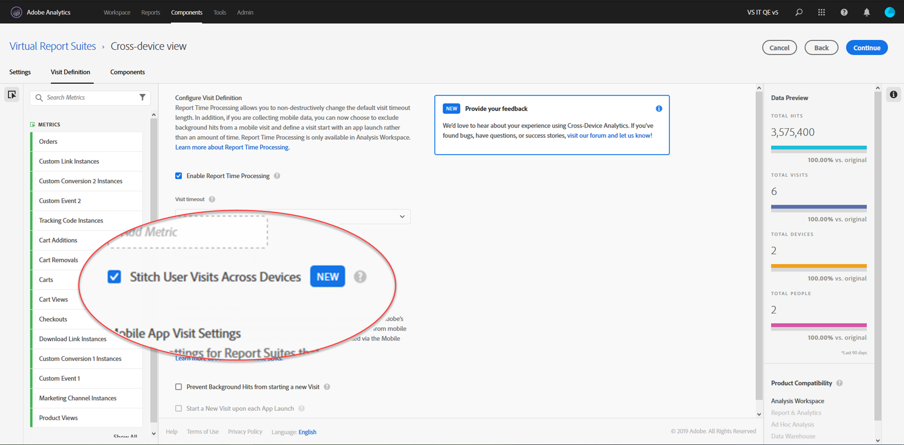

# Konfigurera enhetsövergripande analys

När alla förutsättningar är uppfyllda gör du följande för att aktivera enhetsövergripande analys. Du måste tillhöra en produktprofiladministratörsgrupp eller ha administratörsbehörighet i Adobe Analytics för att kunna följa dessa steg.

>[!IMPORTANT]
>
>Alla förutsättningar måste vara uppfyllda innan du följer dessa steg. Om alla förutsättningar inte uppfylls är funktionen inte tillgänglig eller fungerar inte. Se översiktssidan [och önskad sammanfogningsmetod ([Fältbaserad sammanfogning](field-based-stitching.md) eller [Enhetsdiagram](device-graph.md)) för krav och begränsningar.](overview.md)

## Öppna en biljett hos Kundtjänst om du vill att CDA ska vara etablerat på din enhetsövergripande rapportsvit

CDA tillhandahålls av Adobe Engineering på ditt enhetsövergripande rapportpaket. Kontakta Kundtjänst och be om följande information för att starta processen:

* Ditt Adobe Experience Cloud org-ID (en alfanumerisk sträng som slutar med @AdobeOrg)
* Rapportsvitens-ID för det rapportpaket för olika enheter som du vill aktivera med CDA
* Vilken metod för CDA du vill använda (fältbaserad sammanfogning, privat Adobe-diagram eller Adobe-foto-diagram)
* Om du tänker använda fältbaserad sammanfogning är det utkast eller den eVar som innehåller användar-ID:t
* Din inställning för repetitionsfrekvens och uppslagslängd. Du kan välja att spela upp en gång i veckan med ett 7-dagars uppslagsfönster eller att spela upp varje dag med ett 1-dagars uppslagsfönster.
Standardinställningen är veckovis uppspelning med 7-dagars uppslagsfönster. I så fall kan data under den sista veckan ändras (eftersom de successivt sammanfogas och uppdateras).

När du har försett kundtjänst med den här informationen arbetar de tillsammans med Adobe Engineering för att aktivera den rapportserie du valt för CDA-bearbetning.

## Skapa en virtuell rapportsvit för olika enheter för att se vyn över olika enheter

Administratörer med behörighet att skapa virtuella rapportsviter kan skapa virtuella CDA-rapportsviter enligt följande:

1. Navigera till [experienceCloud.adobe.com](https://experiencecloud.adobe.com) och logga in med dina inloggningsuppgifter för AdobeID.
2. Klicka på ikonen med nio rutnät längst upp och klicka sedan på Analytics (Analyser).
3. Håll muspekaren över komponenterna överst och klicka sedan på Virtuella rapportsviter.
4. Klicka på Lägg till.
5. Ange ett namn för den virtuella rapportsviten och kontrollera att den CDA-aktiverade rapportsviten är vald.
6. (Valfritt) Använd ett segment i den virtuella rapportsviten. Du kan till exempel använda ett segment som begränsar den virtuella rapportsviten till datum efter att CDA aktiverats och sammanfogningen påbörjats. Med det här segmentet kan användare endast se datumintervall i sammanslagna VRS.
7. Klicka på kryssrutan Aktivera rapporttidsbearbetning, som aktiverar flera fler alternativ, bland annat Enhetsövergripande analys.
8. Klicka i kryssrutan &quot;Häfta användarbesök mellan enheter&quot;.
9. Klicka på Fortsätt, avsluta konfigurationen av den virtuella rapportsviten och klicka sedan på Spara.

## Tillägg och ändringar i virtuella rapportsviter för olika enheter

När Enhetsövergripande analys är aktiverat på en virtuell rapportserie bör du tänka på följande ändringar:

* En ny ikon för olika enheter visas bredvid namnet på den virtuella rapportsviten. Den här ikonen är exklusiv för virtuella rapportsviter på olika enheter.
* En ny dimension med namnet [Identifierat tillstånd](../dimensions/identified-state.md) är tillgänglig.
* Nya mätvärden med etiketten [Personer](../metrics/people.md), [Unika enheter](../metrics/unique-devices.md), [Identifierade personer](../metrics/identified-people.md), [Oidentifierade personer](../metrics/unidentified-people.md) och [Personer med Experience Cloud ID](../metrics/people-with-exp-cloud-id.md) är tillgängliga.
* Måttet [Unika besökare](../metrics/unique-visitors.md) är inte tillgängligt eftersom det ersätts med Personer och Unika enheter.
* När du skapar segment ersätts segmentbehållaren &quot;Visitor&quot; med en &quot;Person&quot;-behållare.
