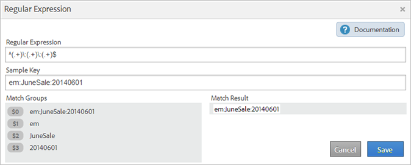
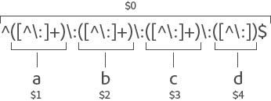

# Klassificeringsregler

Klassificeringsreglerna söker regelbundet efter oklassificerade termer. Om en regelmatchning hittas lägger reglerna automatiskt till villkoren i dina klassificeringsdatatabeller. Du kan också använda klassificeringsregler för att skriva över befintliga nycklar.

**[!UICONTROL Analytics]** > **[!UICONTROL Admin]** > **[!UICONTROL Classification Rule Builder]**

Med regelverktyget kan du skapa en *klassificeringsregeluppsättning*, som är en lista med *klassificeringsregler*. En regel matchar de kriterier som du anger och utför sedan en åtgärd.

Klassificeringsreglerna är praktiska för:

* **E-post** och **Visa annonser**: Skapa klassificeringsregler för att gruppera enskilda displayannonskampanjer så att ni kan lära er hur displaykampanjer fungerar mot e-postkampanjer.

* **Spårningskoder**: Skapa klassificeringsregler för att kategorisera nyckelvärden som härleds från strängar i spårningskoder och matcha dem med specifika kriterier som du definierar.
* **Sökvillkor**: Använd [reguljära uttryck](/help/components/classifications/crb/classification-quickstart-rules.md) och jokertecken för att förenkla klassificeringen av söktermer. Om ett sökord innehåller *`baseball`* kan du ange en *`Sports League`* klassificering till *`MLB`*.

Anta till exempel att en spårningskod för ett e-postkampanjs-ID är:

`em:Summer:2013:Sale`.

Du kan ställa in tre regler i en regeluppsättning som identifierar delarna i strängen och sedan klassificera värdena:

| Välj regeltyp | Ange matchningsvillkor | Ange klassificering | Till |
|---|---|---|---|
| Börjar med | em: | Kanal | E-post |
| Slutar med | Försäljning | Typ | Försäljning |
| Innehåller | 2013 | År | 2013 |

## Hur regler bearbetas {#how-rules-are-processed}

Viktig information om hur klassificeringsregler behandlas.

<!-- 

about_classification_rules.xml

 -->

* [Viktig information om regler](/help/components/classifications/crb/classification-rule-builder.md)
* [När klassificerar regler inte nycklar?](/help/components/classifications/crb/classification-rule-builder.md)
* [Om regelprioritet](/help/components/classifications/crb/classification-quickstart-rules.md)

>[!NOTE]
>
>The [!UICONTROL Rule Builder] stöder inte Numeric 2-klassificeringar.

## Viktig information om regler

* Ange [gruppbehörigheter](https://experienceleague.adobe.com/docs/analytics/admin/user-product-management/user-groups/groups.html) för klassificeringar i [!UICONTROL Admin Tools].

* **Reguljära uttryck**: Hjälp finns under [Reguljära uttryck i klassificeringsregler](/help/components/classifications/crb/classification-quickstart-rules.md).

* **Rapportsviter**: Du kan inte välja en klassificering förrän minst en rapportserie har valts. Du kan inte använda rapportsviten förrän du har skapat regeluppsättningen och tilldelat en variabel.

  När du testar regeluppsättningen kan du använda nycklar (variabeln som klassificeras) från rapporten för att se hur de kommer att påverkas av regeluppsättningen. (Med [key](/help/components/classifications/importer/c-saint-data-files.md) är variabeln som klassificeras, eller den första kolumnen i klassificeringstabellen.)

* **Regelprioritet**: Om en nyckel matchar flera regler som anger samma klassificering (i [!UICONTROL Set Classification] kolumn) används den sista regeln som matchar klassificeringen. Se [Om regelprioritet](/help/components/classifications/crb/classification-quickstart-rules.md).

* **Begränsningar av antalet regler**: Det finns ingen gräns för hur många regler du kan skapa. Ett stort antal regler kan dock påverka webbläsarens prestanda.
* **Bearbetar**: Reglerna behandlas med jämna mellanrum, beroende på hur mycket av klassificeringen som den relaterade trafiken är.

  Aktiva regler bearbetas var fjärde timme och behandlar klassificeringsdata som vanligtvis går tillbaka en månad. Reglerna söker automatiskt efter nya värden och överför klassificeringarna med importverktyget.

* **Skriva över befintliga klassificeringar**: Se [När klassificerar regler inte nycklar?](/help/components/classifications/crb/classification-quickstart-rules.md) Om det behövs kan du ta bort eller ta bort befintliga klassificeringar med hjälp av importeraren.

## När klassificerar regler inte nycklar?

När du aktiverar regler kan du skriva över befintliga klassificeringar. I följande situationer klassificerar en klassificeringsregel inte en [key](/help/components/classifications/importer/c-saint-data-files.md)(variabel) om:

* Nyckeln är redan klassificerad och du väljer inte [Skriv över klassificeringar](/help/components/classifications/crb/classification-rule-definitions.md).

  Du kan skriva över klassificeringar när [lägga till och aktivera](/help/components/classifications/crb/classification-quickstart-rules.md) en regel och när en dataanslutningsintegration aktiveras. (För dataanslutningar skapas regler av partner i Dev Center och visas i [!UICONTROL Classification Rule Builder].)

* En klassificerad nyckel har inte visats i data efter en tidsram som angetts när en nyckel skrevs över, även efter att du aktiverat [Skriv över klassificeringar](/help/components/classifications/crb/classification-rule-definitions.md).
* Nyckeln är inte klassificerad och nyckeln skickas aldrig till [!DNL Adobe Analytics] efter den tidsram som började för ungefär en månad sedan.

  >[!NOTE]
  >
  >I rapporter gäller klassificeringar för alla angivna tidsramar när det finns en nyckel. Rapportens datumintervall påverkar inte rapporteringen.


## Reguljära uttryck i klassificeringsregler {#regex-in-classification-rules}

Använd reguljära uttryck för att matcha konsekvent formaterade strängvärden med en klassificering. Du kan till exempel skapa en klassificering av specifika tecken i en spårningskod. Du kan matcha vissa tecken, ord eller teckenmönster.

<!-- 

regex_classification_rules.xml

 -->

* [Reguljärt uttryck - Exempel på spårningskod](/help/components/classifications/crb/classification-quickstart-rules.md#section_2EF7951398EB4C2F8E52CEFAB4032669)
* [Reguljärt uttryck - klassificera ett visst tecken](/help/components/classifications/crb/classification-quickstart-rules.md#section_5D300C03FA484BADACBFCA983E738ACF)
* [Reguljära uttryck - matchande spårningskoder med varierande längd](/help/components/classifications/crb/classification-quickstart-rules.md#section_E86F5BF5C2F44ABC8FFCE3EA67EE3BB2)
* [Reguljära uttryck - Exempel på&quot;Innehåller inte&quot;](/help/components/classifications/crb/classification-quickstart-rules.md#section_FCA88A612A4E4B099458E3EF7B60B59C)
* [Reguljära uttryck - referenstabell](/help/components/classifications/crb/classification-quickstart-rules.md#section_0211DCB1760042099CCD3ED7A665D716)

>[!NOTE]
>
>Det bästa sättet är att använda reguljära uttryck för att spåra koder som använder avgränsare.

## Reguljärt uttryck - Exempel på spårningskod {#section_2EF7951398EB4C2F8E52CEFAB4032669}

>[!NOTE]
>
>Om spårningskoden är URL-kodad kommer den att **not** klassificeras i Rules Builder.

I det här exemplet antar du att du vill klassificera följande kampanj-ID:

[!UICONTROL Sample Key]: `em:JuneSale:20130601`

De delar av spårningskoden som du vill klassificera är:

* `em` = e-post
* `JuneSale` = kampanjnamn
* `20130601` = datum

[!UICONTROL Regular Expression]: `^(.+)\:(.+)\:(.+)$`

Så här korrelerar det reguljära uttrycket till kampanj-ID:


[!UICONTROL Match Groups]: Visar hur det reguljära uttrycket motsvarar kampanj-ID-tecknen, så att du kan klassificera en position i kampanj-ID:t.



Det här exemplet anger regeln att kampanjdatumet `20140601` är i den tredje gruppen `(.+)`, identifieras av `$3`.

**[!UICONTROL Rule Builder]**

I [!UICONTROL Rule Builder]konfigurerar du regeln enligt följande:

| Välj regeltyp | Ange matchningsvillkor | Ange klassificering | Till |
|---|---|---|---|
| Reguljärt uttryck | &amp;Hatt;(.+)\:(.+)\:(.+)$ | Kampanjdatum | $3 |

**Syntax**

| Reguljärt uttryck | Sträng eller Matcha resultat | Motsvarande Matcha grupper |
|--- |--- |--- |
| `^(.+)\:(.+)\:(.+)$` | `em:JuneSale:20130601` | `$0`: `em:JuneSale:20130601`  `$1`: em  `$2`: JuniSale  `$3`: 20130601 |
| Skapar syntaxen | `^` = startar raden () = grupperar tecken och låter dig extrahera matchande tecken inom parenteserna.  `(.+)` = hämtar ett ( . ) och ( + ) eller fler \ = början av en sträng.  `$` = anger att föregående tecken (eller teckengrupp) är det sista tecknet på raden. |

Se [Reguljära uttryck - referenstabell](/help/components/classifications/crb/classification-quickstart-rules.md#section_0211DCB1760042099CCD3ED7A665D716) om du vill ha information om vad tecknen i ett reguljärt uttryck betyder.

## Reguljärt uttryck - klassificera ett visst tecken {#section_5D300C03FA484BADACBFCA983E738ACF}

Ett sätt att använda ett reguljärt uttryck är att klassificera ett visst tecken i en teckensträng. Anta till exempel att följande spårningskod innehåller två viktiga tecken:

[!UICONTROL Sample Key]: `4s3234`

* `4` = varumärkesnamn
* `s` = identifierar en sökmotor, som Google


**[!UICONTROL Rule Builder]**

I [!UICONTROL Rule Builder]konfigurerar du regeln enligt följande:

| Välj regeltyp | Ange matchningsvillkor | Ange klassificering | Till |
|--- |--- |--- |--- |
| Reguljärt uttryck | `^.(s).*$` | Varumärke och motor | `$0` (Hämtar de två första tecknen för varumärkesnamn och sökmotor.) |
| Reguljärt uttryck | `^.(s).*$` | Sökmotor | `$1` (Hämtar det andra tecknet för Google.) |

## Reguljära uttryck - matchande spårningskoder med varierande längd {#section_E86F5BF5C2F44ABC8FFCE3EA67EE3BB2}

I det här exemplet visas hur du identifierar specifika tecken mellan kolonavgränsare när du har spårningskoder med olika längder. Adobe rekommenderar att du använder ett reguljärt uttryck för varje spårningskod.

Exempeltangenter:

* `a:b`
* `a:b:c`
* `a:b:c:d`

**Syntax**




**[!UICONTROL Rule Builder]**

I [!UICONTROL Rule Builder]konfigurerar du regeln enligt följande:

| Välj regeltyp | Ange matchningsvillkor | Ange klassificering | Till |
|--- |--- |--- |--- |
| Reguljärt uttryck för matchningssträng `a:b` | `^([^\:]+)\:([^\:]+)$` | a | `$1` |
| Reguljärt uttryck för matchningssträng `a:b` | `^([^\:]+)\:([^\:]+)$` | b | `$2` |
| Reguljärt uttryck för matchningssträng `a:b:c` | `^([^\:]+)\:([^\:]+)\:([^\:]+)$` | a | `$1` |
| Reguljärt uttryck för matchningssträng `a:b:c` | `^([^\:]+)\:([^\:]+)\:([^\:]+)$` | b | `$2` |
| Reguljärt uttryck för matchningssträng `a:b:c` | `^([^\:]+)\:([^\:]+)\:([^\:]+)$` | c | `$3` |
| Reguljärt uttryck för matchningssträng `a:b:c:d` | `^([^\:]+)\:([^\:]+)\:([^\:]+)\:([^\:])$` | d | `$4` |

## Reguljära uttryck - Exempel på&quot;Innehåller inte&quot; {#section_FCA88A612A4E4B099458E3EF7B60B59C}

I det här exemplet finns ett reguljärt uttryck som matchar strängar som inte innehåller specifika tecken, i det här fallet `13`.

Reguljärt uttryck:

`^(?!.*13.*).*$`

Teststrängar:

```
a:b:
a:b:1313
c:d:xoxo
c:d:yoyo
```

Matcha resultat:

```
a:b:
c:d:xoxo
c:d:yoyo
```

Detta resulterar i att `a:b:1313` anger inte någon matchning.

## Reguljära uttryck - referenstabell {#section_0211DCB1760042099CCD3ED7A665D716}

| Uttryck | Beskrivning |
|---|---|
| `(?ms)` | Matchar hela det reguljära uttrycket mot flerradiga indata, vilket tillåter . jokertecken som matchar alla radmatningstecken |
| (`?i`) | Gör hela det reguljära uttryckets skiftläge okänsligt |
| [`abc`] | Ett enda tecken: a, b eller c |
| [`^abc`] | Ett enda tecken förutom: a, b eller c |
| [`a-z`] | Ett enskilt tecken i intervallet a-z |
| [`a-zA-Z`] | Ett enskilt tecken i intervallet a-z eller A-Z |
| `^` | Radbörjan (matchar början av raden) |
| `$` | Matcha radens slut (eller före radmatningen i slutet) |
| `\A` | Strängstart |
| `\z` | Strängslut |
| `.` | Matcha alla tecken (utom en ny rad) |
| `\s` | Valfritt blankstegstecken |
| `\S` | Alla tecken som inte är blanksteg |
| `\d` | Alla siffror |
| `\D` | Alla icke-siffror |
| `\w` | Valfritt ordtecken (bokstav, siffra, understreck) |
| `\W` | Valfritt icke-ordtecken |
| `\b` | Valfri ordgräns |
| `(...)` | Fånga allt inneslutet |
| `(a\b)` | a eller b |
| `a?` | Noll eller en av |
| `a*` | Noll eller mer av en |
| `a+` | en eller flera av |
| `a{3}` | Exakt 3 av en |
| `a{3,}` | 3 eller fler av en |
| `a{3,6}` | Mellan 3 och 6 i en |

En bra resurs för att testa giltigheten för reguljära uttryck är [https://rubular.com/](https://rubular.com/).

## Om regelprioritet

Om en nyckel matchas mot flera regler och den anger samma klassificeringskolumn som visas i [!UICONTROL Set Classification] -kolumnen används den sista regeln. Därför kanske du vill rangordna den viktigaste sista i regeluppsättningen.

<!-- 

rule_priority.xml

 -->

Om du skapar flera regler som inte har samma klassificering spelar bearbetningsordningen ingen roll.

Här följer ett exempel på en sökordsregel som klassificerar sökningstyper för en idrottare:

| Regelnummer | Regeltyp | Matcha | Ange klassificering | Till |
|---|---|---|---|---|
| 1 | Innehåller | Cowboy | Söktyp | Team |
| 2 | Innehåller | Fantasy | Söktyp | Fantasy |
| 3 | Innehåller | Romo | Söktyp | Player |

Om en användare söker efter *`Cowboys fantasy Tony Romo`*, term *`Player`* är klassificerad eftersom den matchar den senast angivna klassificeringen som visas i kolumnen Ange klassificering.

Anta på samma sätt att du ställer in två regler i en uppsättning för följande söktermer:

| Regelnummer | Regeltyp | Matcha | Ange klassificering | Till |
|---|---|---|---|---|
| 1 | Innehåller | Cowboy | Ort | Dallas |
| 2 | Innehåller | Broncos | Ort | Denver |

En användare söker efter *`Cowboys vs. Broncos`*. Om regelbyggaren hittar en konflikt i regelmatchning, gäller klassificeringen för den andra regeln (Denver) den här sökningen.

## Lägga till en klassificeringsregel i en regeluppsättning {#add-classification-to-rule-set}

<!-- 

t_classification_rule.xml

 -->

Lägg till regler genom att matcha ett villkor med en klassificering och ange åtgärden.

>[!NOTE]
>
>I den här proceduren måste du tillämpa reglerna på en eller flera rapportsviter. Rekommenderat antal regler per regeluppsättning är mellan 500 och 1000, även om det inte finns några begränsningar. Om du har fler än 100 regler kan du förenkla regeluppsättningen genom att använda [underklassificeringar](/help/components/classifications/c-sub-classifications.md).

Så här lägger du till eller redigerar en klassificeringsregel:

1. [Skapa en klassificeringsregeluppsättning](/help/components/classifications/crb/classification-rule-set.md) .
1. Klicka på **[!UICONTROL Add Rule]**.

   

1. Nästa till **[!UICONTROL Report Suites]**, klicka **[!UICONTROL Add Suites]** om du vill ange en eller flera rapportsviter som ska tilldelas den här regeluppsättningen.

   The **[!UICONTROL Select Report Suites]** visas.

   >[!NOTE]
   >
   >Rapportsviter visas på den här sidan *endast* när följande villkor är uppfyllda:
   >
   >* Rapportsviterna har minst en klassificering definierad för den variabeln i [!UICONTROL Admin Tools].
   >
   >   (Se *Variabel* in [Klassificeringsregeluppsättningar](/help/components/classifications/crb/classification-rule-set.md) om du vill ha en förklaring till detta krav.)
   >
   >* Du valde rapportsviten på **[!UICONTROL Available Report Suites]** sida som visas när du klickar [Lägg till regeluppsättning](/help/components/classifications/crb/classification-rule-set.md) för att skapa regeluppsättningen.

1. Ange om befintliga värden ska skrivas över:

   | **Regler skriver över befintliga värden** | (Standardinställning) Skriv alltid över befintliga klassificeringsnycklar, inklusive klassificeringar som överförts via importören (SAINT). |
   |---|---|
   | **Regler skriver bara över ej avaktiverade värden** | Fyll bara i tomma celler (ta bort). Befintliga klassificeringar ändras inte. |

1. [Definiera regeln eller reglerna](/help/components/classifications/crb/classification-rule-definitions.md#section_4A5BF384EEEE4994B6DC888339833529).

   

   Exempel på byggregler finns i [Klassificeringsregelverktyget](/help/components/classifications/crb/classification-rule-builder.md) och [Reguljära uttryck i klassificeringsregler](/help/components/classifications/crb/classification-quickstart-rules.md).

   >[!NOTE]
   >
   >Om en nyckel matchar flera regler som anger samma klassificering (i kolumnen Ange klassificering) används den sista regeln som matchar klassificeringen. Se **Om regelprioritet** ovan om du vill ha mer information om sorteringsregler.

1. [Testa regeluppsättningen](/help/components/classifications/crb/classification-quickstart-rules.md).
1. Efter testningen klickar du på **[!UICONTROL Active]** för att validera och aktivera regeln.

   När du aktiverar en regel skapas filen automatiskt och den överförs åt dig.

   Fältdefinitioner: Se [Klassificeringsregelverktyget](/help/components/classifications/crb/classification-rule-definitions.md) för fullständiga definitioner av gränssnittsalternativ på den här sidan.

## Testa en klassificeringsregeluppsättning

<!-- 

t_classifications_test_rule.xml

 -->

Du kan testa en klassificeringsregel eller regeluppsättning. När du kör ett test kontrolleras alla regler i en uppsättning.

Så här testar du en klassificeringsregeluppsättning:

1. [Skapa en klassificeringsregeluppsättning](/help/components/classifications/crb/classification-rule-set.md) .
1. På [!UICONTROL Classification Rule Builder]klickar du på regeluppsättningens namn.
1. Kontrollera att regeluppsättningen är associerad med en rapportserie.
1. Klicka på regelredigeraren **[!UICONTROL Test Rule Set]**.

   

1. Skriv eller klistra in testtangenterna i [!UICONTROL Sample Keys] fält.

   Exempelnycklar:

   * Spårningskoder
   * Sök efter nyckelord eller fraser

   Se [Reguljära uttryck i klassificeringsregler](/help/components/classifications/crb/classification-quickstart-rules.md) för information om testning av reguljära uttryck.
1. Klicka på **[!UICONTROL Run Test]**.

   Matchande regler visas i [!UICONTROL Results] tabell.
1. (Valfritt) Klicka på **[!UICONTROL Activate]** om du vill aktivera regeln och skriva över befintliga klassificeringar.

   Mer information om hur du använder regler för att skriva över befintliga klassificeringar finns.

## Validera och aktivera klassificeringsregler

<!-- 

t_validate_rules.xml

 -->

Så här validerar och aktiverar du klassificeringsregler:

1. [Skapa en klassificeringsregeluppsättning](/help/components/classifications/crb/classification-rule-set.md) sedan [lägg till klassificeringsregler](/help/components/classifications/crb/classification-quickstart-rules.md) till uppsättningen.
1. Klicka på regelredigeraren **[!UICONTROL Activate]**.

   

1. (Valfritt) Om du vill skriva över klassificeringar aktiverar du **[!UICONTROL Overwrite classifications for]** &lt;*markering*>.

   Med det här alternativet kan du skriva över befintliga klassificeringar för berörda nycklar.

   Se [Regelsida](/help/components/classifications/crb/classification-rule-definitions.md#section_4A5BF384EEEE4994B6DC888339833529) för en definition av det här alternativet.
