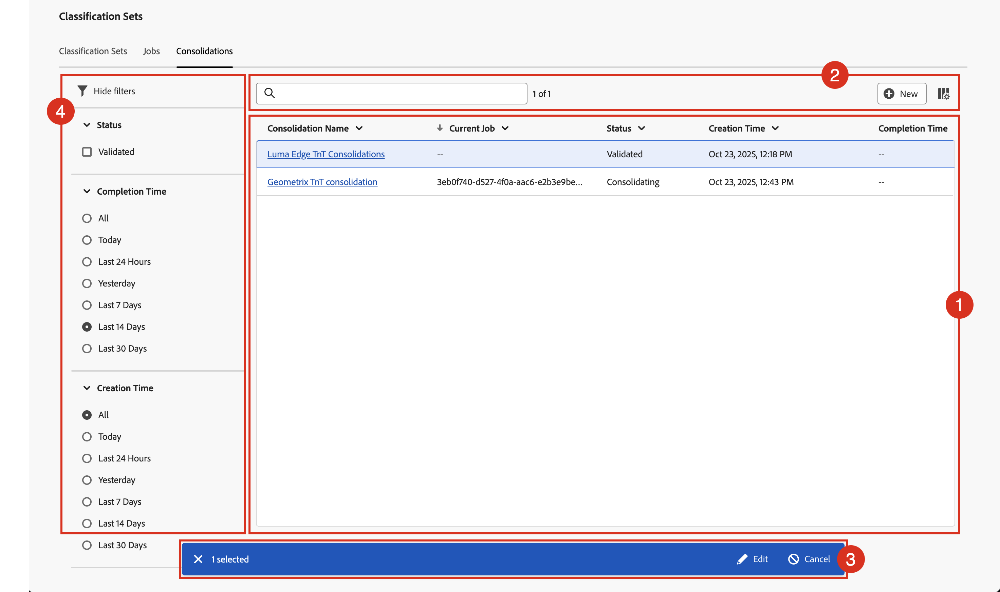

# Hantera klassificeringskonsolidering

Om du har flera klassificeringsuppsättningar som innehåller liknande klassificeringsdata kan du konsolidera dem till en enda klassificeringsuppsättning. När du konsoliderar två eller flera klassificeringsuppsättningar genererar Adobe en ny klassificeringsuppsättning som innehåller alla klassificeringsdata från varje enskild klassificeringsuppsättning. Konsolideringar är användbara när du har överfört data till många rapportsviter. Eller när du har dimensioner som innehåller samma klassificeringsdata och vill sammanfoga dem i ett enda arbetsflöde.

Du måste ha produktadministratörsåtkomst för Adobe Analytics för att kunna se konsolideringshanteraren för klassificeringsuppsättningar.

Så här hanterar du klassificeringskonsolideringar:

1. Välj **[!UICONTROL Components]** i huvudgränssnittet och välj sedan **[!UICONTROL Classification sets]**.
1. I **[!UICONTROL Classification Sets]** väljer du fliken **[!UICONTROL Consolidations]**.

## Klassificeringskonsolideringshanterare

Hanteraren **[!UICONTROL Classification Sets - Consolidations]** har följande gränssnittselement:

### Klassificeringskonsolideringslista

Listan ➊ visar klassificeringskonsolideringar som har skapats och validerats och som kanske konsolideras. Listan innehåller följande kolumner:

| Kolumn | Beskrivning |
|---|---|
| **[!UICONTROL Consolidation Name]** | Namnet på klassificeringen anger konsolidering. |
| **[!UICONTROL Current Job]** | Jobbet som är associerat med konsolideringen av klassificeringsuppsättningar. |
| **[!UICONTROL Status]** | Status för klassificeringen anger konsolidering. Möjliga värden är: **[!UICONTROL Created]**, **[!UICONTROL Canceled]**, **[!UICONTROL Canceling]**, **[!UICONTROL Validating]**, **[!UICONTROL Failed Validation]**, **[!UICONTROL Validated]**, **[!UICONTROL Comparing]**, **[!UICONTROL Comparison Failed]**, **[!UICONTROL Consolidation]**, **[!UICONTROL Submitted]**, **[!UICONTROL Consolidating]**, **[!UICONTROL Consolidation Failed]**, **[!UICONTROL Consolidation Succeeded]**, **[!UICONTROL Waiting for Approval]**, **[!UICONTROL Finalizing]**, **[!UICONTROL Failed]** eller **[!UICONTROL Completed]**. |
| **[!UICONTROL Creation time]** | Skapandetiden för klassificeringen ställer in konsolidering. |
| **[!UICONTROL Completion Time]** | Slutförandetiden för klassificeringskonsolideringarna. |

Om du vill ändra storlek på en kolumn i listan över klassificeringskonsolideringar kan du:

* Håll pekaren över kolumnavgränsaren och dra kolumnavgränsaren till önskad kolumnbredd.
* Välj  och välj **[!UICONTROL Resize column]**. Med en lodrät linje med storleksknappen kan du ändra storlek på kolumnen till det önskade med.

Sortera en kolumn i listan över klassificeringskonsolideringar

* Välj  och välj **[!UICONTROL Sort Ascending]** eller **[!UICONTROL Sort Descending]**. En pil ( ↑ ↓) visar vilken kolumn och hur kolumnen sorteras.

### Sökning och knappar

I området ➋ ovanför listan över klassificeringskonsolideringar kan du:

* Sök i  efter klassificeringskonsolideringar. Resultaten visas i listan över klassificeringskonsolideringar. Välj  för att rensa sökningen.
* Ta bort alla filter som tillämpas på konsolideringslistan för klassificeringsuppsättningar. Välj  om du vill ta bort ett filter.
* Skapa en ny konsolidering av klassificeringsuppsättningar. Välj  **[!UICONTROL New]** för att öppna konsolideringsdialogrutan för klassificeringsuppsättningar och definiera en ny konsolidering av klassificeringsuppsättningar.
* Definiera kolumnerna i klassificeringskonsolideringslistan. Välj  och markera de kolumner som ska visas under **[!UICONTROL Customize table]** i dialogrutan **[!UICONTROL Select columns to show]**. Välj **[!UICONTROL Apply]** om du vill använda kolumninställningarna.

### Åtgärdsfält

När du väljer en eller flera klassificeringsuppsättningar i listan med klassificeringsuppsättningar visas ett blått åtgärdsfält ➌. Följande åtgärder är tillgängliga i åtgärdsfältet:

| Ikon | Åtgärd | Beskrivning |
|---|---|---|
|  | **[!UICONTROL Edit]** | [Redigera konsolideringen av klassificeringsuppsättningar](process.md#edit-a-consolidation) |
|  | **[!UICONTROL View]** | Visa information om konsolideringen av klassificeringsuppsättningar. Beroende på statusen kan du [godkänna](process.md#approve) eller [avbryta](process.md#cancel) konsolideringen. |

### Panelen Filter

Välj  om du vill visa filterpanelen ➍ som du kan använda för att filtrera listan med klassificeringskonsolideringar. Du kan filtrera på:

* **[!UICONTROL Status]**. Välj ett av de möjliga värdena för att filtrera listan över klassificeringskonsolideringar efter status. |
* **[!UICONTROL Completion Time]**. Välj ett av de möjliga värdena för att filtrera listan över klassificeringskonsolideringar när den är klar.
* **[!UICONTROL Creation Time]**. Välj ett av de möjliga värdena för att filtrera listan över klassificeringskonsolideringar när den är klar.

Välj  **[!UICONTROL Hide filters]** om du vill dölja filterpanelen.

Observera att de filter som visas på filterpanelen återspeglar alternativen för de klassificeringskonsolideringar som är förinlästa.

<!--

**[!UICONTROL Components]** > **[!UICONTROL Classification sets]** > **[!UICONTROL Consolidations]**

Once a consolidation is run, the original classification sets are removed, with the consolidated classification set taking their place. Click **[!UICONTROL Add]** to [Create a consolidation](process.md).

## Filter classification sets

The left side of the Classification set consolidation manager provides filter settings to locate the desired consolidation. Clicking the filter icon toggles the filter settings visibility. You can filter consolidations by **[!UICONTROL Status]**, **[!UICONTROL Completion time]**, or **[!UICONTROL Creation time]**.

Additional filter options are available above the Classification set consolidation manager columns:

* **[!UICONTROL Search by title]**: Search for consolidations by name.
* **Show/Hide columns**: Toggle visibility for any column besides [!UICONTROL Name].

## Classification set consolidation manager columns

The following columns are available in the Classification set consolidation manager:

* **[!UICONTROL Name]**: The name of the consolidation.
* **[!UICONTROL Current job]**: The current job. 
* **[!UICONTROL Status]**: The status of the consolidation. 
* **[!UICONTROL Creation date]**: The date and time that the consolidation was created.
* **[!UICONTROL Completion date]**: The date and time that the consolidation completed (or failed).

-->
