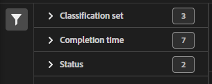

# Jobbhanterare för klassificeringsuppsättning

Med jobbhanteraren för klassificeringsuppsättning kan du visa aktuella och slutförda klassificeringsjobb som genererats från klassificeringsuppsättningar. Du kan också använda det här gränssnittet för att hämta klassificeringsdata eller mallar för ett visst jobb, eller överföra ytterligare data till ett jobb.

>[!NOTE]
>
>Den här funktionen är tillgänglig för alla kunder som har sina rapportsviter migrerade till den nya klassifikationsarkitekturen. Kontakta Adobe kundtjänst eller din kontoansvarige om du vill ha mer information.

**[!UICONTROL Components]** > **[!UICONTROL Classification sets]** > **[!UICONTROL Jobs]**

Observera att du inte kan skapa jobb från det här gränssnittet. I stället kan du skapa jobb genom att överföra data till en klassificeringsuppsättning, begära en hämtningsfil eller begära en mallfil.

## Filterklassificeringsuppsättningar

Vänster sida av jobbhanteraren för klassificeringsuppsättning innehåller filterinställningar för att hitta det önskade jobbet. När du klickar på filterikonen växlas synligheten för filterinställningarna. Du kan filtrera klassificeringsuppsättningar efter **[!UICONTROL Classification Set]**, **[!UICONTROL Completion time]**, eller **[!UICONTROL Status]**.

Ytterligare filteralternativ är tillgängliga ovanför kolumnerna i Klassificeringsuppsättningen Jobbhanterare:

* **[!UICONTROL Search by title]**: Sök efter jobb efter filnamn.
* **[!UICONTROL Load more]**: Jobbhanteraren för klassificeringsuppsättning visar initialt upp till 1 000 jobb. Klicka på den här knappen om du vill läsa in 1 000 fler jobb.
* **Visa/dölj kolumner**: Växla synlighet för alla kolumner förutom [!UICONTROL Filename] och [!UICONTROL Completion time].

## Klassificeringsuppsättning för jobbhanterarkolumner

Följande kolumner är tillgängliga i Klassificeringsuppsättningens jobbhanterare:

* **[!UICONTROL Filename]**: Namnet på överförings- eller nedladdningsfilen.
* **[!UICONTROL Classification Set]**: Namnet på den klassificeringsuppsättning som filen gäller för. Du kan klicka på klassificeringsuppsättningens namn för att nå klassificeringsuppsättningens namn [Inställningar](settings.md).
* **[!UICONTROL Size]**: Filens storlek.
* **[!UICONTROL Status]**: Status för jobbet som bearbetar filen.
   * **[!UICONTROL Created]**: Jobbet skickades.
   * **[!UICONTROL Queued]**: Filen är klar att bearbetas och väntar på att en klassificeringsserver ska bearbeta filen.
   * **[!UICONTROL Validated]**: Filen är giltig och väntar på att bearbetas.
   * **[!UICONTROL Failed validation]**: Filen är felaktigt formaterad eller ogiltig på annat sätt. Filen bearbetas inte.
   * **[!UICONTROL Processing]**: Filen bearbetas aktivt av Adobe.
   * **[!UICONTROL Failed processing]**: Det gick inte att bearbeta filen.
   * **[!UICONTROL Complete]**: Bearbetningen är klar. Klassificeringsdata visas vid rapportering.
   * **[!UICONTROL Failed]**: Allmänt fel som inte är relaterat till validering eller bearbetning.
* **[!UICONTROL Type]**: Typ av jobb.
* **[!UICONTROL File download]**: Gäller endast för nedladdningsjobb, t.ex. nedladdning av klassificeringsdata eller nedladdning av mallar. När nedladdningen är klar visas en nedladdningslänk i den här kolumnen.
* **[!UICONTROL Completion time]**: Datum och tid då jobbet slutfördes (eller misslyckades).
