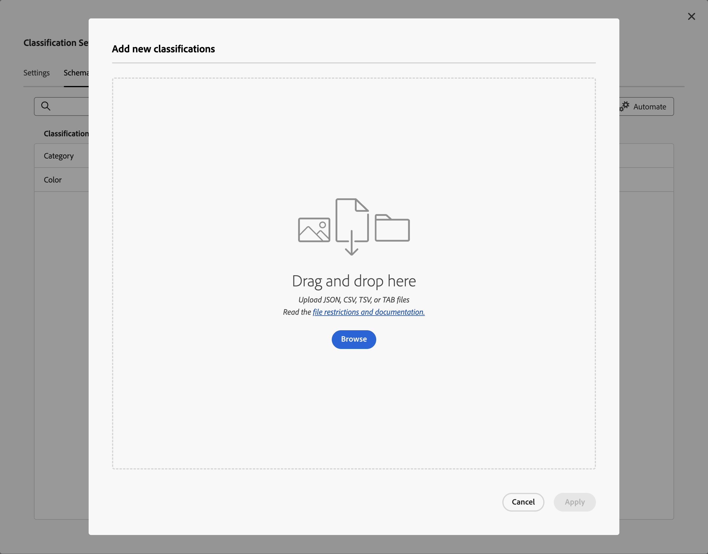
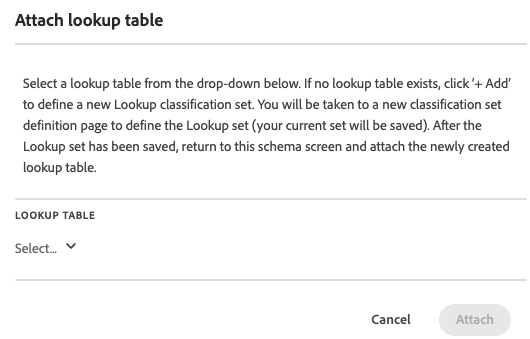

# Schema för klassificeringsuppsättning

Schemat är den lista med klassificeringar som du vill tillämpa på de nyckeldimensioner som du har definierat för klassificeringsuppsättningen. Om du t.ex. har definierat produkten som nyckeldimension och det här fältet innehåller en produkt-SKU, använder du schemat för att lägga till klassificeringar som produktnamn, produktfärg, produktstorlek med mera.

Så här redigerar du schemat för en klassificeringsuppsättning:

1. Välj **[!UICONTROL Components]** i Adobe Analytics övre menyrad och välj sedan **[!UICONTROL Classification sets]**.
1. I **[!UICONTROL Classification Sets]** väljer du fliken **[!UICONTROL Classification Sets]**.
1. I hanteraren för **[!UICONTROL Classifications Sets]** väljer du den klassificeringsgrupp som du vill redigera schemat för.
1. Välj fliken **[!UICONTROL Classification Set: _i dialogrutan_]** klassificeringsuppsättningsnamn **[!UICONTROL Schema]**. Fliken består av följande gränssnittselement:

   

   * [Klassificeringslista](#classification-list)
   * [Sök](#search)
   * [Åtgärder](#actions)
   * [Åtgärdsfält](#action-bar)

## Klassificeringslista

Listan med klassificeringar har följande kolumner:

| Kolumn | Beskrivning |
|---|---|
| **[!UICONTROL Classification Name]** | Namnet som du angav för klassificeringen. |
| **[!UICONTROL Identity Name]** | Det härledda namnet av systemet för klassificeringen. Detta är ett skrivskyddat värde och du kan använda identitetsnamnet |
| **[!UICONTROL Classified By]** | Om det används, en länk till den uppslagsklassificeringsuppsättning som används för att klassificera den här klassificeringen. |

## Sök

Du kan snabbt söka i  efter en eller flera klassificeringar. Använd  för att rensa sökningen.

## Åtgärder

Följande åtgärder är tillgängliga som knappar högst upp i klassificeringslistan:

| Ikon | Åtgärd | Beskrivning |
|---|---|---|
|  | **[!UICONTROL Add]** | [Lägg till en klassificering](#add) i listan. |
|  | **[!UICONTROL Upload]** | [Överför en JSON-, CSV-, TSV- eller TAB-fil](#upload). |
|  | **[!UICONTROL Download]** | [Hämta klassificeringsdata](#download). |
|  | **[!UICONTROL Template]** | [Hämta en mall](#template) för klassificeringsdata. |
|  | **[!UICONTROL Job History]** | Visa jobbhanteraren [ för klassificeringsuppsättningen, filtrerad för den valda klassificeringsuppsättningen.](/help/components/classifications/sets/job-manager.md) |
|  | **[!UICONTROL Automate]** | [Automatisera inmatningen av klassificeringsdata](#automate) med hjälp av en molnplats. |

### Lägg till

Om du vill lägga till en ny klassificering väljer du  **[!UICONTROL Add]**.

Ange **[!UICONTROL Add a new classification for _och välj_]** i dialogrutan **[!UICONTROL Classification Name]** klassificeringsuppsättningsnamn **[!UICONTROL Add]**. Klassificeringen läggs till i listan.

### Överför

Om du vill importera klassificeringsdata till schemat för en klassificering väljer du  **[!UICONTROL Upload]**.

1. I dialogrutan **[!UICONTROL Add new classifications]**:

   * Dra en fil som innehåller klassificeringsdata och släpp filen på **[!UICONTROL Drag and drop here]**.
   * Välj **[!UICONTROL Browse]** och välj en fil på datorn eller i nätverket.

   En **[!UICONTROL Schema Preview]** av filens innehåll visas. I förhandsgranskningen visas kolumnerna med data från filen. Om du vill ändra storlek på en kolumn väljer du  och väljer **[!UICONTROL Resize column]**. Ett handtag som gör att du kan ändra storlek på kolumnen visas.

   När ingen klassificering har definierats i klassificeringsuppsättningen för en kolumn visas en varning . Varningen förklarar att det inte finns någon klassificering i den befintliga klassificeringsschemamängden och att den kommer att skapas vid importen.

1. Välj **[!UICONTROL Overwrite data on conflict?]** om du vill skriva över aktuella klassificeringsdata med de nya importerade. Exempel:

   | | Nyckel | Aktuell färg | Importera fil | Ny produktfärg |
   |---|---|---|---|---|
   |  **[!UICONTROL Overwrite data on conflict?]** | 1234 | grön | blå | blå |
   |  **[!UICONTROL Overwrite data on conflict?]** | 1234 | grön | blå | grön |

1. Välj **[!UICONTROL Apply]**. En varning visas om det inte finns några kolumner som klassificeringar i den befintliga schemamängden. Dessa kolumner läggs till som nya klassificeringar när du bekräftar överföringen.

   

   Välj **[!UICONTROL Confirm Upload]** för att bekräfta överföringen. Välj **[!UICONTROL Cancel Upload]** om du vill avbryta överföringen.

### Ladda ned

Om du vill hämta klassificeringsdata väljer du  **[!UICONTROL Download]**.

I dialogrutan **[!UICONTROL Download data for _klassificeringsuppsättningsnamn_]**:

1. Ange antalet **[!UICONTROL Rows]** som du vill hämta. Till exempel: `10000`.
1. Ange start- och slutdata för **[!UICONTROL Download Rows Received Between]** om du vill välja den period som du vill hämta rader med klassificeringsdata för. Du kan också använda  om du vill använda en kalender-popup för att markera perioden.
1. Välj ett alternativ från **[!UICONTROL Data Returned]** om du vill välja vilka data som ska returneras.

   * **[!UICONTROL All values]** returnerar alla värden för aktuella klassificeringsdata.
   * **[!UICONTROL Any columns empty]** returnerar en kolumn med nyckelvärden för befintliga klassificeringsdata. Och kolumner utan värde för klassificeringsdata som saknar värden.
   * **[!UICONTROL All columns empty]** returnerar en nyckelkolumn med värden för befintliga klassificeringsdata. Och kolumner utan värde för klassificeringsdata.
1. Om du vill välja [filformat](/help/components/classifications/sets/data-files.md#general-file-requirements) för de hämtade klassificeringsdata väljer du ett alternativ i listrutan **[!UICONTROL File Format]** . Alternativ:

   * **[!UICONTROL JSON]**.
   * **[!UICONTROL Comma separated values]** (CSV).
   * **[!UICONTROL Excel tab separated values]** (TSV eller TAB).

1. Om du vill välja [filkodning](/help/components/classifications/sets/data-files.md#general-file-requirements) när filen hämtas väljer du ett alternativ i listrutan Filkodning. Alternativ:

   * **[!UICONTROL UTF-8]**.
   * **[!UICONTROL Latin-1]**.

1. Välj **[!UICONTROL Download]** om du vill hämta klassificeringsdata. Du hittar den hämtade filen i webbläsarens standardkatalog för hämtning, och filen heter <code><i>Klassificeringsuppsättning</i>.<i>json</i>|<i>csv</i>|<i>tsv</i></code>. Om filen redan finns, sekvensnummer <code>(<i>x</i>)</code> läggs till i filnamnet. Om du har angett alternativ som inte returnerar några data visas en **[!UICONTROL Notice]**-dialogruta där du kan ange alternativ för datumintervall och returnerade data.

### Mall

Om du vill hämta en mall för klassificeringsdata väljer du  **[!UICONTROL Template]**.

I dialogrutan **[!UICONTROL Download template for _klassificeringsuppsättningsnamn_]**:

1. Om du vill välja [filformat](/help/components/classifications/sets/data-files.md#general-file-requirements) för de hämtade klassificeringsdata väljer du ett alternativ i listrutan **[!UICONTROL File Format]** . Alternativ:

   * **[!UICONTROL Comma separated values]**.
   * **[!UICONTROL Excel tab separated values]**.

1. Om du vill välja [filkodning](/help/components/classifications/sets/data-files.md#general-file-requirements) när filen hämtas väljer du ett alternativ i listrutan Filkodning. Alternativ:

   * **[!UICONTROL UTF-8]**.
   * **[!UICONTROL Latin-1]**.

1. Välj **[!UICONTROL Download]** om du vill hämta klassificeringsdatamallen. Du hittar den hämtade filen i webbläsarens standardkatalog för hämtning och den heter <code><i>Klassificeringsuppsättning</i>.<i>csv</i>|<i>tsv</i></code>. Om filen redan finns, sekvensnummer <code>(<i>x</i>)</code> läggs till i filnamnet.

### Automatisera

Om du vill automatisera intaget av klassificering väljer du  **[!UICONTROL Automate]**.

I dialogrutan **[!UICONTROL Associate / Update Ingest Location for _klassificeringsuppsättningsnamn_]**:

1. Välj en molnplats genom att välja ett alternativ från **[!UICONTROL Location Account]**. Endast [platskonton för kontotyper som stöds som tillåter import av klassificeringsdata](https://experienceleague.adobe.com/en/docs/analytics/components/locations/configure-import-accounts) visas. Välj **[!UICONTROL New account]** om du vill skapa ett nytt konto.
1. Välj en plats genom att välja ett alternativ från **[!UICONTROL Location]**. Endast platserna för valda kontotyper för import av klassificeringsdata visas. Välj **[!UICONTROL New location]** om du vill skapa en ny plats.

   >[!IMPORTANT]
   >
   >Platsen som du skapar eller väljer bör innehålla en **[!UICONTROL Prefix]** (mapp) i **[!UICONTROL Bucket]** som värd för klassificeringsdatafilerna. En mapp med namnet `files`. De flesta molnplatser fungerar inte med värdfiler som finns i roten av en bucket.
   >

1. Om du vill välja en avgränsare väljer du ett alternativ i listrutan **[!UICONTROL List delimiter]**. Alternativen är:
   * **[!UICONTROL Comma ,]**
   * **[!UICONTROL Semicolon ;]**
   * **[!UICONTROL Colon :]**
   * **[!UICONTROL Vertical bar |]**
   * **[!UICONTROL Space]**
   * **[!UICONTROL Tab]**
1. Om du vill välja [filkodningen](/help/components/classifications/sets/data-files.md#general-file-requirements) när filen hämtas väljer du ett alternativ i listrutan **[!UICONTROL File Encoding]** . Alternativ:

   * **[!UICONTROL UTF-8]**.
   * **[!UICONTROL Latin-1]**.

1. Om du vill meddela användare om slutförandet av importen anger du e-postadresser, avgränsade med kommatecken, för **[!UICONTROL Email(s) to notify when ingest jobs completes (comma separated)]**.
1. Välj **[!UICONTROL Validate]**. Anslutningen till molnplatsen verifieras.
1. Om valideringen lyckas visas ett popup-meddelande som visar  **[!UICONTROL Location validation successful. Connection to cloud storage verified.]** Välj **[!UICONTROL Save]**om du har skapat anslutningen till molnanslutningen. Annars väljer du **[!UICONTROL Update]**. Eller välj **[!UICONTROL Cancel]**om du vill avbryta konfigurationen av molnplatsen.

När du överför filer till molnplatsen identifieras filen och skickas som ett importjobb inom 15 minuter. Resultatet av det importjobbet rapporteras i jobbhanteraren [för klassificeringar](/help/components/classifications/sets/job-manager.md). Om du har lagts till i listan över användare för att meddela att importen har slutförts, får du även e-postmeddelanden.

Exempel:

{width="400"}

## Åtgärdsfält

Åtgärdsfältet visar åtgärder som är tillgängliga för den valda klassificeringen. Tillgängliga alternativ är:

| Ikon | Åtgärd | Beskrivning |
|---|---|---|
|  | **[!UICONTROL Add Lookup]** | Lägg till en klassificeringsuppsättning som en sökning (underklassificering). I tabellen **[!UICONTROL Attach lookup]**: <ol><li>Välj en uppslagsklassificering i listrutan **[!UICONTROL Classification Name]**.</li><li>Välj **[!UICONTROL Add]**.</li></ol>Uppslagsklassificeringen läggs till i klassificeringen och listas i kolumnen **[!UICONTROL Classified by]** med hjälp av det interna ID:t. |
|  | **[!UICONTROL Remove Lookup]** | Ta bort en klassificeringsuppsättning som en sökning. Om du vill ta bort sökningen permanent från klassificeringen väljer du **[!UICONTROL Remove _i bekräftelsedialogrutan för _klassificeringsuppsättningen_ från_]** klassificeringen **[!UICONTROL Delete]**. |
|  | **[!UICONTROL Rename]** | Byt namn på **[!UICONTROL Classification Name]** för en klassificering. I dialogrutan **[!UICONTROL Rename: _klassificeringsnamn_]** anger du ett nytt namn och väljer **[!UICONTROL Rename]**. |
|  | **[!UICONTROL Delete]** | Ta bort en klassificering. Dialogrutan **[!UICONTROL Delete _Klassificeringsnamn_]** visas. Välj **[!UICONTROL Delete]** om du vill ta bort klassificeringen. |

<!--

View currently configured classification dimensions for this classification set.

**[!UICONTROL Components]** > **[!UICONTROL Classification sets]** > **[!UICONTROL Sets]** > Click the desired classification set name > **[!UICONTROL Schema]**

The following buttons are available:

* **[!UICONTROL Upload]**: Manually upload classification data for a classification dimensions. `JSON`, `CSV`, `TSV`, and `TAB` files are supported. Uploading a valid file shows a table preview of data to classify.
  * **[!UICONTROL File encoding]**: Select the correct file encoding using this drop-down. Valid options include [!UICONTROL UTF-8] and [!UICONTROL Latin1].
  * **[!UICONTROL List delimiter]**: Select the correct list delimiter. If using a downloaded file or template file, make sure that the [!UICONTROL List delimiter] here matches the [!UICONTROL List delimiter] when the file was downloaded.
  * **[!UICONTROL Apply]**: Save the uploaded classification data to the classification set.

  

* **[!UICONTROL Download]**: Download key values and their classification columns.
  * **[!UICONTROL Rows]**: The maximum number of rows to include in the download file.
  * **[!UICONTROL Download rows received between]**: A calendar date picker that allows you to filter key values by when they appear in reporting. If a key value was not collected in this date range, it does not appear in the downloaded file.
  * **[!UICONTROL Data returned]**: A drop-down list that lets you filter key values included in the downloaded file based on their associated classification data.
    * **[!UICONTROL All classified values]**: Includes rows where classification data is included in at least one column.
    * **[!UICONTROL All unclassified values]**: Includes rows where classification data is missing in at least one column.
  * **[!UICONTROL File format]**: A drop-down list that determines the file format that the download file is in. Options include [!UICONTROL JSON], [!UICONTROL Comma separated values], and [!UICONTROL Excel tab separated values].
  * **[!UICONTROL File encoding]**: A drop-down list that determines the file encoding. Options include [!UICONTROL UTF-8] and [!UICONTROL Latin1]. UTF-8 is recommended.

  

* **[!UICONTROL Template]**: Download a template file. This file is similar to the [!UICONTROL Download] button, except it does not contain any classification data or key values.
  * **[!UICONTROL File format]**: A drop-down list that determines the file format that the template file is in. Options include [!UICONTROL Comma separated values], and [!UICONTROL Excel tab separated values].
  * **[!UICONTROL File encoding]**: A drop-down list that determines the file encoding. Options include [!UICONTROL UTF-8] and [!UICONTROL Latin1]. UTF-8 is recommended.
  * **[!UICONTROL List delimiters]**: A drop-down list that determines the list delimiter separating classification columns on each row.

  

* **[!UICONTROL Job history]**: A shortcut link that takes you to the [Job manager](../job-manager.md), showing jobs only for this classification set.
* **[!UICONTROL Automate]**: Automatically ingest data from external storage locations.
  * **[!UICONTROL Location account]**: A drop-down list showing existing location accounts that your organization has configured. If your organization hasn't already configured a location account, you can configure one by selecting [!UICONTROL **Create a new account**].
    
    For information about configuring the location account, see [Configure cloud import and export accounts](/help/components/locations/configure-import-accounts.md).

  * **[!UICONTROL Location]**: A drop-down list showing existing locations that your organization has configured. If your organization hasn't already configured a location, you can configure one by selecting [!UICONTROL **Create a new location**]. 

    For information about configuring a location, see [Configure cloud import and export locations](/help/components/locations/configure-import-locations.md). 

  * **[!UICONTROL Delimiter]**: The column delimiter for uploaded files. Options include [!UICONTROL Comma], [!UICONTROL Semicolon], [!UICONTROL Colon], [!UICONTROL Vertical bar], [!UICONTROL Space], [!UICONTROL Forward slash], [!UICONTROL Backward slash], [!UICONTROL Dash], or [!UICONTROL Underscore].

  * **[!UICONTROL Encoding]**: A drop-down list that determines the file encoding. Options include [!UICONTROL UTF-8] and [!UICONTROL Latin1]. UTF-8 is recommended.

The following actions are available only after selecting a classification.

* **Add lookup**: A lookup table is a classification of a classification. It is metadata about a classification value, rather than the variable itself. For example, the Product variable might have a classification of "color code". A lookup table of "color name" might be attached to "color code" to explain what the colors are.

  

* **Rename**: Lets you rename the classification.

* **Delete**: Lets you delete the classification.
-->