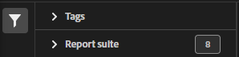

# Klassificeringsuppsättningshanterare

Med Klassificeringsuppsättningshanteraren kan du skapa, redigera eller ta bort klassificeringsuppsättningar.

**[!UICONTROL Components]** > **[!UICONTROL Classification sets]** > **[!UICONTROL Sets]**

Klassificeringsuppsättningar består av **Prenumerationer** (rapportpaket och dimensionskombinationer) och **Klassificeringsnamn** (dimensioner som innehåller klassificeringsdata). Prenumerationer konfigureras under [Inställningar](settings.md) medan klassificeringsnamn konfigureras under [Schema](schema.md).

## Filterklassificeringsuppsättningar

Den vänstra sidan av klassificeringsuppsättningshanteraren innehåller filterinställningar för att hitta önskad klassificeringsuppsättning. När du klickar på filterikonen växlas synligheten för filterinställningarna. Du kan filtrera klassificeringsgrupper efter **[!UICONTROL Tags]** eller **[!UICONTROL Report suite]**.

Observera att 1 000 klassificeringsuppsättningar är förinlästa i taget. De filter som visas i den vänstra listen återspeglar alternativen för de uppsättningar som är förinlästa.

## Hanteringskolumner för klassificeringsuppsättning

Följande kolumner är tillgängliga i Klassificeringsuppsättningshanteraren:

* **[!UICONTROL Classification set]**: Klassificeringsuppsättningens namn. Om du klickar på ett namn på en klassificeringsuppsättning redigeras dess [inställningar](settings.md).
* **[!UICONTROL Subscriptions]**: Antalet prenumerationer som den här klassificeringsuppsättningen gäller för.
* **[!UICONTROL Classifications]**: Antalet klassificeringsdimensioner som klassificeringsuppsättningen innehåller.
* **[!UICONTROL Automated]**: Avgör om klassificeringsuppsättningen är konfigurerad att automatiskt importera data från en molnplats. Automatisering kan konfigureras i klassificeringsuppsättningens [schema](schema.md).
* **[!UICONTROL Last Modified]**: Det datum och den tidpunkt då klassificeringsuppsättningen senast ändrades.

## Skapa eller redigera alternativ

Följande knappar är tillgängliga i Klassificeringsuppsättningshanteraren:

* **[!UICONTROL Add]**: [Skapa](create.md) en klassificeringsgrupp.
* **[!UICONTROL Search by title]**: Sök efter klassificeringsuppsättningar efter namn.
* **[!UICONTROL Load more]**: Klassificeringsuppsättningshanteraren visar initialt upp till 1 000 klassificeringsuppsättningar. Den här knappen läser in ytterligare 1 000 klassificeringsuppsättningar.
* **Visa/dölj kolumner**: Växla synlighet för alla kolumner förutom [!UICONTROL Classification set].

Välj en eller flera klassificeringsuppsättningar genom att klicka i kryssrutan bredvid önskad klassificeringsuppsättning. Om du väljer en klassificeringsuppsättning visas följande alternativ:

* **[!UICONTROL Tag]**: Lägg till en eller flera taggar i de markerade klassificeringsuppsättningarna, så att du kan ordna eller gruppera klassificeringsuppsättningar så att de blir lättare att hitta i framtiden.
* **[!UICONTROL Delete]**: Tar bort klassificeringsuppsättningen. Klassificeringsdimensioner baserade på den här klassificeringsuppsättningen är inte längre tillgängliga. Schemalagda projekt med den borttagna klassificeringsuppsättningen fortsätter att använda beroende dimensioner tills du sparar om det schemalagda projektet.
* **[!UICONTROL Consolidate]**: Starta en ny [konsolidering](../consolidations/process.md).
* **[!UICONTROL Rename]**: Byt namn på den valda klassificeringsuppsättningen.
