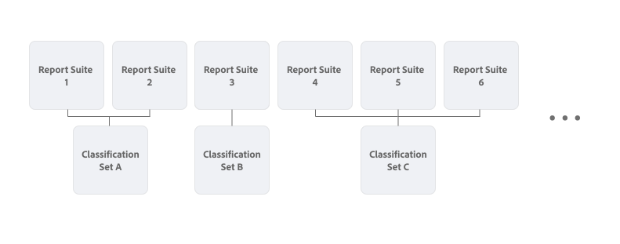

# Översikt över klassificeringsuppsättningar

Klassificeringsuppsättningar har ett enda gränssnitt för att hantera klassificeringar och regler. I det här arbetsflödet kombineras skapandet av klassificeringar i inställningarna för rapportsviten med [klassificeringsimporteraren](/help/components/classifications/sets/manage/set-manager.md). Resultatet blir ett enda intuitivt gränssnitt för att skapa och hantera klassificeringsdata.


## Klassificeringsuppsättningar jämfört med äldre klassificeringar

Den största skillnaden mellan klassificeringsuppsättningar och äldre klassificeringar är relationen mellan klassificeringarna och en rapportserie.

I äldre klassificeringar är varje klassificering direkt kopplad till en rapportserie. Mycket liknande klassificeringar (till exempel för en produktkatalog) replikeras när de används i flera rapportsviter.


I klassificeringsuppsättningar definierar du prenumerationer på rapportsviter och viktiga dimensionskombinationer. En produktkatalogsklassificering som gäller för flera rapportsviter och som baseras på en produktdimension (SKU) behöver du bara definiera en gång som en klassificeringsuppsättning. Och inom den klassificeringen konfigurerar du flera rapportsviter och viktiga dimensionskombinationer för att prenumerera på den klassificeringen.




Om du vill komma åt **[!UICONTROL Classification sets]** från menyn **[!UICONTROL Components]** i Adobe Analytics-gränssnittet måste du vara produktadministratör eller tillhöra en produktprofil som innehåller behörighetsobjektet [!UICONTROL Report Suite Tools] > [!UICONTROL Classifications] . Observera att äldre klassificeringsgränssnitt är tillgängliga på menyn **[!UICONTROL Admin]**.

Klassificeringsuppsättningar består av tre funktionsområden:

* [**[!UICONTROL Classification Sets]**](manage/set-manager.md): Skapa, redigera och ta bort klassificeringsgrupper.
* [**[!UICONTROL Jobs]**](job-manager.md): Visa statusen för klassificeringsuppsättningar för jobb.
* [**[!UICONTROL Consolidations]**](consolidations/manage.md): Kombinera flera klassificeringsuppsättningar till en enda klassificeringsuppsättning.


## Arbetsflöde

Arbetsflödet för klassificeringsuppsättningar omfattar vanligtvis följande steg:

1. Ta en titt på vilken rapportserie och vilka dimensionskombinationer du vill skapa en klassificeringsuppsättning för. Ett exempel är att definiera en produktklassificeringsuppsättning som du skapar för alla rapportsviter där du vill klassificera produkter med mer information. Exempel: information som kategori och färg.
1. [Skapa en klassificeringsuppsättning](/help/components/classifications/sets/manage/create.md) med prenumerationer för en eller flera rapportsviter och viktiga dimensionskombinationer som identifierar produkter. Exempel:

   | Report Suite | Viktiga Dimension |
   |---|---|
   | Report Suite 1 | Produkt-ID |
   | Report Suite 2 | Produkt-SKU |

1. [Lägg till klassificeringarna](/help/components/classifications/sets/manage/schema.md#add) som du har identifierat i klassificeringsmängdens schema. Exempel:

   | Klassificeringsnamn | Identitetsnamn |
   |---|---|
   | Kategori | kategori |
   | Färg | färg |

1. Skapa en fil som innehåller klassificeringsdata manuellt. [Använd en mall](/help/components/classifications/sets/manage/schema.md#template) för att vara säker på att du använder filformatet [som stöds](data-files.md#classification-set-file-formats) och kolumnerna för filen. Lägg sedan till data i mallfilen.

   Du kan också exportera data direkt från produktkatalogen i de [filformat som stöds](data-files.md#classification-set-file-formats) med kolumner som följer mallen. En CSV-fil, till exempel:

   ```
   Key,Category,Color
   Adobe Nike Tech Fleece Full-Zip Hoodie - Men's,Men,Black
   Adobe Nike Tech Fleece Full-Zip Hoodie - Women's,Women,Black
   Men's North Face Adobe Jacket,Men,Black
   Nike Air Hybrid 2 Golf Bag,Equipment,Blue
   STITCH&reg; Ultimate Garment Bag,Equipment,Brown
   Adobe Analytics Training Tee - Navy,Men,Navy
   AirPods Pro 2,Electronics,White
   Adobe Analytics Training Tee - Green,Men,Green
   Women's North Face Adobe Jacket,Women,Blue
   Adobe Analytics Training Tee - Grey,Men,Gray
   Adobe Analytics One Million Views - Grey,Equipment,Grey
   Adobe and MGM Tee - White,Women,White
   Adobe and MGM Tee - Charcoal,Women,Charcoal
   ```

I klassificeringsdatafilen refererar du till nyckeldimensionen för varje rapportserie (till exempel: **[!UICONTROL Product ID]** och **[!UICONTROL Product SKU]**) med `Key`. Och du refererar till varje klassificering med **[!UICONTROL Classification Name]** (till exempel `Category` eller `Color`).

1. [Överför](/help/components/classifications/sets/manage/schema.md#upload) filen som innehåller klassificeringsdata till klassificeringsmängdens schema.

1. [Automatisera](/help/components/classifications/sets/manage/schema.md#automate) uppdateringsprocessen för din produktkatalog som du vill ska återspeglas i klassificeringsdata genom att använda en molnplats.

1. [Hämta](/help/components/classifications/sets/manage/schema.md#download) dina klassificeringsdata för att validera innehållet.

1. [Granska jobbhistoriken](/help/components/classifications/sets/job-manager.md) för att se resultaten av dina åtgärder (överföring, hämtning, mall med mera) för klassificeringar.
1. Om du har flera liknande klassificeringsuppsättningar som ett resultat av en migrering från de äldre klassificeringsfunktionerna [konsoliderar](consolidations/manage.md) dessa klassificeringsuppsättningar.


## Förbättringar

Den serverdelsarkitektur som lanserats med klassificeringsuppsättningar innehåller flera förbättringar:

* Minskad bearbetningstid (från 72 till 24 timmar).
* Ett omdesignat användargränssnitt för att hantera klassificeringar.
* Alternativet att använda klassificeringsdata i Adobe Experience Platform via [Adobe Analytics-källkopplingen för klassificeringsdata](https://experienceleague.adobe.com/en/docs/experience-platform/sources/connectors/adobe-applications/classifications).

Den serverdelsarkitektur som lanserats med klassificeringsuppsättningar innehåller också flera ändringar:

* När du använder webbläsaren eller den automatiska importen är **[!UICONTROL Overwrite on conflict]** alltid aktiverat.
* När du använder webbläsaren eller den automatiska importen stöds inte längre alternativet att exportera direkt efter importen. Export måste initieras separat.
* API-slutpunkten för Analytics 2.0 `GetDimensions` returnerar nu strängidentifierare för klassificeringar i stället för numeriska identifierare. Numeriska identifierare kan fortfarande användas, men rekommendationen är att använda de nya strängidentifierarna där det är möjligt. Numeriska identifierare kan hämtas med frågesträngparametern `?expansion=hidden`.

>[!IMPORTANT]
>
>Klassificeringsuppsättningens prestanda beror huvudsakligen på antalet unika nyckelvärden som innehåller data. Var försiktig när du har variabler som innehåller ett stort antal unika värden. Speciellt när du kombinerar sådana variabler från flera rapportsviter och dimensioner till en enda klassificeringsuppsättning.

## Begränsningar

* Klassificeringsuppsättningar har ännu inte stöd för regler. Regelfunktioner läggs till i klassificeringsmängdens gränssnitt innan funktionen [äldre regelbyggaren](/help/components/classifications/crb/classification-rule-builder.md) blir otillgänglig.
* Det finns ingen migrering av äldre klassificeringsregler och konfigurationer till klassificeringsuppsättningar. Ett migreringsverktyg läggs till i gränssnittet för klassificeringsuppsättningar innan de äldre klassificeringsfunktionerna blir otillgängliga.
