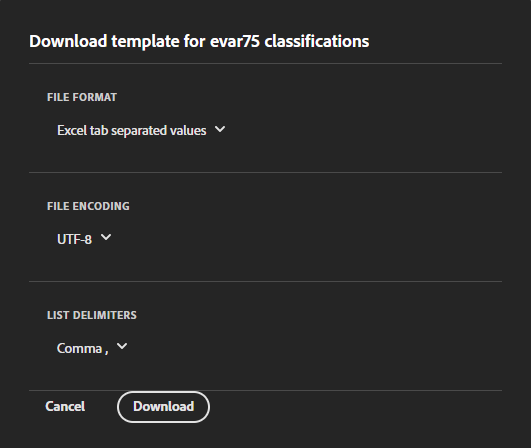

# Inställningar för klassificeringsuppsättning

Konfigurera en klassificeringsuppsättning, överföra data eller hämta data.

**[!UICONTROL Components]** > **[!UICONTROL Classification sets]** > **[!UICONTROL Sets]** > Klicka på önskat namn på klassificeringsuppsättningen

När du redigerar en klassificeringsuppsättning finns det två flikar: **[!UICONTROL Schema]** och **[!UICONTROL Settings]**.

## Inställningar

Följande fält är tillgängliga i [!UICONTROL Settings] och kan redigeras:

* **[!UICONTROL Name]**: Klassificeringsuppsättningens namn.
* **[!UICONTROL Description]**: Beskrivning av klassificeringsuppsättningen.
* **[!UICONTROL Owner name]**: Ägarens namn.
* **[!UICONTROL Owner email]**: Ägarens e-postadress.
* **[!UICONTROL Notify of issues]**: En kommaavgränsad lista med e-postadresser som meddelas om problem med den här klassificeringsuppsättningen.
* **[!UICONTROL Tags]**: Lägg till en eller flera taggar i de markerade klassificeringsuppsättningarna, som gör det enklare att hitta dem i framtiden genom att ordna eller gruppera klassificeringsuppsättningar.

Ytterligare fält är tillgängliga i informationssyfte och kan inte redigeras:

* **[!UICONTROL Type]**: Typ av klassificering mellan [!UICONTROL Primary] och [!UICONTROL Lookup]. Primära klassificeringar används vanligtvis.
* **[!UICONTROL Subscriptions]**: Rapportsviten och variabeln som klassificeringsuppsättningen gäller för. Endast en Report Suite stöds för en viss klassificeringsuppsättning. stöd för flera rapportsviter planeras.

## Schema

Visa aktuella konfigurerade klassificeringsdimensioner för den här prenumerationen. Följande knappar är tillgängliga:

* **[!UICONTROL Upload]**: Överför klassificeringsdata manuellt för en eller flera klassificeringsdimensioner. JSON-, CSV-, TSV- och TAB-filer stöds. När du överför en giltig fil visas en tabellförhandsvisning av data som ska klassificeras.
   * **[!UICONTROL File encoding]**: Välj rätt filkodning i den här listrutan. Giltiga alternativ är [!UICONTROL UTF-8] och [!UICONTROL Latin1].
   * **[!UICONTROL List delimiter]**: Välj rätt listavgränsare. Om du använder en hämtad fil eller mallfil måste du kontrollera att [!UICONTROL List delimiter] här matchar [!UICONTROL List delimiter] när filen hämtades.
   * **[!UICONTROL Apply]**: Spara överförda klassificeringsdata i klassificeringsuppsättningen.

   

* **[!UICONTROL Download]**: Hämta nyckelvärden och deras klassificeringskolumner.
   * **[!UICONTROL Rows]**: Det maximala antalet rader som ska inkluderas i den hämtade filen.
   * **[!UICONTROL Download rows received between]**: En datumväljare för kalender där du kan filtrera nyckelvärden efter när de visas i rapporter. Om ett nyckelvärde inte samlats in i det här datumintervallet visas det inte i den hämtade filen.
   * **[!UICONTROL Data returned]**: En listruta där du kan filtrera nyckelvärden som ingår i den hämtade filen baserat på deras associerade klassificeringsdata.
      * **[!UICONTROL All classified values]**: Inkluderar rader där klassificeringsdata ingår i minst en kolumn.
      * **[!UICONTROL All unclassified values]**: Inkluderar rader där klassificeringsdata saknas i minst en kolumn.
   * **[!UICONTROL File format]**: Listruta som anger i vilket filformat den hämtade filen finns. Alternativen inkluderar [!UICONTROL JSON], [!UICONTROL Comma separated values]och [!UICONTROL Excel tab separated values].
   * **[!UICONTROL File encoding]**: Listruta som bestämmer filkodningen. Alternativen inkluderar [!UICONTROL UTF-8] och [!UICONTROL Latin1]. UTF-8 rekommenderas.
   * **[!UICONTROL List delimiters]**: Listruta som anger listavgränsaren som avgränsar klassificeringskolumner på varje rad.

   

* **[!UICONTROL Template]**: Hämta en mallfil. Den här filen liknar [!UICONTROL Download] -knappen, förutom att den inte innehåller några klassificeringsdata eller nyckelvärden.
   * **[!UICONTROL File format]**: Listruta som bestämmer vilket filformat mallfilen finns i. Alternativen inkluderar [!UICONTROL Comma separated values]och [!UICONTROL Excel tab separated values].
   * **[!UICONTROL File encoding]**: Listruta som bestämmer filkodningen. Alternativen inkluderar [!UICONTROL UTF-8] och [!UICONTROL Latin1]. UTF-8 rekommenderas.
   * **[!UICONTROL List delimiters]**: Listruta som anger listavgränsaren som avgränsar klassificeringskolumner på varje rad.
* **[!UICONTROL Job history]**: En genvägslänk som tar dig till [Jobbhanterare](job-manager.md), visar endast jobb för den här klassificeringsuppsättningen.

   
