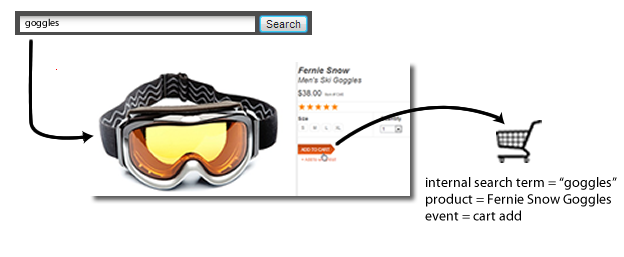

# eVar (Merchandising)

*Den här hjälpsidan beskriver hur e-handel fungerar som en dimension. Mer information om hur du implementerar eVars för marknadsföring finns i [eVar (variabel för försäljning)](/help/implement/vars/page-vars/evar-merchandising.md) i användarhandboken för implementering.*

Mer information om hur du marknadsför eVars finns i [Merchandising eVars and product finding methods](https://experienceleague.adobe.com/docs/analytics/admin/admin-tools/conversion-variables/merchandising-evars.html).

När ni mäter framgångarna med externa kampanjer eller externa söktermer vill ni vanligtvis ha ett enda värde för att ta emot poäng för alla framgångshändelser som inträffar. Om en kund t.ex. klickar på en länk i en e-postkampanj för att besöka webbplatsen, bör alla inköp som görs som ett resultat tillskrivas kampanjen.

Vad gäller för händelser som styrs av intern sökning eller kategoribläddring när en kund letar efter flera objekt? En kund söker till exempel efter `"goggles"`lägger sedan till ett par i kundvagnen:



Före utcheckningen söker kunden efter `"winter coat"`lägger sedan till en jacka i kundvagnen:


När besökaren är klar med köpet har du en intern sökning efter `"winter coat"` krediteras med köp av ett par glasögon (förutsatt att eVar använder standardallokeringen för&quot;Senaste&quot;). Bra för `"winter coat"`men dåligt för marknadsföringsbeslut:

| Intern sökterm | Intäkter |
|---|---|
| vinterrock | 157 dollar |

## Hur variabler för marknadsföring löser det här problemet

Med eVars kan du tilldela en eVar det aktuella värdet när en lyckad händelse inträffar. Det här värdet är kopplat till den produkten även om ett eller flera nya värden senare anges för den aktuella eVar.

Om marknadsföring är aktiverat för eVar i det föregående exemplet, söktermen `"goggles"` är knutet till snön och söktermen `"winter coat"` är knuten till koftan. Merchandising eVars tilldelar intäkter på produktnivå, så varje term får en uppskattning av intäktsbeloppet för den produkt som termen var kopplad till:

| Intern sökterm | Intäkter |
|---|---|
| vinterrock | 119 dollar |
| glasögon | 38 dollar |

Se [Merchandising eVars](/help/implement/vars/page-vars/evar-merchandising.md) för implementeringsanvisningar.

## Instanser av marknadsföringsvariabler

The [Instanser](../metrics/instances.md) metriska värden rekommenderas inte för användning på försäljningsvariabler.

* För variabler som används i produktsyntax ökas inte antalet instanser alls.
* För marknadsföringsvariabler som använder konverteringsvariabelsyntax räknas instanser varje gång eVar anges. Det är emellertid attribut till dimensionsobjektet `"None"` om inte alla följande inträffar i samma träff:
   * Försäljningsvärdet anges med ett eVar.
   * The `products` variabeln definieras med ett värde.
   * En bindningshändelse har angetts.

```js
// This merchandising eVar uses conversion variable syntax, and counts an instance.
// However, if the binding event and products variable are not both set, the instance attributes to "None".
s.eVar1 = "Tower defense";

// This merchandising eVar uses product syntax, and does not count an instance.
s.products = "Games;Wizard tower;;;;eVar2=Tower defense";
```

Eftersom de flesta användningsfall för konvertering av variabelsyntax kräver variabeln eVar och products i olika träffar är det inte realistiskt att använda mätvärdet för &#39;Instances&#39;.
