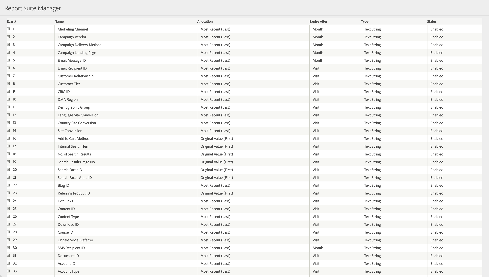

# eVar

*Den här hjälpsidan beskriver hur eVars fungerar som en [dimension](overview.md). Mer information om hur du implementerar eVars finns i [eVars](/help/implement/vars/page-vars/evar.md) i Implementeringshandboken.*

Variabler är anpassade variabler som du kan använda hur du vill. Om du har en [konstruktionsdokument](/help/implement/prepare/solution-design.md)blir de flesta dimensioner som är specifika för din organisation [!UICONTROL eVars], utöver standarddimensionen som är tillgänglig med Adobe Analytics, till exempel Sidnamn, Refererande domän, Kanal. Se [Översikt över Dimension](overview.md) för mer information.

Som standard kvarstår eVars utanför den träff de är inställda på. Du kan anpassa deras förfallodatum och tilldelning under [Konverteringsvariabler](/help/admin/admin/c-manage-report-suites/c-edit-report-suites/conversion-var-admin/conversion-var-admin.md) in [!UICONTROL Report suite settings]. Nedan finns ett exempel på definitioner av eVar i användargränssnittet för konverteringsvariabler.

Antalet tillgängliga eVars-variabler beror på ditt avtal med Adobe. Upp till 250 eVars är tillgängligt om ditt avtal med Adobe stöder det.

Det (övre eller nedre) fall som används vid rapportering baseras på det första värdet som serverdelssystemet registrerar. Värdet kan antingen vara den första förekomsten någonsin eller variera med en tidsperiod (t.ex. en månad), beroende på mängden data som är kopplad till rapportsviten.

## Fyll i eVars med data

Varje eVar samlar in data från [`v1` - `v250` frågesträng](/help/implement/validate/query-parameters.md) i bildbegäranden. Till exempel `v1` frågesträngsparametern samlar in data för eVar1, medan `v222` frågesträngsparametern samlar in data för eVar222.

I AppMeasurementet, som kompilerar JavaScript-variabler till en bildbegäran för datainsamling, används variablerna `eVar1` - `eVar250`. Se [eVar](/help/implement/vars/page-vars/evar.md) i Implementeringsanvändarhandboken för implementeringsriktlinjer.

## Dimensioner

Eftersom eVars innehåller anpassade strängar i implementeringen avgör organisationen vilka dimensionsobjekten är för varje eVar. Se till att du registrerar syftet med varje eVar och typiska dimensionsobjekt i en [konstruktionsdokument](/help/implement/prepare/solution-design.md).

## Hur eVars fungerar

När du skickar data till Adobe Analytics översätter datainsamlingsservrar träffen till en enda rad med hundratals kolumner. Två kolumner är dedikerade till varje eVar, en för direkt datainsamling och den andra för beständiga värden.

* En standardkolumn innehåller data som skickas till Adobe från bildbegäran.
* En post-kolumn innehåller beständiga data, vilket beror på eVarnas förfallodatum och allokering.

Under nästan alla omständigheter `post_evar` -kolumnen används i rapporter.

### Hur eVars knyter till mätvärden

Framgångshändelser och eVars definieras ofta i olika bildbegäranden. The `post_evar` -kolumnen tillåter att eVar-värden binder sig till händelser och visar data i rapporter. Ta till exempel följande besök:

1. En besökare kommer till din webbplats på din hemsida.
2. De söker efter &quot;katter&quot; med hjälp av webbplatsens interna sökning. Implementeringen använder eVar1 för intern sökning.
3. De visar en produkt och går igenom utcheckningsprocessen.

En förenklad version av rådata skulle se ut ungefär så här:

| `visitor_id` | `pagename` | `evar1` | `post_evar1` | `event_list` |
| --- | --- | --- | --- | --- |
| `examplevisitor_987` | `Home page` | | | |
| `examplevisitor_987` | `Search results` | `cats` | `cats` | `event1` |
| `examplevisitor_987` | `Product page` | | `cats` | `prodView` |
| `examplevisitor_987` | `Cart` | | `cats` | `scAdd` |
| `examplevisitor_987` | `Checkout` | | `cats` | `scCheckout` |
| `examplevisitor_987` | `Purchase confirmation` | | `cats` | `purchase` |

* The `visitor_id` länkar träffar på samma besökare. I faktiska rådata är de sammanfogade värdena för `visid_high` och `visid_low` fastställa besökar-ID.
* The `pagename` kolumnen fyller i siddimensionen.
* The `evar` -kolumnen avgör träffar när eVar1 angavs explicit.
* The `post_evar1` har det föregående värdet, beroende på variabelns allokering och förfallodatum som anges i rapportsvitens inställningar.
* The `event_list` -kolumnen innehåller alla måttdata. I detta exempel `event1` är &quot;Sökningar&quot;, och de andra händelserna är standardvärden för kundvagn. I faktiska rådata `event_list` innehåller en kommaavgränsad siduppsättning med en uppslagstabell som kopplar dessa siffror till ett mätvärde.

### Översätta datainsamling till rapportering

Verktyg i Adobe Analytics, t.ex. Analysis Workspace, arbetar med dessa insamlade data. Om du till exempel har dragit en rapport med eVar1 som mått och order visas en rapport som ser ut ungefär så här:

| `Internal search term (eVar1)` | `Orders` |
| --- | --- |
| `cats` | `1` |

Analysis Workspace hämtar denna rapport med hjälp av följande logik:

* Se igenom alla `event_list` och plocka ut alla träffar med `purchase` i dem.
* Visa `post_evar1` värde.

### Betydelsen av tilldelning och förfallodatum

Eftersom allokering och förfallodatum avgör vilka värden som kvarstår är de avgörande för att få ut så mycket som möjligt av en analysimplementering. Adobe rekommenderar starkt att du diskuterar inom organisationen hur flera värden för varje eVar hanteras (allokering) och när eVars stoppar beständiga data (förfallodatum).

* Som standard använder en eVar den senaste allokeringen. Nya värden skriver över beständiga värden.
* Som standard använder en eVar en förfallotid för besök. När besöket är slut slutar värdena att kopieras från rad till rad i dialogrutan `post_evar` kolumn.

Du kan ändra eVarnas allokering och förfallodatum under [Konverteringsvariabler](/help/admin/admin/c-manage-report-suites/c-edit-report-suites/conversion-var-admin/conversion-var-admin.md) i Rapportsvitens inställningar.

## Värdet av eVars över props

Adobe rekommenderar att eVars används i de flesta fall, vilket stöds av följande:

* eVars har en gräns på 255 byte i rapporter. Props har en gräns på 100 byte.
* Som standard kvarstår inte uttryck efter den träff de ställs in. eVars har en anpassad förfallotid, vilket gör att du kan avgöra när en eVar inte längre får kredit för en efterföljande händelse. Om du använder [bearbeta rapporttid](/help/components/vrs/vrs-report-time-processing.md), kan både props och eVars använda en anpassad attribueringsmodell.
* Adobe stöder upp till 250 eVars och endast 75 props.

Se [prop](prop.md) för fler jämförelser mellan utkast och eVars.
