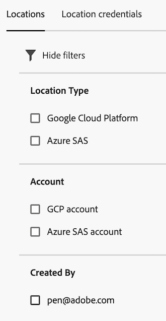

# Platshanteraren

Med Platshanteraren kan du visa, skapa, redigera och ta bort konton och platser. De kan användas för något av följande ändamål:

* Exportera filer med [Dataflöden](/help/export/analytics-data-feed/create-feed.md)
* Exportera rapporter med [Data Warehouse](/help/export/data-warehouse/create-request/dw-request-report-destinations.md)
* Importera scheman med [Klassificeringsuppsättningar](/help/components/classifications/sets/overview.md)

## Visa, filtrera och söka efter platser

Med Platshanteraren kan du visa alla platser som du har skapat eller alla som delas med organisationen. Systemadministratörer kan visa platser som skapats av alla användare, oavsett om de delas.

1. Om du vill komma åt Platshanteraren i Adobe Analytics väljer du **[!UICONTROL Components]** > **[!UICONTROL Locations]**.

1. (Villkorligt) Om du är systemadministratör kan du aktivera [!UICONTROL **Visa platser för alla användare**] om du vill visa platser som har skapats av alla användare i organisationen. <!-- Maybe add a screenshot? This is new functionality -->

1. Filtrera eller sök i listan över platser:

   * **Filter:** Välj ikonen Filter om du vill filtrera listan över platser.

     Du kan filtrera platser efter **[!UICONTROL Location Type]**, **[!UICONTROL Account]**, eller **[!UICONTROL Created By]**.

     

   * **Sök:** I sökfältet börjar du skriva namnet på den plats du vill visa. Resultaten filtreras när du skriver. Följande kolumner genomsöks: **Platsnamn**, **Platstyp**, **Konto** och **Skapad av**.

1. (Valfritt) Om du har fler än 1 000 platser är det bara den första 1 000-skärmen som visas. Välj [!UICONTROL **Läs mer**] för att läsa in ytterligare 1 000 platser.

## Konfigurera kolumner i Platshanteraren

Följande kolumner är tillgängliga i Platshanteraren. Om du vill anpassa kolumnerna som visas i tabellen väljer du **Anpassa tabell** icon .

* **[!UICONTROL Location name]**: Platsnamnet. Välj menyn med tre punkter bredvid ett platsnamn till antingen [redigera platsen](/help/components/locations/configure-import-locations.md) eller ta bort den.
* **[!UICONTROL Location type]**: Den kontotyp som är associerad med platsen.
* **[!UICONTROL Account]**: Det specifika konto som är associerat med platsen.
* **Program**: Den typ av program som platsen kan användas med (till exempel datafeeds, Data Warehouse eller Klassificeringsuppsättningar).
* **[!UICONTROL Last used]**: Det datum då platsen senast användes.
* **[!UICONTROL Created by]**: Den användare som skapade platsen.
* **[!UICONTROL Date created]**: Det datum då platsen skapades.

## Skapa och hantera platser

Du kan skapa, redigera och ta bort platser.

### Skapa en plats

Mer information om hur du skapar en plats finns i [Konfigurera platser för molnimport och -export](/help/components/locations/configure-import-locations.md).

<!-- Do I need to add some steps here about how to create a location and then assign that location to be used with DF, DW, or Classifications sets? Need to hear back from Ron and team whether we are including this functionality -->

### Redigera en plats

En plats kan bara redigeras av den användare som skapade den eller av en systemadministratör.

Mer information om hur du redigerar en plats finns i [Konfigurera platser för molnimport och -export](/help/components/locations/configure-import-locations.md).

### Ta bort en plats

>[!IMPORTANT]
>
>Om en plats tas bort kommer dataflödesfiler, Data Warehouse- eller klassificeringsscheman som är associerade med den borttagna platsen inte att fungera nästa gång de används.
>
>Om du tar bort en plats bör du [redigera dina dataflöden](/help/export/analytics-data-feed/create-feed.md), [Data Warehouse](/help/export/data-warehouse/create-request/dw-request-report-destinations.md)och [Klassificeringsuppsättningar - scheman](/help/components/classifications/sets/manage/schema.md) för att använda en fungerande plats.

En plats kan bara tas bort av den användare som skapade den eller av en systemadministratör.

Så här tar du bort en plats i Platshanteraren i Adobe Analytics:

1. Välj **[!UICONTROL Components]** > **[!UICONTROL Locations]** väljer du [!UICONTROL **Platser**] -fliken.

1. Välj menyn med tre punkter i dialogrutan [!UICONTROL **Platsnamn**] kolumn för den plats som du vill ta bort.

1. Välj [!UICONTROL **Ta bort**].

## Skapa och hantera konton

Du kan skapa, redigera och ta bort konton.

### Skapa ett konto

Mer information om hur du skapar ett konto finns i [Konfigurera molnimport- och exportkonton](/help/components/locations/configure-import-accounts.md).

### Redigera ett konto

Ett konto kan bara redigeras av den användare som skapade det eller av en systemadministratör.

Mer information om hur du redigerar ett konto finns i [Konfigurera molnimport- och exportkonton](/help/components/locations/configure-import-accounts.md).

### Visa kontonycklar

När du har skapat ett konto kan du visa alla associerade kontonycklar för det kontot. Du kan behöva visa den här informationen om du inte har slutfört konfigurationen av kontot med din molnleverantör när du [konfigurerade kontot från början](/help/components/locations/configure-import-accounts.md).

Så här visar du nycklar som är kopplade till ett exportkonto:

1. I Adobe Analytics: **[!UICONTROL Components]** > **[!UICONTROL Locations]** väljer du [!UICONTROL **Platskonton**] -fliken.

1. (Villkorligt) Om du är systemadministratör kan du aktivera [!UICONTROL **Visa platser för alla användare**] om du vill visa platser som har skapats av alla användare i organisationen. <!-- Maybe add a screenshot? This is new functionality -->

1. Markera ikonen med tre punkter på det konto som du vill redigera och välj sedan [!UICONTROL **Kontonycklar**].

### Ta bort ett konto

>[!IMPORTANT]
>
>Konton kan bara tas bort om det inte finns några platser där de används. Innan du tar bort ett konto måste du först ta bort alla platser på kontot enligt beskrivningen i [Ta bort en plats](#delete-a-location).

Ett konto kan bara tas bort av den användare som skapade det eller av en systemadministratör.

Ta bort ett konto:

1. I Adobe Analytics: **[!UICONTROL Components]** > **[!UICONTROL Locations]** väljer du [!UICONTROL **Platskonton**] -fliken.

1. (Villkorligt) Om du är systemadministratör kan du aktivera [!UICONTROL **Visa konton för alla användare**] om du vill visa platser som har skapats av alla användare i organisationen.

1. Markera ikonen med tre punkter på det konto som du vill redigera och välj sedan [!UICONTROL **Ta bort konto**]

## Konfigurera företagsinställningar (endast administratörer)

Systemadministratörer kan hindra användare från att skapa konton och platser eller begränsa vilka typer av konton som användare kan skapa och använda.

### Konfigurera om användare kan skapa och redigera konton

Som standard kan alla användare i organisationen skapa konton och redigera konton som de skapar i din Adobe Analytics-miljö, vilket beskrivs i [konfigurera molnimport- och exportkonton](/help/components/locations/configure-import-accounts.md).

Du kan hindra användare från att skapa konton. När du gör det kan användare fortfarande använda konton som de redan har skapat, men de kan inte längre redigera dem. Du kan ta bort konton som användare har skapat enligt beskrivningen i [Ta bort ett konto](#delete-an-account).

Så här begränsar du alla användare från att skapa och redigera konton:

1. I Adobe Analytics: **[!UICONTROL Components]** > **[!UICONTROL Locations]** väljer du [!UICONTROL **Administratörsinställningar**] -fliken.

1. I [!UICONTROL **Platskonton**] avmarkera alternativet, [!UICONTROL **Tillåt användare att skapa och hantera platskonton**].

1. Välj [!UICONTROL **Spara**].

1. (Valfritt) Ta bort konton som användare har skapat och som du inte längre vill att de ska använda enligt beskrivningen i [Ta bort ett konto](#delete-an-account).

### Konfigurera om användare kan skapa och redigera platser

Som standard kan alla användare i organisationen skapa platser och redigera platser som de skapar i din Adobe Analytics-miljö, enligt beskrivningen i [konfigurera platser för molnimport och -export](/help/components/locations/configure-import-locations.md).

Du kan hindra användare från att skapa platser. När du gör det kan användare fortfarande använda platser som de redan har skapat, men de kan inte längre redigera dem. Du kan ta bort platser som användare har skapat enligt beskrivningen i [Ta bort platser](#delete-a-location).

Så här begränsar du alla användare från att skapa och redigera platser:

1. I Adobe Analytics: **[!UICONTROL Components]** > **[!UICONTROL Locations]** väljer du [!UICONTROL **Administratörsinställningar**] -fliken.

1. I [!UICONTROL **Platser**] avmarkera alternativet, [!UICONTROL **Tillåt användare att skapa och hantera platser**].

1. Välj [!UICONTROL **Spara**].

1. (Valfritt) Ta bort alla platser som användare har skapat och som du inte längre vill att de ska använda enligt beskrivningen i [Ta bort en plats](#delete-a-location).

### Begränsa vilka kontotyper som användare kan skapa och använda

Du kan begränsa vilka kontotyper som användare kan se under följande omständigheter:

* När [skapa nya konton](/help/components/locations/configure-import-accounts.md).

* När du väljer vilka konton som ska användas vid export av filer med [Dataflöden](/help/export/analytics-data-feed/create-feed.md), exportera rapporter med [Data Warehouse](/help/export/data-warehouse/create-request/dw-request-report-destinations.md)eller importera scheman med [Klassificeringsuppsättningar](/help/components/classifications/sets/overview.md).

När du begränsar kontotyper enligt beskrivningen i det här avsnittet, visas inte längre konton av den typ som du begränsar för användarna. Det innebär att det inte går att skapa nya konton av den typen och att befintliga konton av den typen inte kan användas när du skapar datafeeds, Data Warehouse eller klassificeringsuppsättningar.

Befintliga konton som är konfigurerade för schemalagd export måste dock tas bort om du vill begränsa användningen av dem.

#### Se till att konton inte används för schemalagd export

När du begränsar kontotyper döljs befintliga konton, inte tas bort.

Om scheman redan har konfigurerats för att skicka data till ett konto av den typ som du begränsar, kommer scheman att fortsätta att köras även efter att du har begränsat kontotypen och data kommer att fortsätta skickas till kontot.  Om en datafeed till exempel är schemalagd att skicka data till en kontotyp som du begränsar, kommer schemat att fortsätta att köras.

Om du behöver vara säker på att konton av en viss typ inte används i schemalagda exporter kan du ta bort kontona innan du [begränsa kontotyperna](#limit-the-account-types-that-are-available-to-users).

Så här tar du bort konton:

1. Leta reda på kontona för den kontotyp som du vill begränsa och som används för schemalagd export.

1. Ta bort konton enligt beskrivningen i [Ta bort ett konto](#delete-an-account).

1. Fortsätt med följande avsnitt, [Begränsa de kontotyper som är tillgängliga för användare](#limit-the-account-types-that-are-available-to-users).

#### Begränsa de kontotyper som är tillgängliga för användare

Så här begränsar du de kontotyper som är tillgängliga för användare när de skapar och använder konton:

1. I Adobe Analytics: **[!UICONTROL Components]** > **[!UICONTROL Locations]** väljer du [!UICONTROL **Administratörsinställningar**] -fliken.

1. Leta reda på [!UICONTROL **Tillåtna kontotyper**] -avsnitt.

   Följande kontotyper är tillgängliga som standard för användare. Avmarkera någon av de kontotyper som du vill hindra användare från att använda.

   * [!UICONTROL **Amazon S3 Role ARN**]

   * [!UICONTROL **Google Cloud Platform**]

   * [!UICONTROL **Azure SAS**]

   * [!UICONTROL **Azure RBAC**]

   * [!UICONTROL **E-post**]

   * Äldre kontotyper, inklusive [!UICONTROL **Amazon S3**], [!UICONTROL **Azure**], [!UICONTROL **FTP**] och [!UICONTROL **SFTP**]

1. Välj [!UICONTROL **Spara**].

